# Coding Agent 架构分析与实现指南

## 📋 概述

本目录包含对多个生产级 Coding Agent 的深入架构分析，以及为 AutoDev 项目重构提供的详细实现指南。

---

## � MPP-Core 改进建议 (2025-10-31)

> 基于 Codex、Gemini CLI、Kode 三个生产级 Coding Agent 的架构分析，结合 mpp-core 当前实现状态，提供的关键改进建议。

### 当前 mpp-core 架构概览

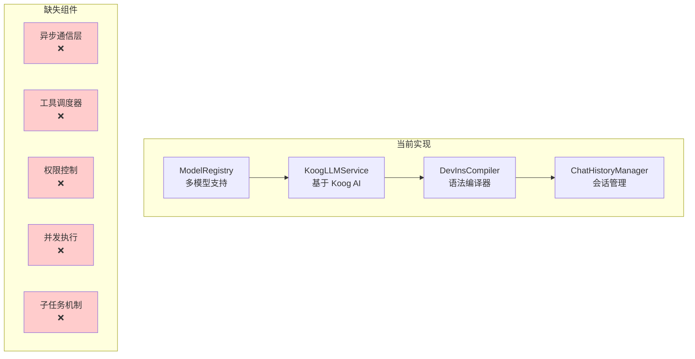

### 核心问题诊断

#### 1. 缺乏异步通信层 ⚠️ 高优先级

**问题**:
- `KoogLLMService` 直接调用 LLM，没有解耦层
- UI 和核心逻辑紧耦合，难以实现响应式界面
- 无法实现后台任务和中断机制

**参考方案**: Codex Queue Pair 模式
```kotlin
// 建议实现
sealed class AgentSubmission {
    data class SendPrompt(val text: String) : AgentSubmission()
    data class CancelTask(val taskId: String) : AgentSubmission()
    data class ApproveToolCall(val callId: String) : AgentSubmission()
}

sealed class AgentEvent {
    data class StreamUpdate(val text: String) : AgentEvent()
    data class ToolCallRequest(val tool: String, val params: Map<String, Any>) : AgentEvent()
    data class TaskComplete(val result: String) : AgentEvent()
    data class Error(val message: String) : AgentEvent()
}

class AgentOrchestrator {
    private val submissionChannel = Channel<AgentSubmission>(Channel.BUFFERED)
    private val eventChannel = Channel<AgentEvent>(Channel.BUFFERED)
    
    suspend fun submit(submission: AgentSubmission) {
        submissionChannel.send(submission)
    }
    
    fun events(): Flow<AgentEvent> = eventChannel.receiveAsFlow()
}
```

**收益**:
- ✅ UI 完全解耦，支持 Compose/Web/CLI 多端
- ✅ 天然支持取消和中断
- ✅ 更好的测试性

---

#### 2. 缺乏工具调度系统 ⚠️ 高优先级

**问题**:
- 工具调用逻辑散落在各处，没有统一编排
- 无审批机制，安全风险高（直接执行 shell 等）
- 无状态追踪，难以调试和监控

**参考方案**: Gemini CLI CoreToolScheduler 状态机
```kotlin
// 建议实现
sealed class ToolCallState {
    data class Validating(val callId: String, val tool: String) : ToolCallState()
    data class Scheduled(val callId: String, val tool: Tool) : ToolCallState()
    data class AwaitingApproval(val callId: String, val tool: Tool) : ToolCallState()
    data class Executing(val callId: String, val tool: Tool, val startTime: Long) : ToolCallState()
    data class Success(val callId: String, val result: String) : ToolCallState()
    data class Error(val callId: String, val error: String) : ToolCallState()
}

class ToolScheduler(
    private val registry: ToolRegistry,
    private val policyEngine: PolicyEngine
) {
    private val toolCalls = mutableMapOf<String, ToolCallState>()
    private val queue = Channel<ToolCallState>(Channel.UNLIMITED)
    
    suspend fun schedule(toolName: String, params: Map<String, Any>): String {
        val callId = UUID.randomUUID().toString()
        val state = ToolCallState.Validating(callId, toolName)
        queue.send(state)
        return callId
    }
    
    private suspend fun processQueue() {
        queue.receiveAsFlow().collect { state ->
            when (state) {
                is ToolCallState.Validating -> validate(state)
                is ToolCallState.Scheduled -> checkPolicy(state)
                is ToolCallState.Executing -> execute(state)
                // ...
            }
        }
    }
}
```

**收益**:
- ✅ 统一的工具调用流程
- ✅ 内置权限控制和审批
- ✅ 完整的状态追踪和日志

---

#### 3. 缺乏并发执行能力 ⚠️ 中优先级

**问题**:
- 多个 `read_file` 调用串行执行，性能差 5-10 倍
- 无读写锁保护，并发修改文件会冲突

**参考方案**: Codex RwLock + 工具分类
```kotlin
// 建议实现
interface Tool {
    val name: String
    val isReadOnly: Boolean  // 新增标志
    suspend fun execute(params: ToolParams): ToolResult
}

class ParallelToolExecutor {
    private val stateLock = ReentrantReadWriteLock()
    
    suspend fun executeBatch(calls: List<ToolCall>): List<ToolResult> {
        // 分类工具
        val (readCalls, writeCalls) = calls.partition { 
            registry.getTool(it.name)?.isReadOnly == true 
        }
        
        // 并行执行只读工具
        val readResults = coroutineScope {
            readCalls.map { call ->
                async {
                    stateLock.readLock().withLock {
                        executeTool(call)
                    }
                }
            }.awaitAll()
        }
        
        // 串行执行写工具
        val writeResults = writeCalls.map { call ->
            stateLock.writeLock().withLock {
                executeTool(call)
            }
        }
        
        return readResults + writeResults
    }
}
```

**收益**:
- ✅ Read 操作 5-10x 性能提升
- ✅ 并发安全保障
- ✅ 更好的资源利用

---

#### 4. 缺乏子任务机制 (Subagent) ⚠️ 中优先级

**问题**:
- 复杂任务无法分解和隔离
- 无法限制子任务的工具权限（安全问题）
- 难以实现结构化的任务编排

**参考方案**: Gemini CLI AgentExecutor
```kotlin
// 建议实现
data class AgentDefinition(
    val name: String,
    val systemPrompt: String,
    val allowedTools: List<String>,  // 只授予必要工具
    val outputSchema: JsonSchema?     // 强制结构化输出
)

class AgentExecutor(
    private val definition: AgentDefinition,
    private val parentRegistry: ToolRegistry
) {
    // 创建隔离的工具注册表
    private val isolatedRegistry = ToolRegistry().apply {
        definition.allowedTools.forEach { toolName ->
            parentRegistry.getTool(toolName)?.let { register(it) }
        }
        // 强制添加 complete_task 工具
        register(CompleteTaskTool(definition.outputSchema))
    }
    
    suspend fun run(inputs: Map<String, Any>): AgentResult {
        var turnCount = 0
        val maxTurns = 20
        
        while (turnCount < maxTurns) {
            val response = llm.chat(history)
            
            // 检查是否调用了 complete_task
            val completeCall = response.toolCalls.find { it.name == "complete_task" }
            if (completeCall != null) {
                return AgentResult.Success(completeCall.output)
            }
            
            // 执行其他工具调用
            processToolCalls(response.toolCalls)
            turnCount++
        }
        
        return AgentResult.MaxTurnsReached
    }
}
```

**典型用例**:
```kotlin
// 定义代码审查子 Agent
val codeReviewer = AgentDefinition(
    name = "code-reviewer",
    systemPrompt = "You review code for security and quality issues...",
    allowedTools = listOf("read_file", "grep", "git_diff"),  // 只读权限
    outputSchema = JsonSchema.of<CodeReviewResult>()
)

// 在主 Agent 中调用
val executor = AgentExecutor(codeReviewer, mainRegistry)
val result = executor.run(mapOf("filePath" to "src/Auth.kt"))
// 返回结构化的审查结果
```

**收益**:
- ✅ 任务隔离和权限控制
- ✅ 强制类型化输出
- ✅ 可组合的任务编排
- ✅ 更好的调试和监控

---

#### 5. 循环检测和历史压缩缺失 ⚠️ 低优先级

**问题**:
- Agent 可能陷入重复调用工具的循环
- 长对话历史导致 token 超限和成本暴增
- 无自动恢复机制

**参考方案**: Gemini CLI LoopDetection + ChatCompression
```kotlin
// 建议实现
class LoopDetectionService {
    private val toolCallHistory = mutableListOf<ToolCallRecord>()
    private val windowSize = 10
    
    fun recordToolCall(toolName: String, params: Map<String, Any>) {
        toolCallHistory.add(ToolCallRecord(toolName, params, System.currentTimeMillis()))
    }
    
    fun detectLoop(): LoopResult {
        if (toolCallHistory.size < windowSize) return LoopResult.None
        
        val recent = toolCallHistory.takeLast(windowSize)
        val signature = recent.joinToString("|") { "${it.toolName}:${it.params.hashCode()}" }
        
        // 检测重复模式
        val pattern = findRepeatingPattern(signature)
        if (pattern != null && pattern.repetitions >= 3) {
            return LoopResult.Detected(pattern)
        }
        
        return LoopResult.None
    }
}

class ChatCompressionService(private val llm: LLMService) {
    suspend fun compress(history: List<Message>): List<Message> {
        if (history.size < 20) return history
        
        // 保留最新 5 轮对话
        val recent = history.takeLast(10)
        
        // 压缩中间历史
        val middle = history.dropLast(10).drop(2)  // 保留开头的 system prompt
        val compressed = llm.summarize(middle, maxTokens = 500)
        
        return history.take(2) + listOf(
            Message.system("Previous conversation summary: $compressed")
        ) + recent
    }
}
```

**收益**:
- ✅ 自动检测和打破循环
- ✅ 控制 token 成本
- ✅ 保持长对话能力

---

#### 6. 缺乏权限控制系统 ⚠️ 高优先级

**问题**:
- 工具直接执行，无安全检查
- 用户无法预览和批准危险操作
- 无持久化的审批记录

**参考方案**: Gemini CLI PolicyEngine
```kotlin
// 建议实现
enum class PolicyDecision {
    ALLOW,      // 自动允许
    DENY,       // 自动拒绝
    ASK_USER    // 需要用户确认
}

data class PolicyRule(
    val toolPattern: Regex,
    val decision: PolicyDecision,
    val condition: ((ToolCall) -> Boolean)? = null
)

class PolicyEngine {
    private val rules = mutableListOf<PolicyRule>()
    private val approvalCache = mutableMapOf<String, Boolean>()  // 会话内缓存
    
    fun checkToolCall(call: ToolCall): PolicyDecision {
        // 1. 检查缓存
        val cacheKey = "${call.toolName}:${call.params.hashCode()}"
        if (approvalCache.containsKey(cacheKey)) {
            return if (approvalCache[cacheKey]!!) PolicyDecision.ALLOW else PolicyDecision.DENY
        }
        
        // 2. 应用规则
        for (rule in rules) {
            if (rule.toolPattern.matches(call.toolName)) {
                val conditionMet = rule.condition?.invoke(call) ?: true
                if (conditionMet) return rule.decision
            }
        }
        
        // 3. 默认策略：危险工具需要确认
        return if (call.isDangerous()) PolicyDecision.ASK_USER else PolicyDecision.ALLOW
    }
    
    fun addRule(rule: PolicyRule) {
        rules.add(rule)
    }
}

// 预定义规则
val defaultPolicy = PolicyEngine().apply {
    // 只读工具自动允许
    addRule(PolicyRule(
        toolPattern = Regex("read_file|grep|glob"),
        decision = PolicyDecision.ALLOW
    ))
    
    // 危险工具需要确认
    addRule(PolicyRule(
        toolPattern = Regex("shell|delete_file|write_file"),
        decision = PolicyDecision.ASK_USER
    ))
    
    // 禁止某些危险操作
    addRule(PolicyRule(
        toolPattern = Regex("shell"),
        decision = PolicyDecision.DENY,
        condition = { call -> 
            val command = call.params["command"] as? String
            command?.contains("rm -rf") == true
        }
    ))
}
```

**收益**:
- ✅ 防止意外破坏性操作
- ✅ 提升用户信任度
- ✅ 灵活的策略配置

---

### 实施优先级和路线图

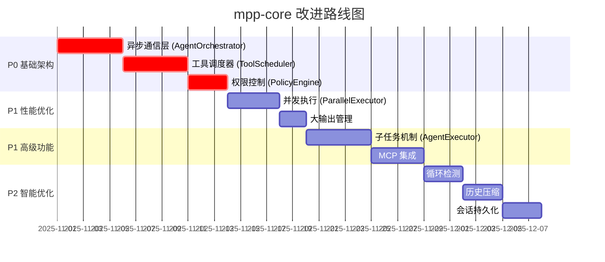

### 立即可行的改进 (本周内)

#### 1. 添加 Tool 抽象接口
```kotlin
// 文件: mpp-core/src/commonMain/kotlin/cc/unitmesh/agent/tool/Tool.kt
interface Tool {
    val name: String
    val description: String
    val isReadOnly: Boolean
    val parameters: ToolParameters
    
    suspend fun execute(params: Map<String, Any>, context: ToolContext): ToolResult
}

data class ToolResult(
    val success: Boolean,
    val output: String,
    val error: String? = null,
    val metadata: Map<String, Any> = emptyMap()
)
```

#### 2. 引入基础通信层
```kotlin
// 文件: mpp-core/src/commonMain/kotlin/cc/unitmesh/agent/communication/AgentChannel.kt
class AgentChannel {
    private val _submissions = MutableSharedFlow<AgentSubmission>()
    private val _events = MutableSharedFlow<AgentEvent>()
    
    val submissions: SharedFlow<AgentSubmission> = _submissions
    val events: SharedFlow<AgentEvent> = _events
    
    suspend fun submit(submission: AgentSubmission) {
        _submissions.emit(submission)
    }
    
    suspend fun emit(event: AgentEvent) {
        _events.emit(event)
    }
}
```

#### 3. 分离工具注册表
```kotlin
// 文件: mpp-core/src/commonMain/kotlin/cc/unitmesh/agent/tool/ToolRegistry.kt
class ToolRegistry {
    private val tools = mutableMapOf<String, Tool>()
    
    fun register(tool: Tool) {
        tools[tool.name] = tool
    }
    
    fun getTool(name: String): Tool? = tools[name]
    
    fun listTools(): List<Tool> = tools.values.toList()
    
    fun filterTools(predicate: (Tool) -> Boolean): List<Tool> {
        return tools.values.filter(predicate)
    }
}
```

---

### 与现有代码的整合建议

#### 保持 DevInsCompiler 不变
✅ `DevInsCompiler` 已经做得很好，保持其作为 DSL 编译器的角色。

#### 重构 KoogLLMService
```kotlin
// 当前
class KoogLLMService {
    fun streamPrompt(userPrompt: String): Flow<String>
}

// 建议重构为
class KoogLLMService(
    private val channel: AgentChannel,  // 新增
    private val toolScheduler: ToolScheduler  // 新增
) {
    suspend fun processSubmission(submission: AgentSubmission) {
        when (submission) {
            is AgentSubmission.SendPrompt -> {
                val compiled = DevInsCompilerFacade.compile(submission.text)
                streamLLM(compiled.output).collect { chunk ->
                    channel.emit(AgentEvent.StreamUpdate(chunk))
                }
            }
            is AgentSubmission.ApproveToolCall -> {
                toolScheduler.approveCall(submission.callId)
            }
        }
    }
}
```

#### 增强 ChatHistoryManager
```kotlin
// 添加压缩支持
class ChatHistoryManager(
    private val compressionService: ChatCompressionService  // 新增
) {
    suspend fun addMessage(message: Message) {
        val session = getCurrentSession()
        session.messages.add(message)
        
        // 自动压缩
        if (session.messages.size > 50) {
            session.messages = compressionService.compress(session.messages).toMutableList()
        }
    }
}
```

---

### 关键设计原则

1. **保持 KMP 兼容性**: 所有新组件必须在 commonMain 中实现
2. **避免阻塞 API**: 使用 `suspend fun` 和 `Flow`，不使用 `runBlocking`
3. **平台差异用 expect/actual**: 文件系统、进程执行等
4. **优先协程而非回调**: 利用 Kotlin Coroutines 的优势
5. **渐进式重构**: 每次改动保持向后兼容

---

### 性能目标

| 指标 | 当前 | 目标 | 参考 |
|------|------|------|------|
| Read 工具并发 | 串行 (1x) | 并行 (5-10x) | Codex |
| 工具调用延迟 | ~150ms | <50ms | Gemini CLI |
| 历史 token 控制 | 无限制 | <8k tokens | Gemini CLI |
| 循环检测 | 无 | <5 次重复 | Gemini CLI |
| 权限检查开销 | N/A | <5ms/call | Gemini CLI |

---

### 测试策略

#### 单元测试 (P0)
```kotlin
// 测试异步通信
@Test
fun `should emit events when submission processed`() = runTest {
    val channel = AgentChannel()
    val events = mutableListOf<AgentEvent>()
    
    launch {
        channel.events.take(2).toList(events)
    }
    
    channel.submit(AgentSubmission.SendPrompt("test"))
    // ...
    
    assertEquals(2, events.size)
}
```

#### 集成测试 (P1)
```kotlin
// 测试完整工具调用流程
@Test
fun `should execute tool with approval`() = runTest {
    val orchestrator = AgentOrchestrator(
        registry = testToolRegistry,
        policy = testPolicyEngine
    )
    
    orchestrator.submit(AgentSubmission.SendPrompt("/read file.txt"))
    
    val event = orchestrator.events().first()
    assertTrue(event is AgentEvent.ToolCallRequest)
}
```

#### 性能测试 (P1)
```kotlin
@Test
fun `parallel read should be faster than serial`() = runTest {
    val files = List(10) { "file$it.txt" }
    
    val serialTime = measureTime {
        files.forEach { readFile(it) }
    }
    
    val parallelTime = measureTime {
        parallelExecutor.executeBatch(files.map { ReadFileCall(it) })
    }
    
    assertTrue(parallelTime < serialTime / 3)
}
```

---

### 文档更新计划

1. **架构文档**: `mpp-core/docs/architecture.md`
   - 新增通信层设计
   - 工具调度器状态机图
   - 子任务机制说明

2. **API 文档**: `mpp-core/docs/api-reference.md`
   - Tool 接口规范
   - AgentOrchestrator 使用指南
   - PolicyEngine 配置示例

3. **迁移指南**: `mpp-core/docs/migration-guide.md`
   - 从当前 API 迁移到新架构
   - Breaking changes 说明
   - 兼容性策略

---

## �🆕 最新文档（推荐优先阅读）

### 1. [gemini-cli-architecture.md](gemini-cli-architecture.md) ⭐⭐⭐⭐⭐
**Google Gemini CLI 深度解析** - TypeScript 实现的最佳实践

**核心亮点**:
- 🎯 **CoreToolScheduler**: 状态机驱动的工具编排
- 🔐 **PolicyEngine**: 声明式权限控制系统
- 🧩 **AgentExecutor**: 完全隔离的 Subagent 机制
- 🔄 **LoopDetection**: 自动循环检测和历史压缩
- 💻 **IDE 集成**: 增量上下文同步
- 📦 **输出管理**: 自动截断大输出并保存文件

**为什么必读**:
- ✅ 最完整的工具编排状态机设计
- ✅ 生产级的权限控制方案
- ✅ 独创的 Subagent 任务隔离机制
- ✅ 实用的循环检测和压缩策略
- ✅ 所有代码均来自实际生产环境

**阅读时间**: 50-60 分钟

### 2. [coding-agents-architecture.md](coding-agents-architecture.md) ⭐⭐⭐⭐
**Codex vs Gemini CLI 双重对比** - 架构设计最佳实践总结

**内容**:
- 🏗️ 6 大核心维度对比（通信、编排、并发、Subagent、状态、工具发现）
- 📊 详细的性能与功能对比表
- 🎯 AutoDev 4 阶段重构路线图（P0/P1/P2 优先级）
- 🔍 Codex 和 Gemini CLI 的核心洞察
- 💡 最佳实践融合建议

**为什么重要**:
- ✅ 一次性了解两个顶级实现
- ✅ 清晰的架构决策依据
- ✅ 可执行的重构计划

**阅读时间**: 40-50 分钟

---

## � 历史参考文档

### 3. AutoDev Sketch 重构实现指南 (本文件后续内容)

本文档基于对原始 IDEA 版本 sketch 实现的分析，参考多个 Coding Agent 的架构设计，为当前项目使用 @mpp-core 和 @mpp-ui 重构 AutoDev
Coding Agent 提供详细的实现指南。

## 🏗️ 架构设计

> 💡 **新增参考**: 本章节整合了 Codex、Gemini CLI 和 Kode 三个 Coding Agent 项目的设计经验。
> 详细的 Codex 架构分析请参考：[docs/codex-architecture-analysis.md](docs/codex-architecture-analysis.md)

### 三大 Agent 对比分析

| 维度 | Codex (OpenAI) | Gemini CLI (Google) | AutoDev (当前) |
|------|----------------|---------------------|----------------|
| **语言** | Rust | TypeScript | Kotlin/Java |
| **通信模式** | ✅ Queue Pair 异步 | 事件流 | 同步回调 |
| **工具系统** | ✅ Orchestrator + Runtime | 工具类 + 验证 | 分散实现 |
| **沙箱机制** | ✅ 多平台沙箱 | 容器化 | 无 |
| **并行执行** | ✅ RwLock 并行 | 不支持 | 不支持 |
| **MCP 支持** | ✅ 原生集成 | ✅ 完整支持 | 无 |
| **会话管理** | ✅ 持久化 Rollout | Checkpoint | 简单对象 |
| **可扩展性** | ⭐⭐⭐⭐⭐ | ⭐⭐⭐⭐ | ⭐⭐⭐ |

### 核心架构：融合三者优势

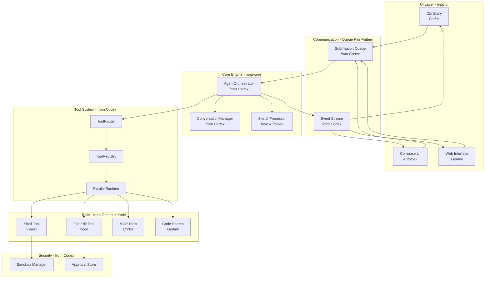

### 原始实现分析 (IDEA 版 AutoDev)

#### 核心组件架构

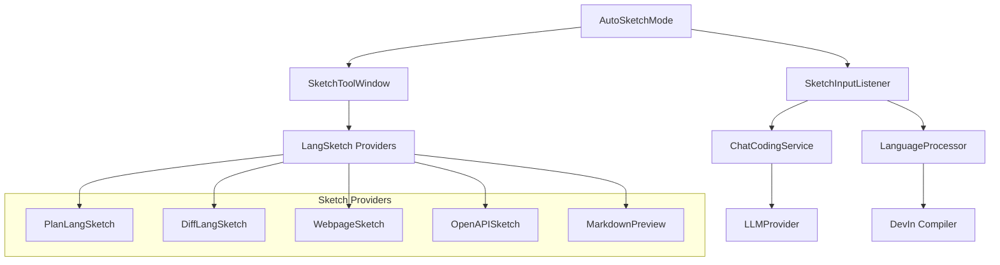

#### 关键特性

1. **自动模式 (AutoSketchMode)**
    * 解析 DevIn 代码块
    * 自动执行内置命令
    * 工具链函数支持
2. **输入监听器 (SketchInputListener)**
    * 处理用户输入
    * DevIn 编译
    * 模板渲染
3. **工具窗口 (SketchToolWindow)**
    * UI 渲染
    * 消息流处理
    * 扩展语言支持

### Codex 核心设计模式

> 详见：[docs/codex-architecture-analysis.md](docs/codex-architecture-analysis.md)

#### 1. Queue Pair 通信模式 ⭐

**适用场景**: mpp-core 与 mpp-ui 解耦

```kotlin
// Kotlin 实现示例
class CodingAgent {
    private val submissionChannel = Channel<Submission>(capacity = 64)
    private val eventChannel = Channel<Event>(capacity = Channel.UNLIMITED)
    
    suspend fun submit(op: Operation): String {
        val id = generateId()
        submissionChannel.send(Submission(id, op))
        return id
    }
    
    suspend fun nextEvent(): Event = eventChannel.receive()
}
```

#### 2. Tool Orchestrator 模式 ⭐⭐⭐

**核心价值**: 统一工具执行流程 - 审批 → 沙箱 → 执行 → 重试

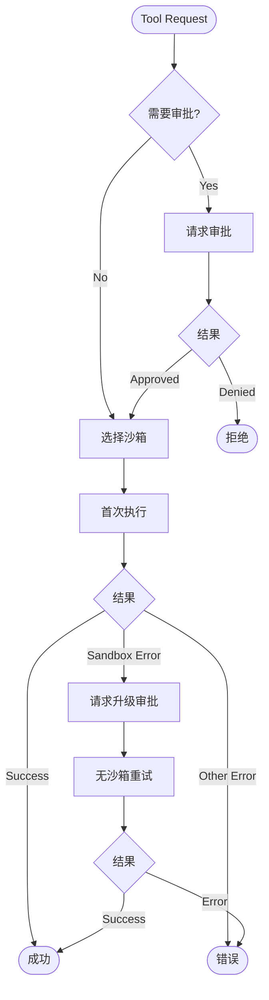

#### 3. Parallel Tool Execution ⭐⭐

**性能优化**: 读操作并行、写操作串行

```kotlin
class ToolCallRuntime {
    private val parallelLock = ReentrantReadWriteLock()
    
    suspend fun execute(tool: Tool, request: Request): Result {
        val lock = if (tool.supportsParallel) {
            parallelLock.readLock() // 允许多个并发
        } else {
            parallelLock.writeLock() // 独占执行
        }
        
        lock.lock()
        try {
            return tool.run(request)
        } finally {
            lock.unlock()
        }
    }
}
```

### Gemini CLI 参考架构

#### 核心设计原则

1. **工具驱动**: 内置文件操作、Shell 命令、Web 获取等工具。**参考 Kode 实现**：Kode 项目提供了一个健壮、可扩展的工具系统示例，其
   `src/Tool.ts` 定义了核心工具接口，而 `src/tools/FileEditTool/FileEditTool.tsx` 等具体工具则展示了如何通过 Zod
   进行输入验证、权限检查和丰富的 UI 渲染来实现这些工具。
2. **MCP 扩展**: 支持 Model Context Protocol 自定义集成
3. **会话管理**: 对话检查点和恢复
4. **上下文文件**: GEMINI.md 提供持久化上下文
5. **Agent 编排**: 专门的子 Agent 处理特定任务
6. **智能提示词**: 分层的系统提示词和上下文注入。**参考 Kode 实现**：Kode 的 `ModelAdapterFactory` (
   `src/services/modelAdapterFactory.ts`) 和 `ModelCapabilities` (`src/constants/modelCapabilities.ts`)
   提供了一个高级示例，展示了如何在代理架构中管理和利用多样化的 LLM，实现动态切换和适应不同的模型 API。

### MPP 重构架构设计

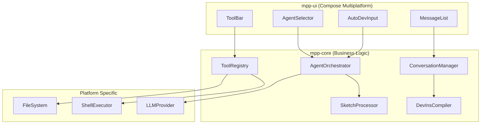

**参考 Kode 实现**：Kode 的 `src/tools.ts` 文件展示了如何聚合和管理工具，可作为 `ToolRegistry` 的实现蓝图。其
`src/services/modelAdapterFactory.ts` 和 `src/services/adapters/base.ts` 则为 `LLMProvider` 提供了统一的接口和多模型适配的优秀范例。

### 详细架构图

#### 整体架构概览

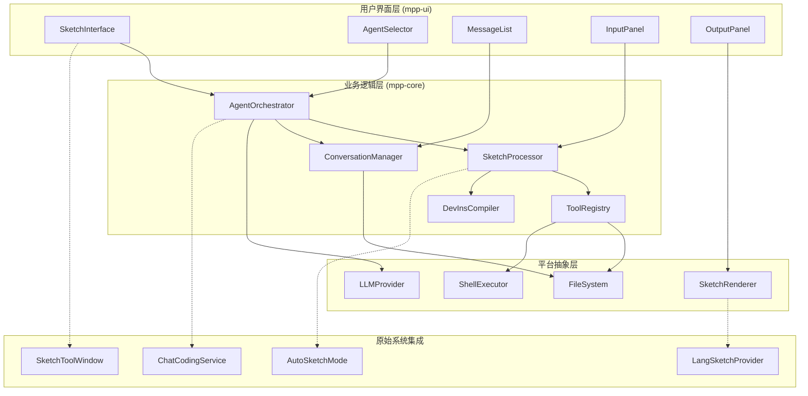

#### 数据流架构

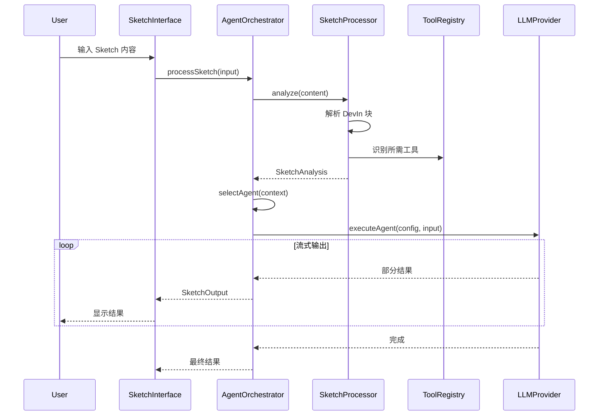

#### 组件依赖关系

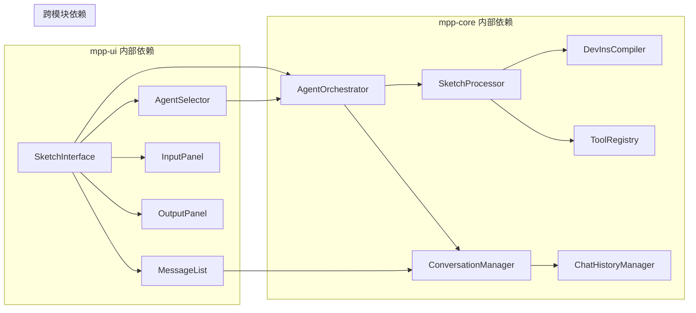

#### Agent 类型和能力映射

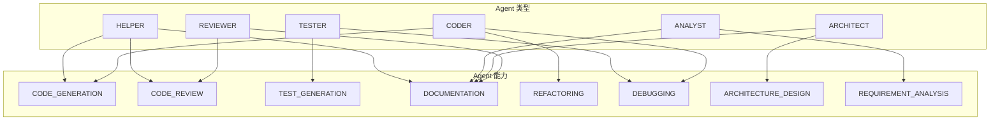

#### 工具系统集成

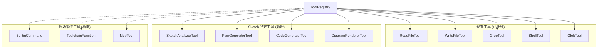

#### 平台适配策略

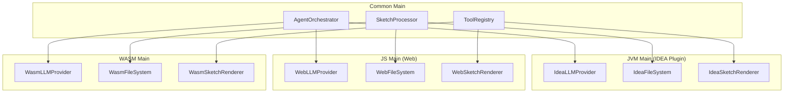

### 安全与沙箱

在构建能与本地文件系统和 Shell 环境交互的 AI Agent 时，安全性是至关重要的考量。`Kode` 项目通过 `--safe` 模式和在工具层面的
`needsPermissions()` 检查，提供了一个应用级的安全模型。然而，OpenAI 的 `codex` 项目展示了一种更深层次、更强大的安全架构，值得我们深入参考。

**参考 `codex` 实现：** `codex` 的核心优势之一是其基于策略的、利用操作系统原生功能的沙箱系统。这种设计提供了比应用级检查更根本的安全保障。

1. **多层次、特定平台的沙箱**：
    * **macOS**: 使用 `sandbox-exec` (Seatbelt) 来限制进程行为。
    * **Linux**: 使用 `seccomp-bpf` 和 `Landlock` 来创建受限的执行环境。
    * **Windows**: 使用受限令牌（Restricted Tokens）来降低进程权限。

2. **策略驱动的配置**：`codex` 不仅仅是简单地开启或关闭安全模式，而是提供了多个预设的、清晰的安全策略，用户可以通过
   `--sandbox` 标志轻松选择：
    * `read-only`: 只读策略，禁止任何文件写入和网络访问。
    * `workspace-write`: 工作区写入，允许在当前项目目录内进行写操作，但仍然限制网络和对其他目录的访问。
    * `danger-full-access`: 完全访问，用于在受信任的环境（如 Docker 容器）中运行时禁用沙箱。

3. **动态策略生成**：最值得借鉴的一点是，沙箱策略是动态生成的。例如，在 `workspace-write` 模式下，`codex` 会智能地禁止对工作区内的
   `.git` 目录进行写操作，从而保护版本控制历史的完整性。这是通过在启动沙箱时动态生成策略文件（如 macOS 的 `.sbpl` 文件）来实现的。

4. **独立的测试命令**：`codex` 提供了 `codex sandbox <platform> [COMMAND]` 命令，允许开发者测试和理解特定命令在沙箱中的行为，极大地增强了透明度和可调试性。

在我们的 `AutoDev` 项目重构中，尤其是在设计 `ShellExecutor` 和文件操作工具时，可以借鉴 `codex`
的分层安全理念。即使初期不实现完整的原生沙箱，也可以在设计上采用策略驱动的模式，例如定义不同的安全级别（`ReadOnly`,
`Workspace`, `Unrestricted`），并在工具执行前根据策略进行更细粒度的检查，从而为未来集成更底层的沙箱技术打下基础。

## 🧠 提示词与上下文工程

### 核心设计原则

1. **分层提示词系统**: 系统提示词 → Agent 特定提示词 → 上下文注入 → 任务查询。**参考 Kode 实现**：Kode 的命令系统（例如
   `src/commands/review.ts`）提供了一个实际示例，展示了如何构建“任务查询”，以及命令如何为 AI 生成详细的、工具感知的提示。
2. **模板化和参数化**: 支持变量替换、条件逻辑和动态内容生成。**参考 Kode 实现**：Kode 的 `Tool` 接口 (`src/Tool.ts`) 中的
   `prompt()` 方法及其在 `FileEditTool` (`src/tools/FileEditTool/prompt.ts`) 中的实现，展示了工具如何提供自己的提示词来指导
   AI 使用它们。
3. **上下文感知**: 根据工作空间、项目配置和用户意图动态调整提示词
4. **Token 优化**: 智能压缩和相关性过滤，最大化有效信息密度

### 提示词工程架构

#### 核心系统提示词结构

```typescript
// 基于 Gemini CLI 的系统提示词设计
interface SystemPromptConfig {
    // 核心身份和规则
    identity: string;           // "You are an interactive CLI agent..."
    coreMandates: string[];     // 核心约束和规则
    workflows: WorkflowConfig[]; // 主要工作流程
    guidelines: string[];       // 操作指导原则

    // 上下文注入
    contextSources: ContextSource[];

    // 工具配置
    availableTools: string[];
    toolUsageGuidelines: string;
}
```

#### 提示词模板系统

##### 基础模板结构

```kotlin
// mpp-core/src/commonMain/kotlin/cc/unitmesh/agent/prompt/PromptTemplate.kt
@Serializable
data class PromptTemplate(
    val name: String,
    val template: String,
    val variables: List<TemplateVariable> = emptyList(),
    val conditionals: List<ConditionalBlock> = emptyList(),
    val contextSources: List<ContextSource> = emptyList()
)

@Serializable
data class TemplateVariable(
    val name: String,
    val type: VariableType,
    val required: Boolean = true,
    val defaultValue: String? = null,
    val description: String = ""
)

enum class VariableType {
    STRING, NUMBER, BOOLEAN, LIST, OBJECT
}

@Serializable
data class ConditionalBlock(
    val condition: String,           // 条件表达式，如 "agentType == 'CODER'"
    val content: String,            // 条件为真时的内容
    val elseContent: String? = null // 条件为假时的内容
)

enum class ContextSource {
    WORKSPACE_STRUCTURE,    // 工作空间文件结构
    PROJECT_CONFIG,         // AGENTS.md 等项目配置
    GIT_INFO,              // Git 仓库信息
    BUILD_SYSTEM,          // 构建系统信息
    USER_MEMORY,           // 用户偏好记忆
    RECENT_FILES,          // 最近访问的文件
    ERROR_CONTEXT          // 错误上下文信息
}
```

#### Agent 特定提示词

##### 代码库调查员 Agent

```kotlin
val CODEBASE_INVESTIGATOR_PROMPT = PromptTemplate(
    name = "codebase_investigator",
    template = """
You are **Codebase Investigator**, a hyper-specialized AI agent and expert in reverse-engineering complex software projects.

Your **SOLE PURPOSE** is to build a complete mental model of the code relevant to a given investigation.

## Your Mission
- Find key modules, classes, and functions that are part of the problem and solution
- Understand *why* the code is written the way it is
- Foresee ripple effects of changes
- Provide actionable insights to the main agent

## Investigation Objective
${objective}

## Available Tools
You have access to read-only tools: ls, read_file, glob, grep

## Output Format
Provide a structured JSON report with:
- SummaryOfFindings: Key insights and conclusions
- ExplorationTrace: Step-by-step investigation actions
- RelevantLocations: Important files with reasoning and key symbols

**DO NOT** write implementation code yourself. Focus on analysis and insights.
""".trimIndent(),

    variables = listOf(
        TemplateVariable("objective", VariableType.STRING, description = "调查目标")
    )
)
```

##### 代码生成器 Agent

```kotlin
val CODE_GENERATOR_PROMPT = PromptTemplate(
    name = "code_generator",
    template = """
You are a **Code Generation Expert** specialized in creating high-quality, maintainable code.

## Your Expertise
- Following existing project conventions and patterns
- Generating clean, readable, and efficient code
- Creating appropriate tests and documentation
- Ensuring seamless integration with existing codebase

## Current Task
${task}

## Project Context
{{CONTEXT}}

## Guidelines
- Always analyze existing code patterns before generating new code
- Include unit tests for new functionality
- Follow the project's established coding style
- Add meaningful comments only when necessary
- Ensure all file paths are absolute

## Available Tools
${availableTools.join(', ')}
""".trimIndent(),

    variables = listOf(
        TemplateVariable("task", VariableType.STRING, description = "具体的代码生成任务"),
        TemplateVariable("availableTools", VariableType.LIST, description = "可用工具列表")
    ),

    contextSources = listOf(
        ContextSource.WORKSPACE_STRUCTURE,
        ContextSource.PROJECT_CONFIG,
        ContextSource.RECENT_FILES
    )
)
```

### 上下文工程系统

#### 上下文数据模型

```kotlin
// mpp-core/src/commonMain/kotlin/cc/unitmesh/agent/context/ContextModels.kt
@Serializable
data class ContextBundle(
    val workspaceContext: WorkspaceContext? = null,
    val projectContext: ProjectContext? = null,
    val environmentContext: EnvironmentContext? = null,
    val fileContents: Map<String, String> = emptyMap(),
    val gitContext: GitContext? = null,
    val buildSystemContext: BuildSystemContext? = null,
    val userMemory: UserMemory? = null,
    val recentActivity: RecentActivity? = null
)

@Serializable
data class WorkspaceContext(
    val rootDirectories: List<String>,
    val folderStructure: String,
    val totalFiles: Int,
    val primaryLanguages: List<String>,
    val lastUpdated: Long = Clock.System.now().toEpochMilliseconds()
)

// ... and other data classes from prompt_context_engineering_guide.md
```

    **参考 Kode 实现**：Kode 的 `Tool` 接口 (`src/Tool.ts`) 中定义的 `ToolUseContext` 是一个很好的运行时上下文示例，它包含了 `messageId`、`agentId`、`safeMode`、`readFileTimestamps` 和各种 `options` 等实用元素，展示了如何将上下文传递给工具执行。

#### 上下文提供者系统

##### 工作空间上下文提供者

```kotlin
// mpp-core/src/commonMain/kotlin/cc/unitmesh/agent/context/WorkspaceContextProvider.kt
class WorkspaceContextProvider(
    private val fileSystem: ToolFileSystem
) {
    private var cachedContext: WorkspaceContext? = null
    private var lastCacheTime: Long = 0
    private val cacheValidityMs = 30_000 // 30秒缓存

    suspend fun getWorkspaceContext(directories: List<String>): WorkspaceContext {
        // ...
    }

    private suspend fun buildFolderStructure(directories: List<String>): String {
        // ...
    }
}
```

##### 项目上下文加载器

```kotlin
// mpp-core/src/commonMain/kotlin/cc/unitmesh/agent/context/ProjectContextLoader.kt
class ProjectContextLoader(
    private val fileSystem: ToolFileSystem
) {
    suspend fun loadProjectContext(rootDirectory: String): ProjectContext {
        // ...
    }
}
```

#### 动态上下文解析器

```kotlin
// mpp-core/src/commonMain/kotlin/cc/unitmesh/agent/context/DynamicContextResolver.kt
class DynamicContextResolver(
    private val workspaceProvider: WorkspaceContextProvider,
    private val projectLoader: ProjectContextLoader,
    private val toolRegistry: ToolRegistry
) {
    suspend fun resolveContext(
        query: String,
        directories: List<String>,
        maxTokens: Int = 8000
    ): ContextBundle {
        // ...
    }
}
```

**参考 Kode 实现**：Kode 的 `Tool` 接口中的 `needsPermissions()` 方法和 `FileEditTool` 中的 `hasWritePermission()`
是将安全和权限检查直接集成到工具执行上下文中的关键，这为上下文管理提供了重要的安全考量。

## 核心模块与实现

### 工具系统架构

工具系统是 AI Agent 的核心，它赋予了 Agent 与外部世界交互的能力。`Kode` 和 `codex` 在此展现了两种不同的但都非常有效的设计哲学。

1. **`Kode` 的一体化工具对象**：
    * **设计**：`Kode` 的 `src/Tool.ts` 文件定义了一个全面的 `Tool` 接口。每个工具都是一个实现了该接口的独立对象，包含了工具的
      **定义**（`name`, `description`）、**Schema**（使用 Zod）、**执行逻辑**（`call` 方法）以及**UI 渲染**（`render...`方法）等所有方面。
    * **优点**：这种方法使得每个工具都高度自包含，易于理解和独立开发。对于简单的工具，开发速度很快。
    * **缺点**：所有功能集于一体，可能导致接口过于庞大，并且规范、实现和视图之间的耦合较紧。

2. **`codex` 的规范与实现分离**：
    * **设计**：`codex` 采用了更形式化的设计，将工具的**规范（Specification）**与**处理器（Handler）**分离。
        * `ToolSpec` (`codex-rs/core/src/tools/spec.rs`)：定义了工具的接口，即其名称、描述和参数 Schema。这部分是暴露给 AI
          模型的。
        * `ToolHandler` (`codex-rs/core/src/tools/registry.rs`)：一个包含 `handle` 方法的 Trait，负责工具的具体执行逻辑。
        * `ToolRegistry`：一个注册中心，通过工具名称将 `ToolSpec` 与其对应的 `ToolHandler` 关联起来，并负责分发调用。
    * **优点**：这种设计实现了高度解耦，使得工具的接口和实现可以独立演进。它也更具伸缩性，适合构建大型、复杂的工具集。
    * **缺点**：对于简单的工具，需要定义 `Spec` 和 `Handler` 两个部分，增加了少许模板代码。

**对我们项目的启示**：

在 `AutoDev` 的重构中，我们当前的 `mpp-core` 设计更接近 `Kode` 的一体化模型。这在项目初期是合适的，可以快速迭代。但随着工具变得越来越复杂，我们可以考虑借鉴
`codex` 的设计，将工具的 `Spec`（用于与 LLM 交互）和 `Handler`（实际执行逻辑）分离开来。这不仅能使代码结构更清晰，也为未来在不同平台（例如，在
JVM 端定义 Spec，但在 JS 端实现 Handler）或在不同安全上下文中（例如，为同一个 Spec 提供沙箱内和沙箱外的两种
Handler）实现同一个工具提供了可能性。

### 模块划分

#### mpp-core 核心模块

* **Agent 管理**: `AgentOrchestrator`, `AgentConfig`
* **对话管理**: `ConversationManager`
* **Sketch 处理器**: `SketchProcessor`

#### mpp-ui 界面模块

* **主界面组件**: `AutoDevSketchInterface`, `SketchInputPanel`, `SketchOutputPanel`

**参考其他技术**：虽然本项目采用 Compose Multiplatform 构建 UI，但值得注意的是，业界也存在其他优秀的终端 UI 构建方案。例如，
`codex` 项目使用 Rust 语言和 `Ratatui` 库构建其高性能的文本用户界面（TUI），这对于需要极致性能和原生体验的场景是一个很好的参考。

### 实现示例

本节提供的代码示例（Agent 编排器、Sketch 数据模型、Agent 配置、UI 组件）旨在提供核心概念的实现思路。这些示例的灵感来源于 Kode
项目的实际实现，建议深入研究 Kode 的源代码以获取更详细的参考。

#### 核心抽象层

##### Agent 编排器接口

```kotlin
// mpp-core/src/commonMain/kotlin/cc/unitmesh/agent/orchestrator/AgentOrchestrator.kt
package cc.unitmesh.agent.orchestrator

import cc.unitmesh.agent.config.AgentConfig
import cc.unitmesh.agent.sketch.SketchInput
import cc.unitmesh.agent.sketch.SketchOutput
import kotlinx.coroutines.flow.Flow

/**
 * Agent 编排器，负责协调不同 Agent 的执行
 * 参考 Gemini CLI 的 Agent 管理模式
 */
interface AgentOrchestrator {
    /**
     * 处理 Sketch 输入，返回流式输出
     */
    suspend fun processSketch(input: SketchInput): Flow<SketchOutput>

    /**
     * 根据上下文选择合适的 Agent
     */
    suspend fun selectAgent(context: SketchContext): AgentConfig

    /**
     * 执行指定的 Agent
     */
    suspend fun executeAgent(config: AgentConfig, input: String): Flow<String>

    /**
     * 获取可用的 Agent 列表
     */
    suspend fun getAvailableAgents(): List<AgentConfig>
}

/**
 * Sketch 上下文信息
 */
data class SketchContext(
    val projectPath: String?,
    val currentFile: String?,
    val selectedText: String?,
    val openFiles: List<String>,
    val userIntent: String,
    val tools: List<String> = emptyList()
)
```

**参考 Kode 实现**：Kode 的 `cli.tsx` 文件展示了主程序循环如何隐式地作为 `AgentOrchestrator` 协调命令和工具的执行，以及
`getTools()` (`src/tools.ts`) 如何动态提供工具。

##### Sketch 数据模型

```kotlin
// mpp-core/src/commonMain/kotlin/cc/unitmesh/agent/sketch/SketchModels.kt
package cc.unitmesh.agent.sketch

import kotlinx.serialization.Serializable

/**
 * Sketch 输入数据
 */
@Serializable
data class SketchInput(
    val content: String,
    val type: SketchInputType = SketchInputType.TEXT,
    val context: Map<String, String> = emptyMap()
)

/**
 * Sketch 输出数据
 */
@Serializable
data class SketchOutput(
    val content: String,
    val type: SketchOutputType,
    val metadata: Map<String, String> = emptyMap(),
    val timestamp: Long = kotlinx.datetime.Clock.System.now().toEpochMilliseconds()
)

enum class SketchInputType {
    TEXT, CODE, MARKDOWN, DEVIN
}

enum class SketchOutputType {
    TEXT, CODE, PLAN, DIAGRAM, ERROR, TOOL_RESULT
}

/**
 * DevIn 代码块
 */
@Serializable
data class DevInBlock(
    val content: String,
    val language: String = "devin",
    val commands: List<String> = emptyList()
)

/**
 * Sketch 分析结果
 */
@Serializable
data class SketchAnalysis(
    val intent: String,
    val complexity: SketchComplexity,
    val requiredTools: List<String>,
    val suggestedAgent: String,
    val devInBlocks: List<DevInBlock> = emptyList()
)

enum class SketchComplexity {
    SIMPLE, MEDIUM, COMPLEX
}
```

##### Agent 配置

```kotlin
// mpp-core/src/commonMain/kotlin/cc/unitmesh/agent/config/AgentConfig.kt
package cc.unitmesh.agent.config

import kotlinx.serialization.Serializable

/**
 * Agent 配置，参考原始 CustomAgentConfig 但简化为跨平台版本
 */
@Serializable
data class AgentConfig(
    val name: String,
    val type: AgentType,
    val description: String = "",
    val systemPrompt: String = "",
    val capabilities: List<AgentCapability> = emptyList(),
    val tools: List<String> = emptyList(),
    val maxTokens: Int = 4096,
    val temperature: Double = 0.7,
    val enabled: Boolean = true
)

enum class AgentType {
    CODER,      // 代码生成和修改
    REVIEWER,   // 代码审查
    TESTER,     // 测试生成
    ARCHITECT,  // 架构设计
    ANALYST,    // 需求分析
    HELPER,     // 通用助手
    CUSTOM      // 自定义
}

enum class AgentCapability {
    CODE_GENERATION,
    CODE_REVIEW,
    TEST_GENERATION,
    DOCUMENTATION,
    REFACTORING,
    DEBUGGING,
    ARCHITECTURE_DESIGN,
    REQUIREMENT_ANALYSIS
}
```

**参考 Kode 实现**：Kode 的 `ModelProfile` (`@utils/config`) 和 `ModelCapabilities` (
`src/constants/modelCapabilities.ts`) 提供了一个复杂的示例，展示了如何定义和管理 Agent/模型配置，包括其特定功能和 API 交互。

#### UI 组件扩展

##### Agent 选择器组件

```kotlin
// mpp-ui/src/main/kotlin/cc/unitmesh/devins/ui/compose/agent/AgentSelector.kt
package cc.unitmesh.devins.ui.compose.agent

import androidx.compose.foundation.layout.*
import androidx.compose.material3.*
import androidx.compose.runtime.*
import androidx.compose.ui.Modifier
import androidx.compose.ui.unit.dp
import cc.unitmesh.agent.config.AgentConfig

@OptIn(ExperimentalMaterial3Api::class)
@Composable
fun AgentSelector(
    agents: List<AgentConfig>,
    selectedAgent: AgentConfig?,
    onAgentSelected: (AgentConfig) -> Unit,
    modifier: Modifier = Modifier
) {
    var expanded by remember { mutableStateOf(false) }

    ExposedDropdownMenuBox(
        expanded = expanded,
        onExpandedChange = { expanded = !expanded },
        modifier = modifier
    ) {
        OutlinedTextField(
            value = selectedAgent?.name ?: "选择 Agent",
            onValueChange = { },
            readOnly = true,
            trailingIcon = { ExposedDropdownMenuDefaults.TrailingIcon(expanded = expanded) },
            modifier = Modifier.menuAnchor()
        )

        ExposedDropdownMenu(
            expanded = expanded,
            onDismissRequest = { expanded = false }
        ) {
            agents.forEach { agent ->
                DropdownMenuItem(
                    text = {
                        Column {
                            Text(agent.name)
                            Text(
                                text = agent.description,
                                style = MaterialTheme.typography.bodySmall,
                                color = MaterialTheme.colorScheme.onSurfaceVariant
                            )
                        }
                    },
                    onClick = {
                        onAgentSelected(agent)
                        expanded = false
                    }
                )
            }
        }
    }
}
```

## 实施计划与测试

**关于构建系统的思考**：对于像 `codex` 这样包含 Rust 原生组件和多语言环境的复杂项目，它采用了 `Nix` (`flake.nix`)
来确保开发和构建环境的一致性和可复现性。在我们的项目进入更复杂的阶段时，尤其是在需要管理原生依赖或确保跨团队环境一致性时，
`Nix` 是一个值得考虑的高级方案。

### 实现步骤

#### 阶段 1: 核心抽象层 (mpp-core)

1. **创建 Agent 抽象**: `AgentOrchestrator`, `AgentDefinition`, `AgentExecutor`
2. **实现提示词工程系统**: `PromptTemplateEngine`, `SystemPromptBuilder`
3. **实现上下文工程系统**: `WorkspaceContextManager`, `DynamicContextResolver`
4. **实现对话管理**: 扩展 `ChatHistoryManager`
5. **Sketch 处理器**: 移植 `AutoSketchMode` 逻辑

#### 阶段 2: UI 层重构 (mpp-ui)

1. **主界面重构**: 基于 `AutoDevInput` 扩展
2. **消息渲染**: 扩展 `MessageList` 支持 Sketch 输出

#### 阶段 3: 平台集成

1. **工具系统集成**: 利用 `ToolRegistry`
2. **LLM 集成**: 适配现有 LLM 服务

### 测试策略

* **单元测试**: `SketchProcessorTest`
* **集成测试**: `SketchIntegrationTest`
* **UI 测试**: `SketchUITest`

## 性能与错误处理

### 性能考虑

1. **内存管理**: 使用 `Flow` 进行流式处理，分页加载历史
2. **并发处理**: 使用协程并行分析
3. **缓存策略**: 缓存 `SketchAnalysis` 结果

### 错误处理策略

#### 分层错误处理

```kotlin
sealed class SketchError : Exception() {
    data class CompilationError(val details: String) : SketchError()
    data class ToolExecutionError(val toolName: String, val error: String) : SketchError()
    data class LLMError(val provider: String, val error: String) : SketchError()
    data class PlatformError(val platform: String, val error: String) : SketchError()
}
```
