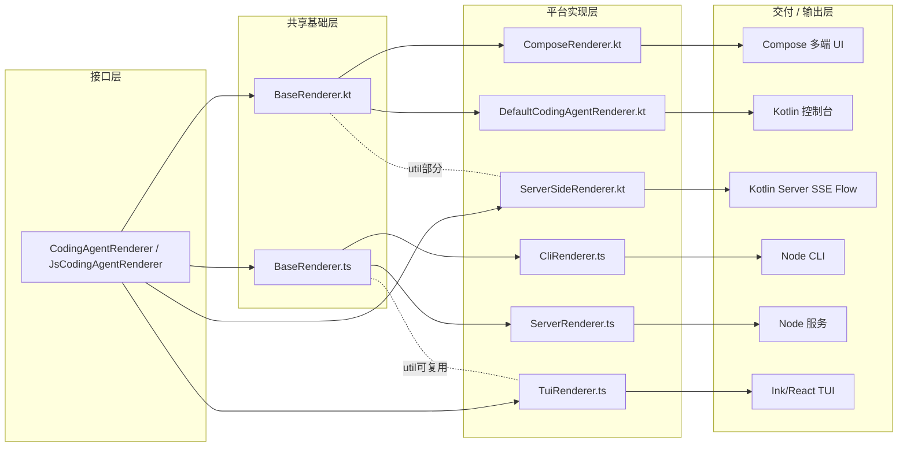

# 多平台 Renderer 架构概述

本文介绍 `BaseRenderer` 及其在 Kotlin Multiplatform (KMP) 与 TypeScript/Node.js 环境中的整合方式，展示如何通过统一的接口与基础实现支持多端渲染需求（CLI、Server、Compose UI 等）。

## 架构总览

核心思想：以 KMP 的通用接口 `CodingAgentRenderer` 作为唯一渲染契约；在 Kotlin 端与 JS 端分别提供镜像式的 `BaseRenderer` 基础类，封装通用逻辑（增量流式输出、devin block 过滤、重复分析检测等），平台特定的 renderer 只需关注输出与状态管理。

```mermaid
%% 引用独立文件可在构建或文档站统一渲染；此处直接内联方便快速浏览
flowchart TB
  subgraph Core
    I["CodingAgentRenderer.kt\n接口契约"]
    BRK["BaseRenderer.kt\n通用基础实现"]
    JSE["RendererExports.kt\nJs 导出接口"]
    I --> BRK
    I --> JSE
  end

  subgraph KotlinSide
    CR["ComposeRenderer.kt\n继承 BaseRenderer\n管理 UI 状态"]
    DEF["DefaultCodingAgentRenderer.kt\n继承 BaseRenderer\n控制台输出"]
    SSR["ServerSideRenderer.kt\n实现接口\nSSE 事件流"]
    BRK --> DEF
    I --> SSR
  end

  subgraph JSSide
    BRTS["BaseRenderer.ts\n镜像基础实现"]
    CLIRS["CliRenderer.ts\n命令行输出"]
    SVRS["ServerRenderer.ts\nSSE & 日志"]
    TUIRS["TuiRenderer.ts\nReact/Ink\n直接实现接口"]
    JSE --> BRTS
    BRTS --> CLIRS
    BRTS --> SVRS
    JSE --> TUIRS
  end

  BRK --> CR

  subgraph Consumers
    CLI[CLI 应用]
    SRV[Server 服务]
    UI[Compose 多端界面]
  end

  CLIRS --> CLI
  SVRS --> SRV
  CR --> UI
  DEF --> UI
  SSR --> SSE

  subgraph Ext[扩展点]
    EXT1[平台输出抽象\n(outputContent, outputNewline)]
    EXT2[可覆盖钩子\nrenderRepeatAnalysisWarning]
  end

  BRK -. 覆盖 .- EXT2
  BRTS -. 覆盖 .- EXT1
```

## 关键组成

- 接口层：`CodingAgentRenderer`（Kotlin）与其 JS 导出 `JsCodingAgentRenderer` 保证跨平台方法签名一致。
- 基础实现：`BaseRenderer.kt` / `BaseRenderer.ts` 提供共享的推理缓冲、重复检测、流式过滤等逻辑。
- 平台实现：
  - `ComposeRenderer.kt`：结合 Jetpack Compose / Compose Multiplatform 的响应式状态（Timeline、Tool 调用、错误等）。
  - `CliRenderer.ts`：终端高亮与增量打印。
  - `ServerRenderer.ts`：面向后端推送（SSE）、日志与进度事件。
  - `TuiRenderer.ts`：React/Ink 特殊模式，直接实现接口（未来可抽取公共工具函数）。

## 通用能力（由 BaseRenderer 提供）

1. Devin block 过滤：移除 `<devin>...</devin>` 及不完整片段避免 UI 抖动。
2. 增量流式输出：缓冲 + 去重 + 按需截断（CLI / Compose）。
3. 重复分析检测：相似度（词集合交集比）> 0.8 连续两次触发警告钩子。
4. 换行清理：统一多余空行，提升可读性。
5. 钩子覆盖：`renderRepeatAnalysisWarning` 可在不同端定制样式。

## 平台差异点

| 平台 | 关注点 | 特殊方法 | 状态管理 | 是否继承 BaseRenderer |
|-------|--------|----------|----------|------------------------|
| Compose | UI 可观察状态、时间线合并 | `addLiveTerminal`, `forceStop` | `mutableState*` | ✅ |
| Kotlin 默认控制台 | 简洁打印、日志 | 无 | stdout + 日志 | ✅（DefaultCodingAgentRenderer） |
| Kotlin Server | SSE 事件流（Flow） | 通过 `AgentEvent` 推送 | Flow/Channel | ❌（直接实现接口） |
| Node CLI | 增量白字输出+警告高亮 | 无 | stdout | ✅（CliRenderer） |
| Node Server | SSE/日志/进度 | `renderEvent` 等 | 事件分发 | ✅（ServerRenderer） |
| Node TUI | React 组件式渲染 | 组件态 | React state/context | ❌（直接实现） |

## 扩展指南

新增平台时：
1. 引入 `JsCodingAgentRenderer` 或 `CodingAgentRenderer` 接口。
2. 优先继承对应语言的 `BaseRenderer`，仅实现输出相关抽象：`outputContent` / `outputNewline`（TS）。
3. 若使用非线性渲染框架（如 React/Ink），可直接实现接口，并按需复制或封装基础算法为独立 util。
4. 更新文档与测试，确保方法签名一致。

## 常见演进场景

- 增加新的过滤规则：只需在两个 BaseRenderer 同步增加函数与调用点。
- 扩充生命周期方法：先改接口 → 更新导出 → 再调适各实现。
- 引入富媒体输出（如代码块折叠）：在平台 renderer 中覆盖对应输出逻辑，不改核心算法。

## 其它分层视图（Layered）

下图从“分层视角”展示接口、基础实现、平台渲染与交付通道的对应关系：



## 质量与保持一致性

遵循以下操作顺序可避免分叉：接口 → 基础实现 → 导出适配 → 具体 renderer → 测试 → 文档。

## 总结

通过“接口统一 + 镜像式基础实现 + 最小平台差异”模式，`BaseRenderer` 让多端渲染共享关键的智能逻辑，同时保持各平台的表现自由度。该设计可低成本扩展至更多运行环境（如浏览器纯前端、IDE 插件），仅需在输出层对接，而无需重写推理/过滤/检测核心。

---
相关文件索引：`mpp-core/src/commonMain/kotlin/cc/unitmesh/agent/render/BaseRenderer.kt`，`mpp-ui/src/jsMain/typescript/agents/render/BaseRenderer.ts`，`mpp-ui/src/commonMain/kotlin/cc/unitmesh/devins/ui/compose/agent/ComposeRenderer.kt`。
