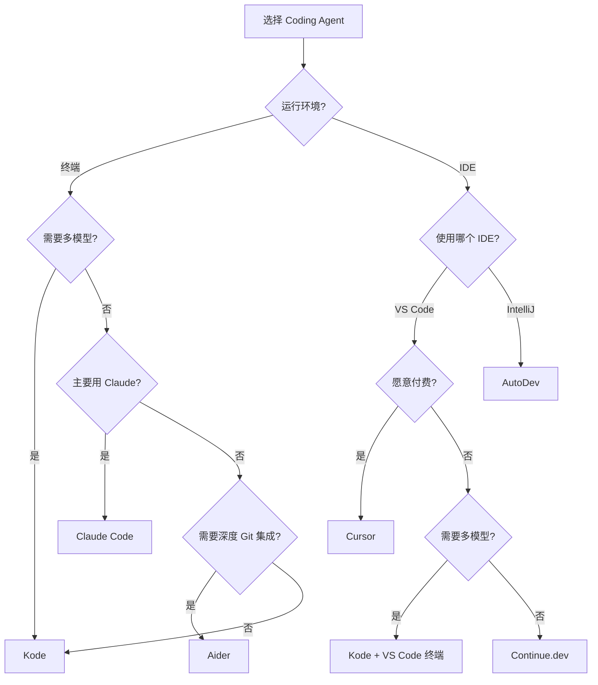

# Kode 对比分析：Coding Agent 生态全景

本文档通过对比 Kode 与其他主流 Coding Agent，揭示各自的设计哲学、技术选型和适用场景。

---

## 一、Coding Agent 分类框架

根据设计目标和实现方式，当前的 Coding Agent 可以分为以下几类：

### 1.1 分类维度

| 维度 | 说明 | 代表项目 |
|------|------|---------|
| **运行环境** | 独立终端 vs IDE 集成 vs Web 应用 | Kode(终端), AutoDev(IDE), Cursor(IDE) |
| **模型策略** | 单一模型 vs 多模型协作 | Claude Code(单一), Kode(多模型) |
| **工具系统** | 内置工具 vs 可扩展框架 | Aider(内置), Kode(MCP+工具接口) |
| **Agent 架构** | 单 Agent vs 多 Agent 协作 | Gemini CLI(单), Kode(多 Agent) |
| **开源策略** | 完全开源 vs 部分开源 vs 闭源 | Kode(开源), Cursor(闭源) |

### 1.2 技术栈对比

| 项目 | 语言 | UI 框架 | LLM 集成 | 工具扩展 |
|------|------|---------|----------|----------|
| **Kode** | TypeScript | Ink (React) | 多 LLM Adapter | MCP + Tool Interface |
| **Claude Code** | TypeScript | Ink | Anthropic SDK | 内置 + MCP |
| **Aider** | Python | Rich | LiteLLM | 内置工具 |
| **Cursor** | TypeScript/Rust | Electron | 内置 | 闭源插件系统 |
| **AutoDev (本项目)** | Kotlin | IntelliJ Platform | Gemini SDK | DevInsFlow + Extension |
| **Gemini CLI** | TypeScript | Ink | Gemini SDK | 内置工具 |

---

## 二、Kode vs Claude Code

### 2.1 架构对比

**相同点**:
- 都使用 TypeScript + Ink 构建终端 UI
- 都支持 MCP 协议集成外部工具
- 都实现了细粒度的权限系统
- 都支持 `.claude` 目录的 Agent 配置

**关键差异**:

| 特性 | Kode | Claude Code |
|------|------|-------------|
| **开源协议** | Apache 2.0 (完全开源) | 闭源 |
| **模型支持** | 无限制（OpenAI, Anthropic, 自定义） | 仅 Anthropic Claude |
| **多模型协作** | ✅ ModelManager + @ask-model | ❌ 不支持 |
| **子任务委托** | ✅ TaskTool + Agent 系统 | ❌ 不支持 |
| **Agent 热重载** | ✅ 文件监听 + 缓存清理 | ❌ 需要重启 |
| **配置优先级** | 5 层（built-in → user → project） | 2 层（user → project） |
| **API 适配器** | 抽象适配器工厂 | 直接 SDK 调用 |

### 2.2 代码架构对比

**Kode 的优势**:
```typescript
// 1. 多模型管理
const modelManager = new ModelManager(config)
modelManager.switchModel('gpt-5')  // 运行时切换

// 2. 专家咨询
@ask-claude-opus "Analyze this architecture"
@ask-gpt-5 "Optimize this algorithm"

// 3. 子任务委托
{
  description: "Database optimization",
  prompt: "Optimize the user table queries",
  subagent_type: "database-specialist",
  model_name: "gpt-5"
}

// 4. API 抽象
const adapter = ModelAdapterFactory.createAdapter(profile)
await adapter.createCompletion(params)
```

**Claude Code 的优势**:
- 与 Claude 模型深度集成（如 Extended Thinking）
- 经过 Anthropic 官方测试和优化
- 更稳定的生产环境表现
- 官方支持和文档

### 2.3 适用场景

**选择 Kode 的理由**:
- 需要使用多种 LLM 模型（OpenAI, Anthropic, Gemini 等）
- 需要跨模型协作（不同模型的优势互补）
- 需要自定义 Agent 和工具
- 团队需要完全掌控代码（开源）
- 预算有限，希望使用更便宜的模型

**选择 Claude Code 的理由**:
- 只使用 Anthropic Claude 模型
- 追求稳定性和官方支持
- 不需要多模型协作功能
- 不需要修改源代码

---

## 三、Kode vs Aider

### 3.1 设计哲学差异

| 维度 | Kode | Aider |
|------|------|-------|
| **核心理念** | 多模型协作 + Agent 系统 | Git 中心化 + 简单高效 |
| **技术栈** | TypeScript (Node/Bun) | Python |
| **UI 框架** | Ink (React for CLI) | Rich (Python TUI) |
| **编辑模式** | Search-Replace | Diff + Whole File + Diff-Fenced |
| **Git 集成** | 基础支持 | 深度集成（auto-commit, git blame） |
| **上下文管理** | 自动压缩 | Repository Map + 手动添加 |

### 3.2 编辑模式对比

**Kode 的 Search-Replace**:
```typescript
{
  file_path: "src/App.tsx",
  old_string: "const [count, setCount] = useState(0)",
  new_string: "const [count, setCount] = useState(10)"
}
```

**优点**:
- 简单直观，易于理解
- LLM 容易生成正确的参数
- 适合小范围修改

**缺点**:
- 多处修改需要多次调用
- 大范围重构效率较低
- 需要精确匹配 old_string

**Aider 的 Diff Mode**:
```python
# Unified diff format
--- src/App.tsx
+++ src/App.tsx
@@ -1,3 +1,3 @@
-const [count, setCount] = useState(0)
+const [count, setCount] = useState(10)
```

**优点**:
- 支持一次修改多个位置
- 适合大范围重构
- 更接近 Git 的工作方式

**缺点**:
- LLM 容易生成格式错误的 diff
- 需要更复杂的解析逻辑
- 对 LLM 要求更高

### 3.3 上下文管理策略

**Kode 的自动压缩**:
```typescript
// 当 token 使用率 > 80% 时自动压缩
const { messages, wasCompacted } = await checkAutoCompact(messages, context)

if (wasCompacted) {
  // 保留最近 10 条消息
  // 总结更早的消息
}
```

**Aider 的 Repository Map**:
```python
# 自动生成代码库地图
/add src/  # 添加整个目录到上下文
/map-refresh  # 刷新 repository map

# Map 包含:
# - 文件列表
# - 函数/类定义
# - 文件之间的依赖关系
```

**对比**:

| 策略 | Kode 自动压缩 | Aider Repository Map |
|------|---------------|---------------------|
| **Token 效率** | ⭐⭐⭐ | ⭐⭐⭐⭐⭐ |
| **准确性** | ⭐⭐⭐⭐ | ⭐⭐⭐⭐ |
| **用户控制** | ⭐⭐ | ⭐⭐⭐⭐⭐ |
| **自动化程度** | ⭐⭐⭐⭐⭐ | ⭐⭐⭐ |

### 3.4 Git 集成深度

**Aider 的 Git 优势**:
```bash
# 自动提交
aider --auto-commits

# Git blame 集成
aider --blame

# 分支管理
aider --branch feature/new-feature

# Commit 消息自动生成
aider --commit  # AI 生成 commit message
```

**Kode 的 Git 支持**:
```typescript
// 基础 Git 操作通过 BashTool
@bash git add .
@bash git commit -m "Update feature"

// 没有深度集成
```

**结论**: Aider 在 Git 工作流集成上显著领先。

---

## 四、Kode vs AutoDev (本项目)

### 4.1 运行环境差异

| 特性 | Kode | AutoDev |
|------|------|---------|
| **运行环境** | 独立终端进程 | IntelliJ IDE 插件 |
| **语言** | TypeScript | Kotlin |
| **UI** | Ink (CLI) | Swing (IDE) |
| **模型** | 多 LLM | 主要 Gemini |
| **工具系统** | MCP + Tool Interface | DevInsFlow + Extension |

### 4.2 Agent 系统对比

**Kode 的动态 Agent**:
```markdown
---
name: database-specialist
description: "Database expert"
tools: ["FileRead", "FileEdit", "Bash"]
model_name: gpt-5
---

You are a database expert...
```

**特点**:
- Markdown + YAML 配置
- 5 层优先级覆盖
- 热重载支持
- 兼容 Claude Code `.claude` 目录

**AutoDev 的 DevInsFlow**:
```kotlin
// 通过 Kotlin DSL 定义
class DatabaseFlow : DevInsFlow {
    override fun execute(context: FlowContext) {
        // 1. 分析数据库模式
        val schema = analyzeSchema()
        
        // 2. 生成优化建议
        val suggestions = generateSuggestions(schema)
        
        // 3. 应用优化
        applySuggestions(suggestions)
    }
}
```

**特点**:
- 编程式定义（Kotlin DSL）
- 强类型检查
- 深度 IDE 集成
- 可调用 IDE API

### 4.3 架构设计对比

**Kode 三层架构**:
```
UI Layer (REPL.tsx)
    ↓
Orchestration Layer (query.ts + claude.ts)
    ↓
Tool Execution Layer (tools/* + MCP)
```

**AutoDev 插件化架构**:
```
IDE Integration Layer (IntelliJ API)
    ↓
Core Engine (DevInsFlow + LLM Service)
    ↓
Extension System (Custom Extensions)
```

### 4.4 优劣势分析

**Kode 的优势**:
- 独立运行，不依赖特定 IDE
- 多模型协作能力
- 更灵活的工具扩展（MCP）
- 开源，社区驱动

**AutoDev 的优势**:
- 深度 IDE 集成（代码导航、重构等）
- 访问项目结构和索引
- 可视化 UI（Swing）
- 利用 IDE 的语言服务

**适用场景**:
- **Kode**: 多语言项目、终端工作流、多模型协作
- **AutoDev**: JVM 项目、需要 IDE 功能、团队统一工具

---

## 五、Kode vs Cursor

### 5.1 商业模式差异

| 维度 | Kode | Cursor |
|------|------|--------|
| **开源性** | 完全开源 (Apache 2.0) | 闭源 |
| **定价** | 免费（自备 API Key） | $20/月 (Pro) |
| **模型** | 任意 LLM | 内置 + 自定义 |
| **IDE** | 独立终端 | Fork of VS Code |

### 5.2 功能对比

| 功能 | Kode | Cursor |
|------|------|--------|
| **代码补全** | ❌ | ✅ (Tab) |
| **代码生成** | ✅ (通过对话) | ✅ (Cmd+K) |
| **项目搜索** | ✅ (Grep, Glob) | ✅ (Codebase Index) |
| **文件编辑** | ✅ (FileEditTool) | ✅ (Apply) |
| **多文件编辑** | ✅ (MultiEditTool) | ✅ (Composer) |
| **终端执行** | ✅ (BashTool) | ⚠️ (有限支持) |
| **MCP 集成** | ✅ | ❌ |
| **多模型协作** | ✅ | ❌ |
| **可视化 UI** | ❌ | ✅ |

### 5.3 用户体验对比

**Cursor 的优势**:
- **即时代码补全** - Tab 键触发，类似 GitHub Copilot
- **可视化编辑** - 代码 diff 预览
- **IDE 集成** - 完整的 VS Code 体验
- **Composer 模式** - 多文件协同编辑
- **代码库索引** - 快速语义搜索

**Kode 的优势**:
- **终端原生** - 适合 SSH、容器、CI/CD
- **模型灵活性** - 随时切换不同 LLM
- **开源透明** - 完全掌控代码和数据
- **多 Agent 协作** - 复杂任务分解
- **成本控制** - 使用便宜的模型

---

## 六、综合评分矩阵

### 6.1 功能完整性

| 功能 | Kode | Claude Code | Aider | Cursor | AutoDev |
|------|------|-------------|-------|--------|---------|
| 代码编辑 | ⭐⭐⭐⭐ | ⭐⭐⭐⭐ | ⭐⭐⭐⭐⭐ | ⭐⭐⭐⭐⭐ | ⭐⭐⭐⭐ |
| 终端执行 | ⭐⭐⭐⭐⭐ | ⭐⭐⭐⭐⭐ | ⭐⭐⭐⭐ | ⭐⭐⭐ | ⭐⭐⭐⭐ |
| 代码搜索 | ⭐⭐⭐⭐ | ⭐⭐⭐⭐ | ⭐⭐⭐⭐⭐ | ⭐⭐⭐⭐⭐ | ⭐⭐⭐⭐ |
| Git 集成 | ⭐⭐ | ⭐⭐ | ⭐⭐⭐⭐⭐ | ⭐⭐⭐⭐ | ⭐⭐⭐ |
| 多模型支持 | ⭐⭐⭐⭐⭐ | ⭐ | ⭐⭐⭐⭐ | ⭐⭐⭐ | ⭐⭐ |
| 工具扩展 | ⭐⭐⭐⭐⭐ | ⭐⭐⭐⭐ | ⭐⭐ | ⭐ | ⭐⭐⭐⭐ |
| Agent 系统 | ⭐⭐⭐⭐⭐ | ⭐⭐⭐ | ⭐ | ⭐ | ⭐⭐⭐⭐ |
| IDE 集成 | ⭐ | ⭐ | ⭐ | ⭐⭐⭐⭐⭐ | ⭐⭐⭐⭐⭐ |

### 6.2 技术特征

| 特征 | Kode | Claude Code | Aider | Cursor | AutoDev |
|------|------|-------------|-------|--------|---------|
| 开源程度 | 100% | 0% | 100% | 0% | 100% |
| 类型安全 | ✅ TS | ✅ TS | ❌ Python | ✅ TS/Rust | ✅ Kotlin |
| 异步架构 | ✅ Generator | ✅ Stream | ✅ Async/Await | ✅ Stream | ✅ Coroutine |
| 测试覆盖 | ⭐⭐⭐ | ⭐⭐⭐⭐ | ⭐⭐⭐⭐ | Unknown | ⭐⭐⭐ |
| 文档质量 | ⭐⭐⭐⭐ | ⭐⭐⭐⭐⭐ | ⭐⭐⭐⭐⭐ | ⭐⭐⭐⭐ | ⭐⭐⭐ |

### 6.3 适用场景推荐

| 场景 | 推荐方案 | 理由 |
|------|----------|------|
| **多模型协作** | Kode | 独家支持 @ask-model 和 TaskTool |
| **Git 深度集成** | Aider | 自动 commit、blame、branch 管理 |
| **VS Code 用户** | Cursor | Fork of VS Code，无缝体验 |
| **IntelliJ 用户** | AutoDev | 深度 IDE 集成 |
| **Claude 重度用户** | Claude Code | 官方优化，Extended Thinking |
| **终端工作流** | Kode | 独立进程，适合 SSH/容器 |
| **企业私有部署** | Kode / AutoDev | 开源，可自托管 |
| **快速原型开发** | Cursor | 可视化 UI，即时反馈 |
| **大型代码库** | Aider | Repository Map 高效管理上下文 |
| **多语言项目** | Kode | 语言无关的工具系统 |

---

## 七、未来发展趋势

### 7.1 技术演进方向

**多模型编排**:
- Kode 已经领先，其他项目可能跟进
- 预计会出现更复杂的模型路由策略
- 成本优化：便宜模型处理简单任务，昂贵模型处理复杂任务

**Agent 协作**:
- 从单 Agent 到多 Agent 系统
- 专业化 Agent（前端、后端、测试、DevOps）
- Agent 之间的通信和协调机制

**IDE 深度集成**:
- 终端工具（Kode, Aider）可能推出 IDE 插件
- IDE 插件（AutoDev）可能推出独立 CLI
- 统一的 Agent 接口标准

**标准化协议**:
- MCP (Model Context Protocol) 成为事实标准
- AGENTS.md 规范推广
- 跨工具的 Agent 配置共享

### 7.2 商业模式演变

**开源 vs 闭源**:
- 开源项目（Kode, Aider, AutoDev）通过服务和支持变现
- 闭源项目（Cursor, Claude Code）通过订阅变现
- 混合模式：开源核心 + 付费高级功能

**社区驱动**:
- 插件市场和 Agent 市场
- 社区贡献的工具和配置
- 企业级支持服务

---

## 八、选型决策树



---

## 九、对 AutoDev 的启示

基于对 Kode 的深入分析，AutoDev 可以借鉴以下设计：

### 9.1 多模型支持

**当前**: 主要支持 Gemini
**改进**: 
```kotlin
interface LLMAdapter {
    suspend fun createCompletion(params: CompletionParams): CompletionResponse
}

class GeminiAdapter : LLMAdapter { ... }
class OpenAIAdapter : LLMAdapter { ... }
class AnthropicAdapter : LLMAdapter { ... }

class ModelManager {
    private val adapters = mutableMapOf<String, LLMAdapter>()
    
    fun registerAdapter(name: String, adapter: LLMAdapter) {
        adapters[name] = adapter
    }
    
    suspend fun query(model: String, params: CompletionParams): CompletionResponse {
        val adapter = adapters[model] ?: error("Model not found")
        return adapter.createCompletion(params)
    }
}
```

### 9.2 动态 Agent 系统

**当前**: DevInsFlow 需要编译
**改进**:
```kotlin
// 支持运行时加载 Agent 配置
class AgentLoader {
    fun loadFromMarkdown(path: Path): AgentConfig {
        val (frontmatter, body) = parseMarkdown(path)
        return AgentConfig(
            name = frontmatter["name"],
            description = frontmatter["description"],
            tools = frontmatter["tools"],
            systemPrompt = body
        )
    }
    
    fun watchAgentDirectory(dir: Path) {
        // 监听 .kode/agents/ 目录变化
        WatchService.observe(dir) { event ->
            when (event.type) {
                CREATED, MODIFIED -> reloadAgent(event.file)
                DELETED -> removeAgent(event.file)
            }
        }
    }
}
```

### 9.3 MCP 集成

**当前**: Extension 系统
**改进**:
```kotlin
// 集成 MCP 协议
class MCPClient(private val config: MCPServerConfig) {
    private val client = Client(ClientInfo("autodev", VERSION))
    
    suspend fun connect() {
        val transport = when {
            config.url != null -> SSEClientTransport(config.url)
            else -> StdioClientTransport(config.command, config.args)
        }
        client.connect(transport)
    }
    
    suspend fun listTools(): List<MCPTool> {
        return client.listTools().tools
    }
    
    suspend fun callTool(name: String, args: Map<String, Any>): ToolResult {
        return client.callTool(name, args)
    }
}
```

### 9.4 工具并发执行

**当前**: 串行执行
**改进**:
```kotlin
class ToolExecutor {
    suspend fun executeTools(calls: List<ToolCall>): List<ToolResult> = coroutineScope {
        // 区分并发安全和非安全工具
        val safeCalls = calls.filter { it.tool.isConcurrencySafe }
        val unsafeCalls = calls.filter { !it.tool.isConcurrencySafe }
        
        // 并发执行安全工具
        val safeResults = safeCalls.map { call ->
            async { executeSingleTool(call) }
        }.awaitAll()
        
        // 串行执行非安全工具
        val unsafeResults = unsafeCalls.map { call ->
            executeSingleTool(call)
        }
        
        safeResults + unsafeResults
    }
}
```

---

## 总结

通过深入对比，我们可以得出以下结论：

### Kode 的独特价值

1. **多模型协作** - 业界领先，真正实现了"集百家之长"
2. **开源透明** - Apache 2.0 协议，完全掌控
3. **Agent 系统** - 动态配置 + 热重载 + 多层优先级
4. **MCP 集成** - 标准化的工具扩展方式
5. **终端原生** - 适合自动化和远程工作

### 各工具的最佳实践

- **Aider**: Git 工作流集成、Repository Map
- **Cursor**: 可视化 UI、即时反馈
- **Claude Code**: 模型深度优化、生产稳定性
- **AutoDev**: IDE 深度集成、项目结构理解

### 对 AutoDev 的建议

1. 引入 ModelManager，支持多 LLM
2. 实现动态 Agent 加载，兼容 AGENTS.md
3. 集成 MCP 协议，统一工具生态
4. 优化工具执行，支持并发控制
5. 考虑发布独立 CLI 版本

通过学习 Kode 的设计，AutoDev 可以在保持 IDE 深度集成优势的同时，获得更强的灵活性和扩展性。
