# Coding Agent 核心架构分析

> 基于 Codex (Rust) 和 Gemini CLI (TypeScript) 两个生产级 Coding Agent 的架构分析

## 📋 概述

本文档深入分析两个开源 Coding Agent 的核心实现：
- **Codex**: OpenAI/Anthropic 的 Rust 实现，强调并发和沙箱安全
- **Gemini CLI**: Google 的 TypeScript 实现，强调异步编排和工具调度

两者的共同点和差异为 AutoDev 项目提供了宝贵的参考。

---

## 🏗️ 核心架构对比

### 1. 通信模式

#### Codex: Queue Pair 模式 (Rust)

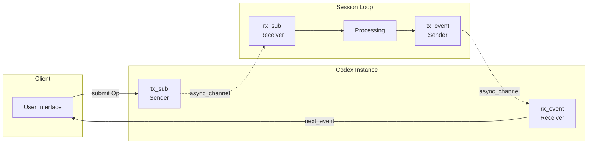

**核心特点**:
- 双向异步 Channel (Rust `async_channel`)
- 完全解耦 UI 和核心逻辑
- 天然的背压控制
- 类型安全的消息传递

**代码示例**:
```rust
pub struct Codex {
    tx_sub: Sender<Submission>,     // 提交到 Session
    rx_event: Receiver<Event>,      // 接收事件
}

pub async fn submit(&self, op: Op) -> CodexResult<String>
pub async fn next_event(&self) -> CodexResult<Event>
```

#### Gemini CLI: MessageBus + Event 模式 (TypeScript)

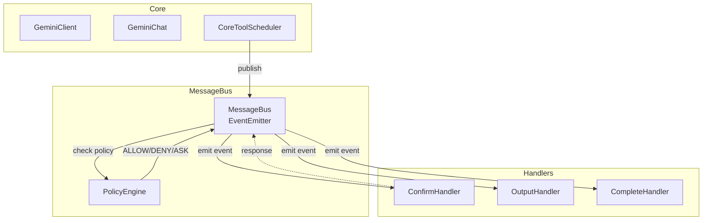

**核心特点**:
- Event-driven 架构 (Node.js `EventEmitter`)
- PolicyEngine 集成的权限控制
- 回调式异步处理
- 类型化的消息定义

**代码示例**:
```typescript
export class MessageBus extends EventEmitter {
  publish(message: Message): void {
    const decision = this.policyEngine.check(message.toolCall);
    switch (decision) {
      case PolicyDecision.ALLOW:
        this.emit(MessageBusType.CONFIRMATION_RESPONSE, { confirmed: true });
        break;
      case PolicyDecision.ASK_USER:
        this.emit(message.type, message);
        break;
    }
  }
}
```

**对比总结**:

| 维度 | Codex (Queue Pair) | Gemini CLI (MessageBus) | AutoDev 建议 |
|------|-------------------|------------------------|-------------|
| **通信模式** | 双向 Channel | Event Emitter | Kotlin Channel |
| **解耦程度** | ⭐⭐⭐⭐⭐ 完全解耦 | ⭐⭐⭐⭐ 回调解耦 | Channel 实现 |
| **背压控制** | ✅ 内置 | ❌ 需手动 | Channel 内置 |
| **类型安全** | ✅ Rust 编译期 | ✅ TypeScript 静态 | Kotlin 密封类 |
| **复杂度** | 低 - 简单清晰 | 中 - Event 管理 | 低 - Channel API |

---

### 2. 工具执行编排

#### Codex: ToolOrchestrator 模式

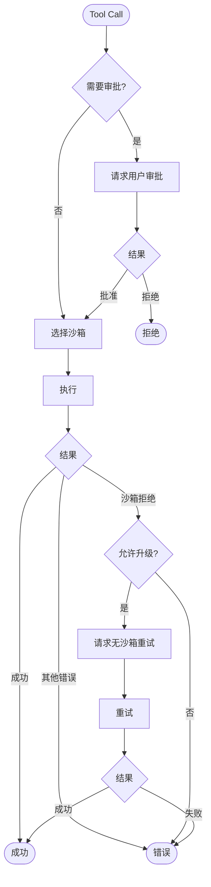

**特点**:
- **统一流程**: 所有工具都经过相同的编排
- **审批缓存**: 会话内缓存已批准操作
- **风险评估**: `assess_sandbox_command()` 分析命令
- **沙箱升级**: 失败时可升级到无沙箱

#### Gemini CLI: CoreToolScheduler 模式

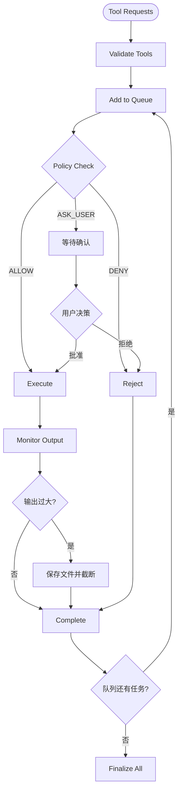

**特点**:
- **状态机管理**: 每个工具调用有清晰状态转换
  - `validating` → `scheduled` → `awaiting_approval` → `executing` → `success`/`error`/`cancelled`
- **队列化**: 请求队列化处理，支持批量
- **输出管理**: 自动截断大输出并保存文件
- **集成 PolicyEngine**: 与权限系统深度集成

**代码示例**:
```typescript
export type ToolCall =
  | ValidatingToolCall
  | ScheduledToolCall
  | WaitingToolCall
  | ExecutingToolCall
  | SuccessfulToolCall
  | ErroredToolCall
  | CancelledToolCall;

export class CoreToolScheduler {
  private toolCalls: ToolCall[] = [];
  private toolCallQueue: ToolCall[] = [];
  private requestQueue: Array<{request, signal, resolve, reject}> = [];
  
  async scheduleToolCalls(
    requests: ToolCallRequestInfo | ToolCallRequestInfo[],
    signal: AbortSignal
  ): Promise<void>
}
```

**对比总结**:

| 维度 | Codex (Orchestrator) | Gemini CLI (Scheduler) | AutoDev 建议 |
|------|---------------------|------------------------|-------------|
| **编排模式** | Pipeline 流水线 | State Machine 状态机 | 混合模式 |
| **状态追踪** | ⭐⭐⭐ 简单状态 | ⭐⭐⭐⭐⭐ 详细状态 | 状态机 |
| **队列管理** | ❌ 直接执行 | ✅ 请求队列化 | 队列 + 并发控制 |
| **输出处理** | 基础处理 | ⭐⭐⭐⭐⭐ 自动截断和文件保存 | 采用 Gemini 方案 |
| **重试策略** | ✅ 沙箱升级重试 | ⭐⭐⭐ Policy 重试 | 两者结合 |

---

### 3. 并发执行

#### Codex: RwLock + Parallel Execution

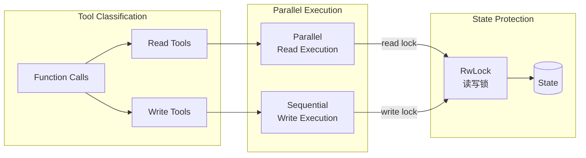

**核心实现**:
```rust
// 工具分类
let (read_tools, write_tools): (Vec<_>, Vec<_>) = function_calls
    .iter()
    .partition(|fc| {
        tool_registry
            .get(fc.name)
            .map_or(false, |t| t.is_read_only())
    });

// 并行执行 read-only 工具
let read_results = futures::future::join_all(
    read_tools.iter().map(|fc| {
        let lock = state.read().await;
        execute_tool(fc, &lock)
    })
).await;

// 串行执行 write 工具
for write_fc in write_tools {
    let mut lock = state.write().await;
    execute_tool(write_fc, &mut lock).await;
}
```

**性能提升**:
- Read-only 工具 5-10x 加速
- 典型场景: `read_file` × 5 并行 vs 串行

#### Gemini CLI: 串行执行 + 异步优化

Gemini CLI 目前主要采用串行执行，但通过以下方式优化:

1. **异步 I/O**: 所有工具都是 async 实现
2. **流式输出**: 工具执行时实时更新 UI
3. **可取消**: 通过 `AbortSignal` 支持取消

```typescript
async executeToolCall(
  toolCall: ScheduledToolCall,
  signal: AbortSignal,
): Promise<CompletedToolCall> {
  const { tool, invocation } = toolCall;
  
  // 实时输出更新
  const updateOutput = (chunk: string) => {
    this.outputUpdateHandler?.(toolCall.request.callId, chunk);
  };
  
  // 异步执行
  const result = await tool.execute(invocation, signal, updateOutput);
  
  return { status: 'success', ...result };
}
```

**对比总结**:

| 维度 | Codex | Gemini CLI | AutoDev 建议 |
|------|-------|-----------|-------------|
| **并发执行** | ✅ Read 工具并行 | ❌ 串行执行 | 采用 Codex 方案 |
| **锁机制** | RwLock | 无 | ReentrantReadWriteLock |
| **性能提升** | 5-10x (Read 并行) | 基线 | 实现并行读 |
| **实时反馈** | 基础支持 | ⭐⭐⭐⭐⭐ 流式输出 | 两者结合 |
| **可取消性** | ⭐⭐⭐ 基础取消 | ⭐⭐⭐⭐⭐ AbortSignal | 采用 Signal 模式 |

---

### 4. Agent 子任务编排

#### Gemini CLI: AgentExecutor 模式

Gemini CLI 有一个独特的 **Subagent** 机制，允许主 Agent 调用子 Agent 处理特定任务。

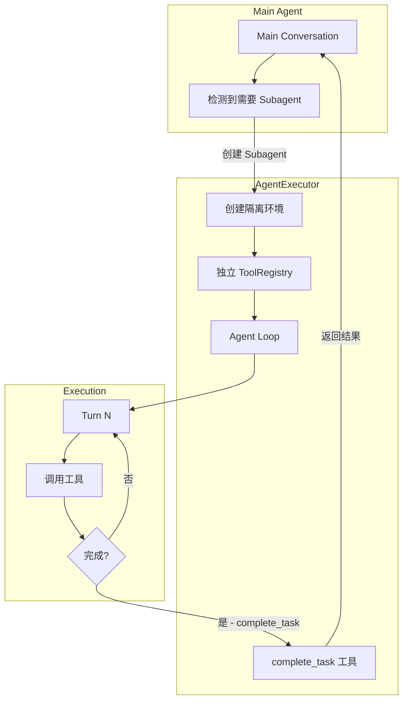

**核心特点**:

1. **隔离的工具注册表**: 每个 Subagent 有独立的 `ToolRegistry`
2. **强制完成工具**: 必须调用 `complete_task` 工具才能结束
3. **嵌套 Prompt ID**: 形如 `parent-123-subagent-abc` 的层级 ID
4. **活动回调**: 父 Agent 可监听子 Agent 的执行进度

**代码示例**:
```typescript
export class AgentExecutor<TOutput extends z.ZodTypeAny> {
  static async create(
    definition: AgentDefinition<TOutput>,
    runtimeContext: Config,
    onActivity?: ActivityCallback,
  ): Promise<AgentExecutor<TOutput>> {
    // 创建隔离的 ToolRegistry
    const agentToolRegistry = new ToolRegistry(runtimeContext);
    const parentToolRegistry = await runtimeContext.getToolRegistry();
    
    // 从父注册表复制指定工具
    for (const toolRef of definition.toolConfig.tools) {
      const tool = parentToolRegistry.getTool(toolRef);
      agentToolRegistry.registerTool(tool);
    }
    
    return new AgentExecutor(definition, agentToolRegistry, onActivity);
  }

  async run(inputs: AgentInputs, signal: AbortSignal): Promise<OutputObject> {
    while (true) {
      const { functionCalls } = await this.callModel(chat, message, tools);
      
      // 检查是否调用了 complete_task
      const completeCall = functionCalls.find(
        fc => fc.name === 'complete_task'
      );
      
      if (completeCall) {
        return { result: completeCall.args.output, terminate_reason: 'GOAL' };
      }
      
      // 否则继续执行工具
      await this.processFunctionCalls(functionCalls, signal);
    }
  }
}
```

**典型用例**:
```typescript
// 定义一个代码库分析子 Agent
const codebaseInvestigator: AgentDefinition = {
  name: 'codebase-investigator',
  modelConfig: { model: 'gemini-2.0-flash-exp' },
  promptConfig: {
    systemInstruction: 'You analyze codebases...',
    query: 'Investigate the {{module}} module',
  },
  toolConfig: {
    tools: ['read-file', 'glob', 'grep'] // 只授予只读工具
  },
  outputSchema: z.object({
    summary: z.string(),
    keyFiles: z.array(z.string()),
  }),
};

// 在主 Agent 中调用
const result = await executor.run({ module: 'auth' }, signal);
// result: { summary: "...", keyFiles: ["auth/login.ts", ...] }
```

**优势**:
- **权限隔离**: 子任务只能访问授权的工具
- **结构化输出**: 通过 Zod schema 强制类型化结果
- **可组合性**: 可以嵌套多层子 Agent
- **失败隔离**: 子 Agent 失败不影响主流程

#### Codex: 无显式 Subagent

Codex 没有专门的 Subagent 机制，但可以通过以下方式实现类似效果:
- **工具嵌套**: 工具内部可以启动新的 Agent 实例
- **Context 隔离**: 通过 `SessionState` 分支实现隔离

**对比总结**:

| 维度 | Codex | Gemini CLI | AutoDev 建议 |
|------|-------|-----------|-------------|
| **Subagent 支持** | ❌ 无原生支持 | ✅ AgentExecutor | 实现 Subagent |
| **工具隔离** | 手动实现 | ⭐⭐⭐⭐⭐ 独立 Registry | 采用 Gemini 方案 |
| **结构化输出** | 依赖提示词 | ⭐⭐⭐⭐⭐ Zod Schema | 引入 Schema 验证 |
| **嵌套监控** | 基础日志 | ⭐⭐⭐⭐ Activity Callback | 实现活动监听 |

---

### 5. 状态管理

#### Codex: SessionState 分层

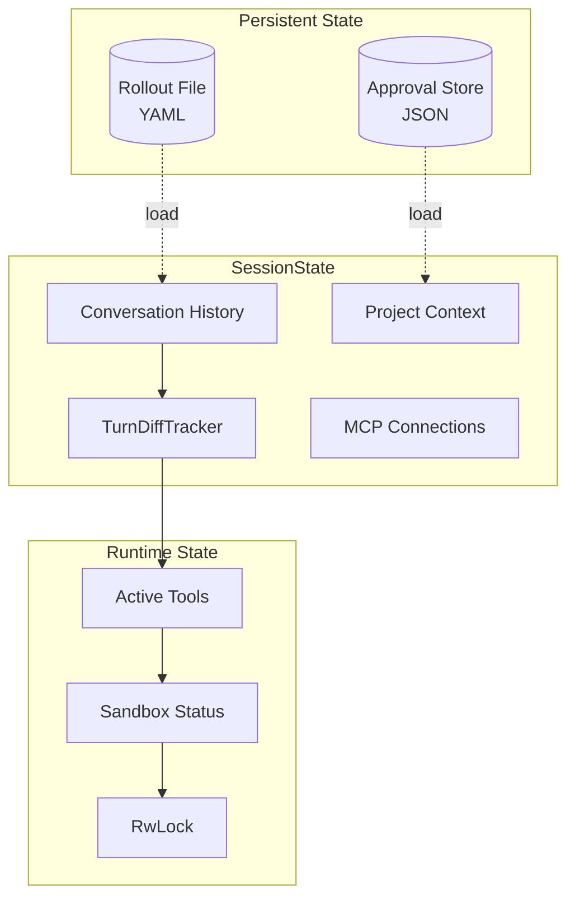

**关键特性**:
- **Rollout 持久化**: 所有对话和操作都记录到 YAML 文件
- **会话恢复**: 可以从 Rollout 恢复会话状态
- **Diff 追踪**: `TurnDiffTracker` 追踪每轮的文件变更

#### Gemini CLI: GeminiClient + History

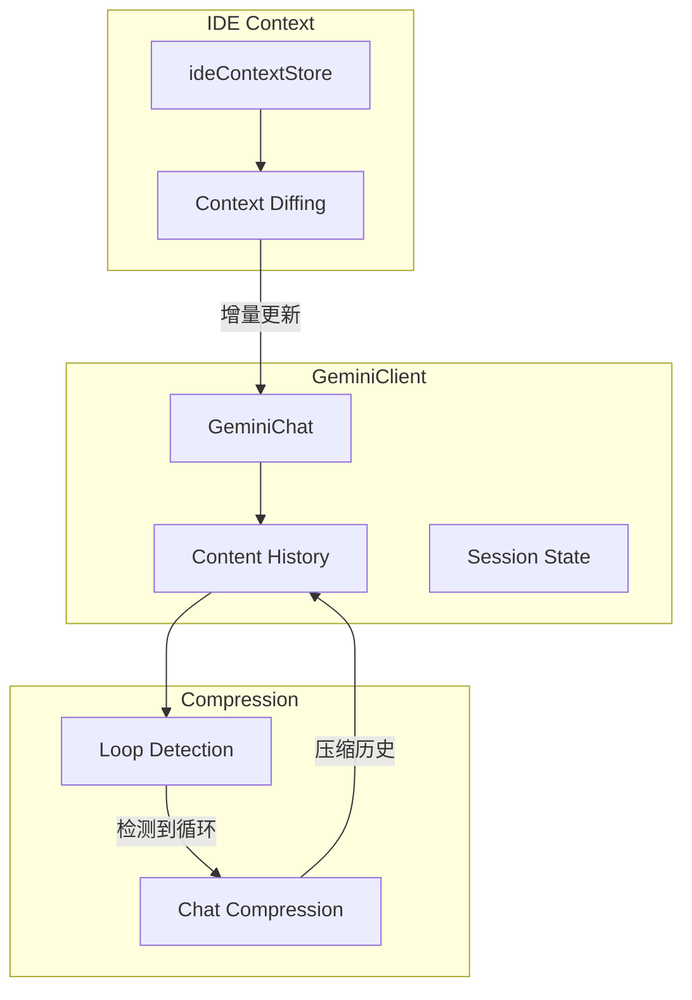

**关键特性**:
- **循环检测**: `LoopDetectionService` 检测重复模式
- **自动压缩**: 历史过长时自动压缩
- **IDE 上下文**: 追踪 IDE 状态（打开文件、光标位置）
- **增量同步**: 只发送变化的上下文

**代码示例**:
```typescript
export class GeminiClient {
  private readonly loopDetector: LoopDetectionService;
  private readonly compressionService: ChatCompressionService;
  private lastSentIdeContext: IdeContext | undefined;
  private forceFullIdeContext = true;

  async sendMessage(parts: PartListUnion): Promise<void> {
    // 1. 添加 IDE 上下文差异
    const ideContextParts = this.getIdeContextParts(this.forceFullIdeContext);
    
    // 2. 检测循环
    if (this.loopDetector.shouldCompress()) {
      await this.compressionService.compress(this.chat.getHistory());
    }
    
    // 3. 发送消息
    await this.chat.sendMessage([...ideContextParts, ...parts]);
  }
}
```

**对比总结**:

| 维度 | Codex | Gemini CLI | AutoDev 建议 |
|------|-------|-----------|-------------|
| **持久化** | ⭐⭐⭐⭐⭐ Rollout YAML | ⭐⭐⭐ 可选录制 | 实现持久化 |
| **会话恢复** | ✅ 完整恢复 | ⭐⭐ 基础恢复 | 采用 Codex 方案 |
| **循环检测** | ❌ 无 | ⭐⭐⭐⭐⭐ 自动检测 | 实现检测和压缩 |
| **IDE 集成** | 基础支持 | ⭐⭐⭐⭐⭐ 深度集成 | 增强 IDE 上下文 |
| **压缩策略** | 手动 | ⭐⭐⭐⭐ 自动压缩 | 实现自动压缩 |

---

### 6. 工具注册与发现

#### Codex: 静态注册 + MCP 动态发现

```rust
// 静态注册核心工具
pub fn register_core_tools(registry: &mut ToolRegistry) {
    registry.register(ShellTool::new());
    registry.register(ReadFileTool::new());
    registry.register(ApplyPatchTool::new());
}

// MCP 工具动态发现
pub async fn discover_mcp_tools(
    mcp_config: &McpConfig,
    registry: &mut ToolRegistry,
) -> Result<()> {
    for server in &mcp_config.servers {
        let client = connect_mcp(server).await?;
        let tools = client.list_tools().await?;
        
        for tool in tools {
            registry.register(McpToolWrapper::new(tool, client.clone()));
        }
    }
}
```

#### Gemini CLI: ToolRegistry + MCP Client Manager

```typescript
export class ToolRegistry {
  private tools = new Map<string, AnyDeclarativeTool>();
  private mcpManager: McpClientManager;

  async initialize(): Promise<void> {
    // 1. 注册核心工具
    this.registerCoreTools();
    
    // 2. 发现项目自定义工具
    await this.discoverProjectTools();
    
    // 3. 连接 MCP 服务器
    await this.mcpManager.connectAll();
    
    // 4. 注册 MCP 工具
    for (const [serverName, tools] of this.mcpManager.getAllTools()) {
      for (const tool of tools) {
        this.registerTool(new DiscoveredMCPTool(serverName, tool));
      }
    }
  }

  registerTool(tool: AnyDeclarativeTool): void {
    this.tools.set(tool.name, tool);
  }

  getFunctionDeclarations(): FunctionDeclaration[] {
    return Array.from(this.tools.values()).map(t => t.toFunctionDeclaration());
  }
}
```

**MCP 工具包装**:
```typescript
export class DiscoveredMCPTool extends BaseDeclarativeTool {
  constructor(
    private readonly serverName: string,
    private readonly mcpTool: McpToolSchema,
    private readonly client: McpClient,
  ) {
    super();
  }

  get name(): string {
    return `${this.serverName}__${this.mcpTool.name}`;
  }

  async execute(invocation, signal): Promise<ToolResult> {
    const result = await this.client.callTool({
      name: this.mcpTool.name,
      arguments: invocation.params,
    });
    
    return {
      llmContent: result.content,
      returnDisplay: this.formatDisplay(result),
    };
  }
}
```

**对比总结**:

| 维度 | Codex | Gemini CLI | AutoDev 建议 |
|------|-------|-----------|-------------|
| **核心工具** | 静态注册 | 静态注册 | 静态注册 |
| **MCP 集成** | ✅ 原生支持 | ⭐⭐⭐⭐⭐ 深度集成 | 采用 Gemini 方案 |
| **工具发现** | 基础发现 | ⭐⭐⭐⭐ 项目 + MCP | 实现多源发现 |
| **工具命名** | 直接使用 | `server__tool` 隔离 | 采用命名空间 |
| **生命周期** | 手动管理 | ⭐⭐⭐⭐ Manager 管理 | 实现 Manager |

---

## 🎯 AutoDev 重构路线图

基于以上分析，我们推荐以下优先级实现：

### Phase 1: 核心架构 (P0 - 2 weeks)

**目标**: 建立异步通信和统一编排

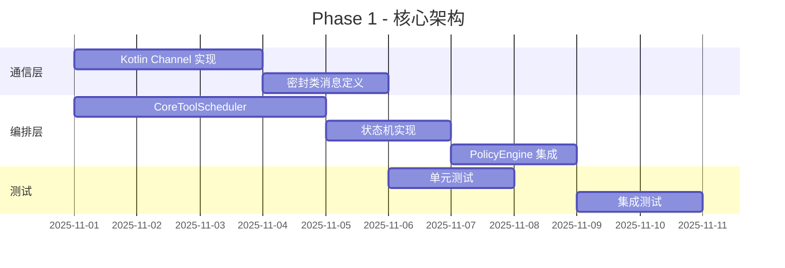

**Deliverables**:
- ✅ `Channel<Submission>` 和 `Channel<Event>` 通信
- ✅ `ToolScheduler` 状态机编排
- ✅ `PolicyEngine` 权限控制
- ✅ 基础工具: Shell, ReadFile, WriteFile

**参考实现**:
- 通信层: 参考 Codex Queue Pair
- 编排层: 参考 Gemini CLI CoreToolScheduler
- 策略引擎: 直接采用 Gemini CLI PolicyEngine 设计

---

### Phase 2: 性能优化 (P1 - 2 weeks)

**目标**: 并行执行和输出优化

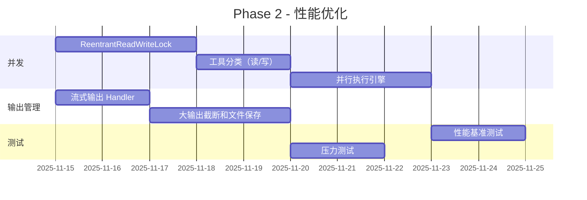

**Deliverables**:
- ⭐ Read 工具并行执行（5-10x 加速）
- ⭐ 大输出自动截断和文件保存
- ⭐ 实时流式输出更新
- ⭐ AbortSignal 取消机制

**参考实现**:
- 并发锁: Codex RwLock 模式
- 输出管理: Gemini CLI 截断和保存逻辑

---

### Phase 3: 高级功能 (P1 - 3 weeks)

**目标**: Subagent 和 MCP 生态

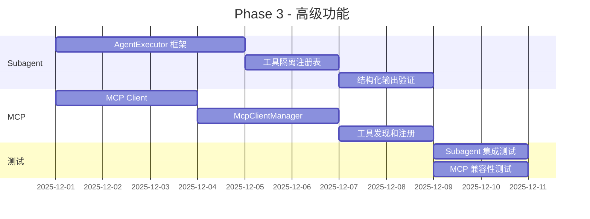

**Deliverables**:
- 🔧 AgentExecutor 子任务机制
- 🔧 独立的 ToolRegistry 隔离
- 🔧 MCP 协议客户端
- 🔧 MCP 工具发现和包装

**参考实现**:
- Subagent: 完全采用 Gemini CLI AgentExecutor 设计
- MCP: 参考两者的 MCP 集成实现

---

### Phase 4: 状态与持久化 (P2 - 2 weeks)

**目标**: 可恢复性和智能压缩

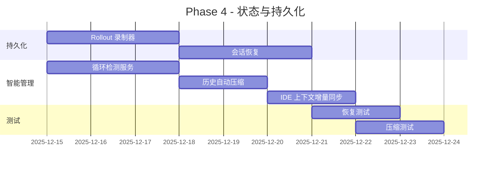

**Deliverables**:
- 💾 Rollout 持久化（参考 Codex）
- 💾 LoopDetectionService（参考 Gemini CLI）
- 💾 ChatCompressionService（参考 Gemini CLI）
- 💾 IDE Context 增量同步（参考 Gemini CLI）

---

## 📊 关键指标对比

### 性能指标

| 指标 | Codex | Gemini CLI | AutoDev 目标 |
|------|-------|-----------|-------------|
| **并发读操作** | 5-10x | 1x | 5-10x |
| **工具调用延迟** | <50ms | ~100ms | <50ms |
| **大输出处理** | 基础 | ⭐⭐⭐⭐⭐ | 采用 Gemini |
| **内存占用** | 低（Rust） | 中（Node） | 中等可接受 |

### 功能完整度

| 功能 | Codex | Gemini CLI | AutoDev 计划 |
|------|-------|-----------|-------------|
| **异步通信** | ⭐⭐⭐⭐⭐ | ⭐⭐⭐⭐ | P0 实现 |
| **工具编排** | ⭐⭐⭐⭐ | ⭐⭐⭐⭐⭐ | P0 实现 |
| **并行执行** | ⭐⭐⭐⭐⭐ | ⭐⭐ | P1 实现 |
| **Subagent** | ⭐ | ⭐⭐⭐⭐⭐ | P1 实现 |
| **MCP 支持** | ⭐⭐⭐⭐ | ⭐⭐⭐⭐⭐ | P1 实现 |
| **持久化** | ⭐⭐⭐⭐⭐ | ⭐⭐⭐ | P2 实现 |
| **循环检测** | ⭐ | ⭐⭐⭐⭐⭐ | P2 实现 |
| **沙箱安全** | ⭐⭐⭐⭐⭐ | ⭐⭐ | P2 实现（简化） |

---

## 🔍 核心洞察总结

### Codex 的优势
1. **性能优化**: RwLock 并行执行是重要创新
2. **持久化**: Rollout 机制保证可恢复性
3. **沙箱安全**: 多平台沙箱策略（生产级）

### Gemini CLI 的优势
1. **工具编排**: CoreToolScheduler 状态机设计优雅
2. **输出管理**: 自动截断和文件保存非常实用
3. **Subagent**: AgentExecutor 实现了真正的任务隔离
4. **循环检测**: LoopDetectionService 解决实际问题
5. **IDE 集成**: 深度的 IDE 上下文集成

### AutoDev 的机会
1. **最佳实践融合**: 取两者之长
2. **Kotlin 优势**: Coroutines 比 Rust async 更易用，比 Node.js 更高效
3. **JetBrains 生态**: 天然的 IDE 集成优势
4. **渐进式实现**: 分阶段降低风险

---

## 📚 参考资源

- **Codex**: https://github.com/openai/codex
- **Gemini CLI**: https://github.com/google-gemini/gemini-cli
- **MCP Protocol**: https://modelcontextprotocol.io/
- **Kotlin Coroutines**: https://kotlinlang.org/docs/coroutines-overview.html

---

**文档版本**: v1.0  
**最后更新**: 2025-10-31  
**作者**: AutoDev Team
