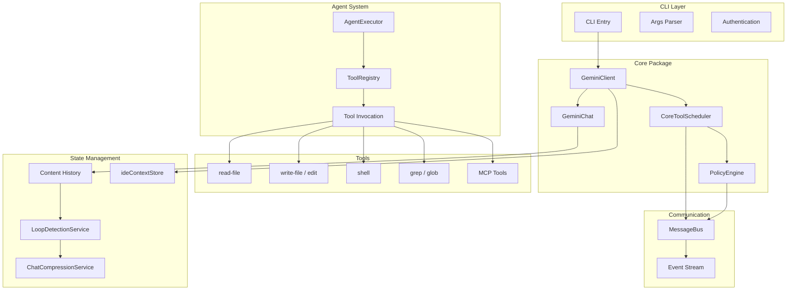
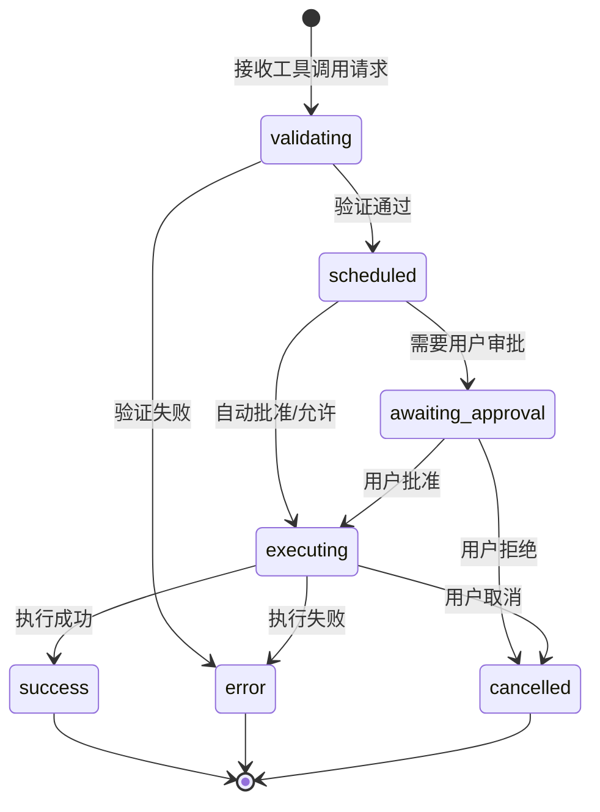
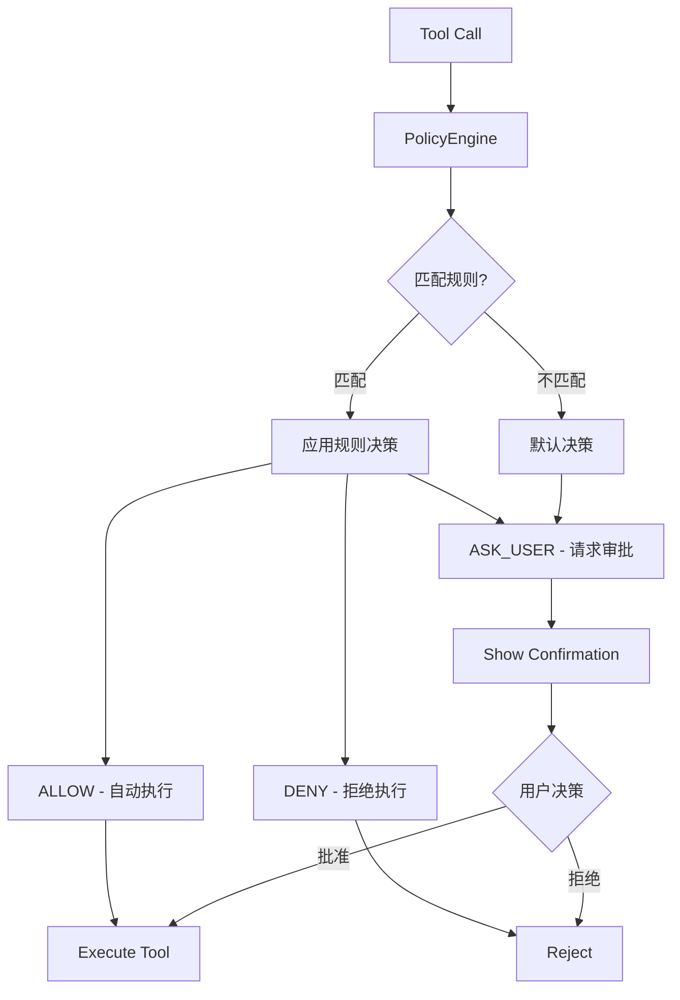
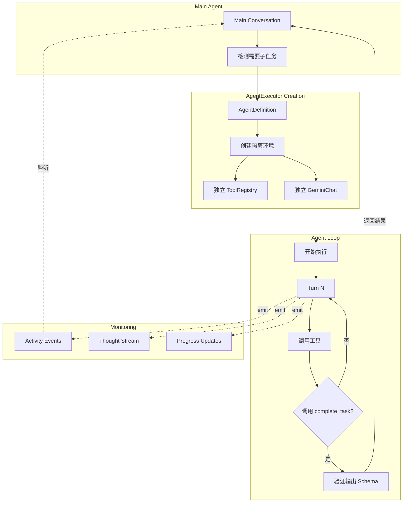

# Gemini CLI Coding Agent - 架构深度解析

> Google 官方开源的生产级 TypeScript Coding Agent

## 📋 概述

Gemini CLI 是 Google 开源的终端 AI 助手，采用 TypeScript/Node.js 实现。相比 Codex 的 Rust 实现，Gemini CLI 在工具编排、状态管理和 IDE 集成方面展现了独特的设计思路，特别适合需要深度 IDE 集成的场景。

**核心特点**:
- 🎯 **状态机驱动**: CoreToolScheduler 精确控制工具执行流程
- 🧩 **Subagent 机制**: AgentExecutor 实现真正的任务隔离
- 🔄 **智能压缩**: 自动检测循环并压缩历史
- 💻 **IDE 深度集成**: 追踪编辑器状态和上下文变化
- 📦 **输出管理**: 自动截断大输出并保存文件

---

## 🏗️ 整体架构

### 系统架构全景



---

## 🔑 核心设计模式

### 1. CoreToolScheduler - 状态机编排 ⭐⭐⭐⭐⭐

**Problem**: 工具调用需要经过复杂的验证、审批、执行、输出处理流程，串行编写会导致代码重复和不一致。

**Solution**: CoreToolScheduler 使用状态机模式统一管理工具的生命周期。

#### 状态转换图



#### 核心代码结构

```typescript
// 所有可能的工具调用状态
export type ToolCall =
  | ValidatingToolCall      // 正在验证工具和参数
  | ScheduledToolCall       // 已调度，等待执行
  | WaitingToolCall         // 等待用户审批
  | ExecutingToolCall       // 正在执行
  | SuccessfulToolCall      // 执行成功
  | ErroredToolCall         // 执行出错
  | CancelledToolCall;      // 已取消

export type CompletedToolCall = 
  | SuccessfulToolCall 
  | ErroredToolCall 
  | CancelledToolCall;

// 状态定义示例
export type ExecutingToolCall = {
  status: 'executing';
  request: ToolCallRequestInfo;
  tool: AnyDeclarativeTool;
  invocation: AnyToolInvocation;
  liveOutput?: string | AnsiOutput;  // 实时输出
  startTime?: number;
  outcome?: ToolConfirmationOutcome;
  pid?: number;                       // 进程 ID（如 shell）
};
```

#### 调度流程

```typescript
export class CoreToolScheduler {
  private toolCalls: ToolCall[] = [];
  private toolCallQueue: ToolCall[] = [];
  private requestQueue: Array<{
    request: ToolCallRequestInfo | ToolCallRequestInfo[];
    signal: AbortSignal;
    resolve: () => void;
    reject: (reason?: Error) => void;
  }> = [];

  async scheduleToolCalls(
    requests: ToolCallRequestInfo | ToolCallRequestInfo[],
    signal: AbortSignal,
  ): Promise<void> {
    // 1. 验证阶段：检查工具是否存在
    const validatingCalls = this.createValidatingCalls(requests);
    this.updateToolCalls(validatingCalls);

    // 2. 调度阶段：转为 scheduled 状态
    const scheduledCalls = await this.validateAndSchedule(validatingCalls);
    this.updateToolCalls(scheduledCalls);

    // 3. 权限检查：通过 PolicyEngine
    const callsNeedingApproval = scheduledCalls.filter(
      call => this.policyEngine.check(call) === PolicyDecision.ASK_USER
    );

    // 4. 执行阶段
    await this.executeScheduledCalls(scheduledCalls, signal);
  }

  private async executeScheduledCalls(
    calls: ScheduledToolCall[],
    signal: AbortSignal,
  ): Promise<void> {
    for (const call of calls) {
      // 转换为 executing 状态
      this.updateToolCall(call.request.callId, {
        status: 'executing',
        startTime: Date.now(),
      });

      try {
        // 执行工具，支持实时输出
        const result = await call.tool.execute(
          call.invocation,
          signal,
          (output) => this.handleOutputChunk(call.request.callId, output),
        );

        // 处理输出大小
        const processedResult = await this.processToolOutput(
          result,
          call.request.callId,
        );

        // 转换为 success 状态
        this.updateToolCall(call.request.callId, {
          status: 'success',
          response: processedResult,
          durationMs: Date.now() - call.startTime!,
        });
      } catch (error) {
        // 转换为 error 状态
        this.updateToolCall(call.request.callId, {
          status: 'error',
          response: this.createErrorResponse(error),
          durationMs: Date.now() - call.startTime!,
        });
      }
    }

    // 所有工具执行完成后的回调
    await this.onAllToolCallsComplete?.(this.getCompletedCalls());
  }
}
```

#### 关键特性

**1. 队列化管理**
```typescript
// 请求队列化，避免并发冲突
private async processNextInQueue(): Promise<void> {
  if (this.isScheduling || this.requestQueue.length === 0) {
    return;
  }

  this.isScheduling = true;
  const { request, signal, resolve, reject } = this.requestQueue.shift()!;

  try {
    await this.scheduleToolCalls(request, signal);
    resolve();
  } catch (error) {
    reject(error);
  } finally {
    this.isScheduling = false;
    await this.processNextInQueue(); // 处理下一个
  }
}
```

**2. 实时输出更新**
```typescript
private handleOutputChunk(callId: string, chunk: string | AnsiOutput): void {
  // 更新工具调用的 liveOutput
  const call = this.toolCalls.find(c => c.request.callId === callId);
  if (call && call.status === 'executing') {
    call.liveOutput = (call.liveOutput || '') + chunk;
  }

  // 通知 UI 更新
  this.outputUpdateHandler?.(callId, chunk);
}
```

**3. 大输出自动处理**
```typescript
async processToolOutput(
  result: ToolResult,
  callId: string,
): Promise<ToolCallResponseInfo> {
  const content = typeof result.llmContent === 'string' 
    ? result.llmContent 
    : this.stringifyContent(result.llmContent);

  // 输出过大（>50KB）自动截断并保存文件
  if (content.length > 50_000) {
    const { content: truncated, outputFile } = 
      await this.truncateAndSaveToFile(content, callId);

    return {
      callId,
      responseParts: [{ text: truncated }],
      resultDisplay: `Output saved to: ${outputFile}\n\n${truncated}`,
      metadata: { outputFile },
    };
  }

  return { callId, responseParts: [{ text: content }] };
}

async truncateAndSaveToFile(
  content: string,
  callId: string,
): Promise<{ content: string; outputFile: string }> {
  // 保留前 20% 和后 80% 的行数
  const lines = content.split('\n');
  const head = lines.slice(0, Math.floor(lines.length * 0.2));
  const tail = lines.slice(Math.floor(lines.length * 0.8));
  
  const truncated = [
    ...head,
    '... [CONTENT TRUNCATED] ...',
    `Full output saved to: ${outputFile}`,
    'Use read-file tool to access the complete content',
    ...tail,
  ].join('\n');

  const outputFile = path.join(projectTempDir, `${callId}.output`);
  await fs.writeFile(outputFile, content);

  return { content: truncated, outputFile };
}
```

**优势**:
- ✅ **清晰的状态**: 每个工具调用的状态一目了然
- ✅ **易于调试**: 状态转换可追踪和日志记录
- ✅ **UI 友好**: 状态变化自动通知 UI 更新
- ✅ **错误恢复**: 每个状态都有明确的错误处理路径
- ✅ **输出优化**: 自动处理大输出，避免 token 浪费

---

### 2. PolicyEngine - 声明式权限控制 ⭐⭐⭐⭐⭐

**Problem**: 不同工具有不同的危险性，需要灵活的权限控制策略。

**Solution**: 基于规则的 PolicyEngine，支持工具名、参数模式匹配和优先级。

#### 架构设计



#### 核心实现

```typescript
export enum PolicyDecision {
  ALLOW = 'allow',        // 自动允许
  DENY = 'deny',          // 直接拒绝
  ASK_USER = 'ask_user',  // 询问用户
}

export interface PolicyRule {
  toolName?: string;           // 工具名匹配（支持通配符）
  argsPattern?: RegExp;        // 参数模式（JSON 字符串匹配）
  decision: PolicyDecision;    // 决策结果
  priority?: number;           // 优先级（数字越大越优先）
}

export class PolicyEngine {
  private rules: PolicyRule[];
  private readonly defaultDecision: PolicyDecision;
  private readonly nonInteractive: boolean;

  constructor(config: PolicyEngineConfig = {}) {
    // 按优先级降序排序
    this.rules = (config.rules ?? []).sort(
      (a, b) => (b.priority ?? 0) - (a.priority ?? 0)
    );
    this.defaultDecision = config.defaultDecision ?? PolicyDecision.ASK_USER;
    this.nonInteractive = config.nonInteractive ?? false;
  }

  check(toolCall: FunctionCall): PolicyDecision {
    // 预先计算参数的稳定 JSON 字符串（键排序）
    const stringifiedArgs = toolCall.args 
      ? stableStringify(toolCall.args) 
      : undefined;

    // 遍历规则（已按优先级排序）
    for (const rule of this.rules) {
      if (this.ruleMatches(rule, toolCall, stringifiedArgs)) {
        return this.applyNonInteractiveMode(rule.decision);
      }
    }

    // 没有匹配规则，使用默认决策
    return this.applyNonInteractiveMode(this.defaultDecision);
  }

  private ruleMatches(
    rule: PolicyRule,
    toolCall: FunctionCall,
    stringifiedArgs?: string,
  ): boolean {
    // 1. 检查工具名（支持通配符）
    if (rule.toolName) {
      // 支持 "serverName__*" 匹配所有该服务器的工具
      if (rule.toolName.endsWith('__*')) {
        const prefix = rule.toolName.slice(0, -3);
        if (!toolCall.name?.startsWith(prefix + '__')) {
          return false;
        }
      } else if (toolCall.name !== rule.toolName) {
        return false;
      }
    }

    // 2. 检查参数模式
    if (rule.argsPattern) {
      if (!toolCall.args || !stringifiedArgs) {
        return false;
      }
      if (!rule.argsPattern.test(stringifiedArgs)) {
        return false;
      }
    }

    return true;
  }

  private applyNonInteractiveMode(decision: PolicyDecision): PolicyDecision {
    // 非交互模式下，ASK_USER 转为 DENY
    if (this.nonInteractive && decision === PolicyDecision.ASK_USER) {
      return PolicyDecision.DENY;
    }
    return decision;
  }

  addRule(rule: PolicyRule): void {
    this.rules.push(rule);
    this.rules.sort((a, b) => (b.priority ?? 0) - (a.priority ?? 0));
  }
}
```

#### 规则示例

```typescript
// 1. 允许所有只读工具自动执行
const readOnlyRule: PolicyRule = {
  toolName: undefined,  // 匹配所有工具
  argsPattern: undefined,
  decision: PolicyDecision.ALLOW,
  priority: 10,
};

// 2. Shell 命令默认需要审批
const shellRule: PolicyRule = {
  toolName: 'shell',
  decision: PolicyDecision.ASK_USER,
  priority: 50,
};

// 3. 危险的 Shell 命令直接拒绝
const dangerousShellRule: PolicyRule = {
  toolName: 'shell',
  argsPattern: /rm\s+-rf\s+\/|sudo|format/i,  // 匹配危险命令
  decision: PolicyDecision.DENY,
  priority: 100,  // 最高优先级
};

// 4. 安全的 ls/pwd 命令自动允许
const safeShellRule: PolicyRule = {
  toolName: 'shell',
  argsPattern: /^(ls|pwd|echo|cat)\s/i,
  decision: PolicyDecision.ALLOW,
  priority: 80,
};

// 5. 允许特定 MCP 服务器的所有工具
const mcpServerRule: PolicyRule = {
  toolName: 'filesystem__*',  // 通配符匹配
  decision: PolicyDecision.ALLOW,
  priority: 60,
};
```

#### MessageBus 集成

```typescript
export class MessageBus extends EventEmitter {
  constructor(private readonly policyEngine: PolicyEngine) {
    super();
  }

  publish(message: Message): void {
    if (message.type === MessageBusType.TOOL_CONFIRMATION_REQUEST) {
      const decision = this.policyEngine.check(message.toolCall);

      switch (decision) {
        case PolicyDecision.ALLOW:
          // 直接响应批准
          this.emit(MessageBusType.TOOL_CONFIRMATION_RESPONSE, {
            correlationId: message.correlationId,
            confirmed: true,
          });
          break;

        case PolicyDecision.DENY:
          // 发送拒绝事件
          this.emit(MessageBusType.TOOL_POLICY_REJECTION, {
            toolCall: message.toolCall,
          });
          this.emit(MessageBusType.TOOL_CONFIRMATION_RESPONSE, {
            correlationId: message.correlationId,
            confirmed: false,
          });
          break;

        case PolicyDecision.ASK_USER:
          // 转发给 UI 处理
          this.emit(message.type, message);
          break;
      }
    } else {
      this.emit(message.type, message);
    }
  }
}
```

**优势**:
- ✅ **灵活配置**: 声明式规则，易于理解和修改
- ✅ **优先级控制**: 精确控制规则匹配顺序
- ✅ **通配符支持**: 简化批量工具配置
- ✅ **参数匹配**: 基于实际参数的细粒度控制
- ✅ **非交互模式**: 自动降级为安全策略

---

### 3. AgentExecutor - Subagent 子任务编排 ⭐⭐⭐⭐⭐

**Problem**: 复杂任务需要拆分为子任务，每个子任务有独立的工具权限和执行环境。

**Solution**: AgentExecutor 实现了完全隔离的子 Agent 机制。

#### 架构设计



#### 核心实现

```typescript
export interface AgentDefinition<TOutput extends z.ZodTypeAny> {
  name: string;                      // Agent 名称
  modelConfig: {
    model: string;                   // 使用的模型
    temperature?: number;
  };
  promptConfig: {
    systemInstruction: string;       // 系统提示词
    query?: string;                  // 初始查询（支持模板）
  };
  toolConfig?: {
    tools: ToolReference[];          // 授权的工具列表
  };
  outputSchema: TOutput;             // 输出验证 Schema (Zod)
  maxTurns?: number;                 // 最大轮次
  timeoutMs?: number;                // 超时时间
}

export class AgentExecutor<TOutput extends z.ZodTypeAny> {
  private readonly agentId: string;
  private readonly toolRegistry: ToolRegistry;
  private readonly runtimeContext: Config;
  private readonly onActivity?: ActivityCallback;

  static async create<TOutput extends z.ZodTypeAny>(
    definition: AgentDefinition<TOutput>,
    runtimeContext: Config,
    onActivity?: ActivityCallback,
  ): Promise<AgentExecutor<TOutput>> {
    // 1. 创建隔离的 ToolRegistry
    const agentToolRegistry = new ToolRegistry(runtimeContext);
    const parentToolRegistry = await runtimeContext.getToolRegistry();

    // 2. 从父注册表复制授权的工具
    for (const toolRef of definition.toolConfig?.tools ?? []) {
      if (typeof toolRef === 'string') {
        const tool = parentToolRegistry.getTool(toolRef);
        if (tool) {
          agentToolRegistry.registerTool(tool);
        }
      } else {
        // 直接注册工具实例
        agentToolRegistry.registerTool(toolRef);
      }
    }

    // 3. 验证所有工具都是非交互式安全的
    await AgentExecutor.validateTools(agentToolRegistry, definition.name);

    // 4. 生成嵌套的 Agent ID
    const parentPromptId = promptIdContext.getStore();
    const randomId = Math.random().toString(36).slice(2, 8);
    const agentId = parentPromptId 
      ? `${parentPromptId}-${definition.name}-${randomId}`
      : `${definition.name}-${randomId}`;

    return new AgentExecutor(
      definition,
      runtimeContext,
      agentToolRegistry,
      agentId,
      onActivity,
    );
  }

  async run(inputs: AgentInputs, signal: AbortSignal): Promise<OutputObject> {
    const startTime = Date.now();
    let turnCounter = 0;
    let terminateReason = AgentTerminateMode.ERROR;
    let finalResult: string | null = null;

    // 发送 Agent 开始事件
    this.emitActivity('START', { agentId: this.agentId });

    try {
      // 1. 创建独立的 Chat 实例
      const chat = await this.createChatObject(inputs);

      // 2. 准备工具列表（包含 complete_task）
      const tools = this.prepareToolsList();

      // 3. 构造初始查询（支持模板变量）
      const query = this.definition.promptConfig.query
        ? templateString(this.definition.promptConfig.query, inputs)
        : 'Get Started!';

      let currentMessage: Content = {
        role: 'user',
        parts: [{ text: query }],
      };

      // 4. Agent Loop
      while (true) {
        // 检查终止条件
        const reason = this.checkTermination(startTime, turnCounter);
        if (reason || signal.aborted) {
          terminateReason = reason ?? AgentTerminateMode.ABORTED;
          break;
        }

        const promptId = `${this.agentId}#${turnCounter++}`;

        // 调用模型
        const { functionCalls, textResponse } = await promptIdContext.run(
          promptId,
          async () => this.callModel(chat, currentMessage, tools, signal, promptId)
        );

        // 发送思考内容
        if (textResponse) {
          this.emitActivity('THOUGHT_CHUNK', { text: textResponse });
        }

        // 检查是否调用了 complete_task
        if (functionCalls.length === 0) {
          terminateReason = AgentTerminateMode.ERROR;
          finalResult = `Agent did not call 'complete_task' to finalize.`;
          break;
        }

        // 处理工具调用
        const { nextMessage, submittedOutput, taskCompleted } =
          await this.processFunctionCalls(functionCalls, signal, promptId);

        if (taskCompleted) {
          // 验证输出符合 Schema
          const parsed = this.definition.outputSchema.safeParse(
            JSON.parse(submittedOutput!)
          );

          if (parsed.success) {
            finalResult = submittedOutput!;
            terminateReason = AgentTerminateMode.GOAL;
          } else {
            terminateReason = AgentTerminateMode.ERROR;
            finalResult = `Output validation failed: ${parsed.error}`;
          }
          break;
        }

        currentMessage = nextMessage;
      }

      return {
        result: finalResult || 'Task completed.',
        terminate_reason: terminateReason,
      };
    } catch (error) {
      this.emitActivity('ERROR', { error: String(error) });
      throw error;
    } finally {
      // 发送 Agent 完成事件
      this.emitActivity('FINISH', {
        agentId: this.agentId,
        durationMs: Date.now() - startTime,
        turns: turnCounter,
        terminateReason,
      });
    }
  }

  private prepareToolsList(): FunctionDeclaration[] {
    const tools = this.toolRegistry.getFunctionDeclarations();

    // 强制添加 complete_task 工具
    const outputSchema = zodToJsonSchema(this.definition.outputSchema);

    tools.push({
      name: 'complete_task',
      description: 'Call this tool when the task is complete. You MUST call this to finish.',
      parameters: {
        type: 'object',
        properties: {
          output: outputSchema,
        },
        required: ['output'],
      },
    });

    return tools;
  }

  private emitActivity(type: string, data: Record<string, unknown>): void {
    this.onActivity?.({
      type,
      agentId: this.agentId,
      timestamp: Date.now(),
      ...data,
    });
  }
}
```

#### 使用示例

```typescript
// 定义一个代码分析子 Agent
const codeAnalyzerDef: AgentDefinition<typeof OutputSchema> = {
  name: 'code-analyzer',
  modelConfig: {
    model: 'gemini-2.0-flash-exp',
    temperature: 0,
  },
  promptConfig: {
    systemInstruction: `You are a code analysis expert. 
      Analyze the given code module and identify:
      1. Key files and their purposes
      2. Main classes and functions
      3. Dependencies and imports
      4. Potential issues or improvements`,
    query: 'Analyze the {{moduleName}} module in the codebase',
  },
  toolConfig: {
    tools: [
      'read-file',      // 只读文件
      'glob',           // 列出文件
      'grep',           // 搜索代码
      // 故意不包含 write-file, shell 等危险工具
    ],
  },
  outputSchema: z.object({
    moduleName: z.string(),
    keyFiles: z.array(z.object({
      path: z.string(),
      purpose: z.string(),
    })),
    mainClasses: z.array(z.string()),
    dependencies: z.array(z.string()),
    issues: z.array(z.string()).optional(),
    improvements: z.array(z.string()).optional(),
  }),
  maxTurns: 20,
  timeoutMs: 120_000,  // 2 分钟超时
};

// 在主 Agent 或工具中使用
async function analyzeModule(moduleName: string): Promise<AnalysisResult> {
  const executor = await AgentExecutor.create(
    codeAnalyzerDef,
    runtimeConfig,
    (activity) => {
      // 监听子 Agent 活动
      console.log(`[${activity.type}] ${activity.agentId}:`, activity);
    },
  );

  const signal = new AbortController().signal;
  const result = await executor.run({ moduleName }, signal);

  return JSON.parse(result.result);
}

// 调用
const analysis = await analyzeModule('auth');
console.log(`Found ${analysis.keyFiles.length} key files`);
console.log(`Dependencies:`, analysis.dependencies);
```

#### 嵌套工具包装

可以将 Subagent 包装成工具，供主 Agent 调用：

```typescript
export class SubagentTool extends BaseDeclarativeTool {
  constructor(
    private readonly definition: AgentDefinition<any>,
    private readonly config: Config,
  ) {
    super();
  }

  get name(): string {
    return `subagent__${this.definition.name}`;
  }

  get description(): string {
    return this.definition.promptConfig.systemInstruction;
  }

  async execute(
    invocation: ToolInvocation,
    signal: AbortSignal,
  ): Promise<ToolResult> {
    const executor = await AgentExecutor.create(
      this.definition,
      this.config,
    );

    const result = await executor.run(invocation.params, signal);

    return {
      llmContent: result.result,
      returnDisplay: `Subagent ${this.name} completed:\n${result.result}`,
    };
  }
}
```

**优势**:
- ✅ **完全隔离**: 独立的工具集、Chat、状态
- ✅ **类型安全**: Zod Schema 强制输出结构
- ✅ **可监控**: Activity 回调监听执行进度
- ✅ **嵌套 ID**: 清晰的父子关系追踪
- ✅ **强制完成**: 必须调用 complete_task
- ✅ **权限控制**: 只能使用授权的工具

---

### 4. 智能历史管理 ⭐⭐⭐⭐

#### 4.1 LoopDetectionService - 循环检测

**Problem**: Agent 可能陷入重复操作的循环，浪费 token 和时间。

**Solution**: 基于滑动窗口的模式检测。

```typescript
export class LoopDetectionService {
  private readonly windowSize = 10;  // 检测窗口大小
  private readonly threshold = 0.8;  // 相似度阈值
  private history: string[] = [];    // 工具调用历史

  addToolCall(toolName: string, args: Record<string, unknown>): void {
    // 标准化表示
    const signature = `${toolName}(${this.normalizeArgs(args)})`;
    this.history.push(signature);

    // 保持窗口大小
    if (this.history.length > this.windowSize * 2) {
      this.history = this.history.slice(-this.windowSize * 2);
    }
  }

  detectLoop(): LoopDetection | null {
    if (this.history.length < this.windowSize) {
      return null;
    }

    // 检查最近的 N 次调用是否与之前的 N 次高度相似
    const recentCalls = this.history.slice(-this.windowSize);
    const previousCalls = this.history.slice(
      -this.windowSize * 2,
      -this.windowSize
    );

    const similarity = this.calculateSimilarity(recentCalls, previousCalls);

    if (similarity > this.threshold) {
      return {
        detected: true,
        pattern: recentCalls,
        confidence: similarity,
      };
    }

    return null;
  }

  private calculateSimilarity(seq1: string[], seq2: string[]): number {
    const matches = seq1.filter((call, i) => call === seq2[i]).length;
    return matches / seq1.length;
  }

  private normalizeArgs(args: Record<string, unknown>): string {
    // 简化参数表示（避免完全相同的参数才算循环）
    const keys = Object.keys(args).sort();
    return keys.map(k => `${k}:${typeof args[k]}`).join(',');
  }
}
```

#### 4.2 ChatCompressionService - 历史压缩

**Problem**: 长对话会超出模型上下文限制。

**Solution**: 智能压缩历史，保留关键信息。

```typescript
export class ChatCompressionService {
  async compress(history: Content[]): Promise<Content[]> {
    // 1. 识别压缩候选（中间的对话轮次）
    const recentTurns = 5;  // 保留最近 5 轮
    const initialTurns = 3; // 保留最初 3 轮
    
    if (history.length <= recentTurns + initialTurns) {
      return history; // 不需要压缩
    }

    const toCompress = history.slice(initialTurns, -recentTurns);
    
    // 2. 提取关键信息
    const summary = await this.summarizeHistory(toCompress);

    // 3. 构造压缩后的历史
    return [
      ...history.slice(0, initialTurns),
      {
        role: 'user',
        parts: [{
          text: `[Previous conversation summary]\n${summary}\n[End summary]`,
        }],
      },
      ...history.slice(-recentTurns),
    ];
  }

  private async summarizeHistory(content: Content[]): Promise<string> {
    // 使用 LLM 生成摘要
    const prompt = `Summarize the following conversation, focusing on:
      - Key decisions made
      - Files modified
      - Important context established
      
      Conversation:
      ${this.formatHistory(content)}`;

    const response = await this.llm.generate(prompt);
    return response.text;
  }
}
```

#### 4.3 IDE Context 增量同步

**Problem**: 频繁发送完整 IDE 状态会浪费 token。

**Solution**: Diff 检测，只发送变化部分。

```typescript
export class GeminiClient {
  private lastSentIdeContext: IdeContext | undefined;
  private forceFullIdeContext = true;

  private getIdeContextParts(forceFullContext: boolean): {
    contextParts: string[];
    newIdeContext: IdeContext | undefined;
  } {
    const currentIdeContext = ideContextStore.get();
    if (!currentIdeContext) {
      return { contextParts: [], newIdeContext: undefined };
    }

    // 首次或强制全量
    if (forceFullContext || !this.lastSentIdeContext) {
      const contextData = {
        activeFile: {
          path: currentIdeContext.activeFile?.path,
          cursor: currentIdeContext.activeFile?.cursor,
          selectedText: currentIdeContext.activeFile?.selectedText,
        },
        otherOpenFiles: currentIdeContext.openFiles
          .filter(f => !f.isActive)
          .map(f => f.path),
      };

      return {
        contextParts: [
          `<ide_context>\n${JSON.stringify(contextData, null, 2)}\n</ide_context>`,
        ],
        newIdeContext: currentIdeContext,
      };
    }

    // 增量更新：只发送变化
    const changes: string[] = [];

    // 检测活动文件变化
    if (currentIdeContext.activeFile?.path !== 
        this.lastSentIdeContext.activeFile?.path) {
      changes.push(`Active file changed to: ${currentIdeContext.activeFile?.path}`);
    }

    // 检测光标位置变化（显著移动才报告）
    const cursorMoved = this.isCursorMovedSignificantly(
      this.lastSentIdeContext.activeFile?.cursor,
      currentIdeContext.activeFile?.cursor,
    );
    if (cursorMoved) {
      changes.push(
        `Cursor moved to line ${currentIdeContext.activeFile?.cursor?.line}`
      );
    }

    // 检测选择文本变化
    if (currentIdeContext.activeFile?.selectedText &&
        currentIdeContext.activeFile.selectedText !== 
        this.lastSentIdeContext.activeFile?.selectedText) {
      changes.push(
        `Selected text:\n${currentIdeContext.activeFile.selectedText}`
      );
    }

    if (changes.length === 0) {
      return { contextParts: [], newIdeContext: currentIdeContext };
    }

    return {
      contextParts: [`<ide_context_update>\n${changes.join('\n')}\n</ide_context_update>`],
      newIdeContext: currentIdeContext,
    };
  }

  private isCursorMovedSignificantly(
    oldCursor?: Cursor,
    newCursor?: Cursor,
  ): boolean {
    if (!oldCursor || !newCursor) return false;
    
    // 移动超过 10 行或切换文件才算显著
    return Math.abs(newCursor.line - oldCursor.line) > 10;
  }

  async sendMessage(parts: PartListUnion): Promise<void> {
    // 1. 获取 IDE 上下文（增量或全量）
    const { contextParts, newIdeContext } = this.getIdeContextParts(
      this.forceFullIdeContext
    );

    // 2. 发送消息
    await this.chat.sendMessage([...contextParts, ...parts]);

    // 3. 更新缓存
    this.lastSentIdeContext = newIdeContext;
    this.forceFullIdeContext = false;
  }
}
```

**优势**:
- ✅ **循环检测**: 自动发现重复模式
- ✅ **智能压缩**: 保留关键信息，减少 token
- ✅ **增量同步**: IDE 状态变化增量发送
- ✅ **自动触发**: 检测到问题自动处理

---

### 5. 工具系统设计

#### 5.1 声明式工具接口

```typescript
export abstract class BaseDeclarativeTool<
  TParams = Record<string, unknown>,
  TResult extends ToolResult = ToolResult
> {
  abstract get name(): string;
  abstract get description(): string;
  abstract get parameterSchema(): Record<string, unknown>;

  // 是否为只读工具（用于并发优化）
  get isReadOnly(): boolean {
    return false;
  }

  // 是否适合非交互式执行（用于 Subagent）
  get safeForNonInteractive(): boolean {
    return true;
  }

  // 转换为 Gemini FunctionDeclaration
  toFunctionDeclaration(): FunctionDeclaration {
    return {
      name: this.name,
      description: this.description,
      parameters: this.parameterSchema,
    };
  }

  // 创建工具调用实例
  abstract createInvocation(params: TParams): ToolInvocation<TParams, TResult>;

  // 执行工具
  abstract execute(
    invocation: ToolInvocation<TParams, TResult>,
    signal: AbortSignal,
    updateOutput?: (output: string) => void,
  ): Promise<TResult>;
}
```

#### 5.2 ModifiableTool - 可修改工具

支持在执行前通过编辑器修改参数的工具：

```typescript
export interface ModifyContext {
  tool: AnyDeclarativeTool;
  invocation: AnyToolInvocation;
  preferredEditor: EditorType | undefined;
}

export function isModifiableDeclarativeTool(
  tool: AnyDeclarativeTool,
): tool is ModifiableDeclarativeTool {
  return 'getModifiableContent' in tool;
}

export abstract class ModifiableDeclarativeTool extends BaseDeclarativeTool {
  // 返回可编辑的内容
  abstract getModifiableContent(
    invocation: AnyToolInvocation,
  ): string | Promise<string>;

  // 应用编辑后的内容
  abstract applyModifiedContent(
    invocation: AnyToolInvocation,
    modifiedContent: string,
  ): AnyToolInvocation | Promise<AnyToolInvocation>;
}

// 使用示例：编辑工具参数
export async function modifyWithEditor(
  context: ModifyContext,
): Promise<AnyToolInvocation> {
  const tool = context.tool as ModifiableDeclarativeTool;

  // 1. 获取可编辑内容
  const content = await tool.getModifiableContent(context.invocation);

  // 2. 在编辑器中打开
  const tempFile = await createTempFile(content);
  await openEditor(tempFile, context.preferredEditor);

  // 3. 等待编辑器关闭
  const modifiedContent = await fs.readFile(tempFile, 'utf-8');

  // 4. 应用修改
  return await tool.applyModifiedContent(
    context.invocation,
    modifiedContent,
  );
}
```

示例：可修改的 Edit 工具

```typescript
export class EditTool extends ModifiableDeclarativeTool {
  get name() {
    return 'edit';
  }

  get description() {
    return 'Edit a file by applying a unified diff patch';
  }

  async getModifiableContent(invocation: EditInvocation): Promise<string> {
    // 返回 diff 内容供用户编辑
    return invocation.params.diff;
  }

  async applyModifiedContent(
    invocation: EditInvocation,
    modifiedContent: string,
  ): Promise<EditInvocation> {
    // 更新 invocation 的 diff 参数
    return {
      ...invocation,
      params: {
        ...invocation.params,
        diff: modifiedContent,
      },
    };
  }

  async execute(
    invocation: EditInvocation,
    signal: AbortSignal,
  ): Promise<ToolResult> {
    const { filePath, diff } = invocation.params;

    // 应用 diff
    const originalContent = await fs.readFile(filePath, 'utf-8');
    const patchedContent = applyPatch(originalContent, diff);

    await fs.writeFile(filePath, patchedContent);

    return {
      llmContent: `Successfully edited ${filePath}`,
      returnDisplay: `File updated: ${filePath}\n${diff}`,
    };
  }
}
```

---

## 📊 与 Codex 的对比总结

| 维度 | Codex (Rust) | Gemini CLI (TypeScript) | 推荐给 AutoDev |
|------|-------------|------------------------|----------------|
| **工具编排** | Pipeline 流水线 | ⭐⭐⭐⭐⭐ 状态机 | Gemini CLI |
| **权限控制** | 基础审批 | ⭐⭐⭐⭐⭐ PolicyEngine | Gemini CLI |
| **Subagent** | ❌ 无 | ⭐⭐⭐⭐⭐ AgentExecutor | Gemini CLI |
| **并发执行** | ⭐⭐⭐⭐⭐ RwLock | ❌ 串行 | Codex |
| **输出管理** | 基础 | ⭐⭐⭐⭐⭐ 自动截断保存 | Gemini CLI |
| **循环检测** | ❌ 无 | ⭐⭐⭐⭐⭐ 自动检测 | Gemini CLI |
| **历史压缩** | 手动 | ⭐⭐⭐⭐ 自动压缩 | Gemini CLI |
| **IDE 集成** | 基础 | ⭐⭐⭐⭐⭐ 深度集成 | Gemini CLI |
| **持久化** | ⭐⭐⭐⭐⭐ Rollout | ⭐⭐⭐ 可选 | Codex |
| **沙箱安全** | ⭐⭐⭐⭐⭐ 多平台 | ⭐⭐ 基础 | Codex |

---

## 🎯 AutoDev 集成建议

### 优先采用 Gemini CLI 的设计

1. **CoreToolScheduler** - 状态机管理 (P0)
   - 清晰的状态转换
   - 队列化请求处理
   - 自动输出截断和保存

2. **PolicyEngine** - 权限控制 (P0)
   - 声明式规则配置
   - 优先级和通配符支持
   - 与 MessageBus 集成

3. **AgentExecutor** - Subagent 机制 (P1)
   - 工具隔离
   - 结构化输出验证
   - Activity 监听

4. **LoopDetectionService** - 循环检测 (P1)
   - 自动检测重复模式
   - 触发压缩或警告

5. **IDE Context 增量同步** (P1)
   - Diff 检测
   - 增量发送上下文

### 融合 Codex 的优势

1. **并发执行** - RwLock 模式 (P1)
   - Read 工具并行
   - Write 工具串行
   - 5-10x 性能提升

2. **Rollout 持久化** - 会话恢复 (P2)
   - YAML 格式记录
   - 完整的操作历史
   - 支持恢复

---

## 📚 参考资源

- **Gemini CLI 仓库**: https://github.com/google-gemini/gemini-cli
- **MCP Protocol**: https://modelcontextprotocol.io/
- **Gemini API**: https://ai.google.dev/gemini-api/docs

---

**文档版本**: v1.0  
**最后更新**: 2025-10-31  
**作者**: AutoDev Team
