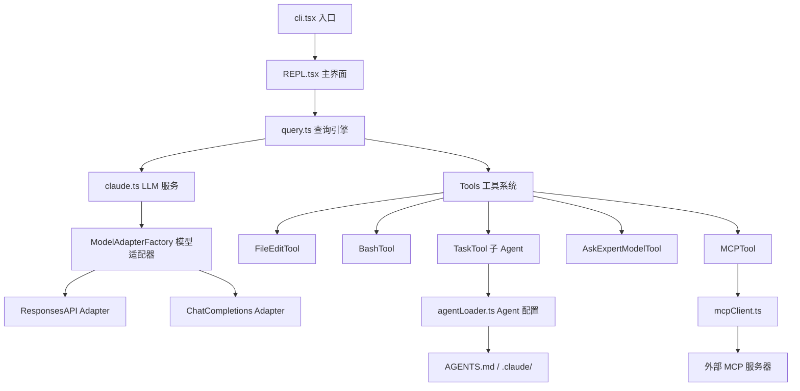

# Kode 架构分析

## 项目概述

**项目名称**: Kode - AI Coding Agent  
**技术栈**: TypeScript + React (Ink) + Bun/Node.js  
**开源协议**: Apache 2.0  
**代码仓库**: https://github.com/shareAI-lab/kode  
**核心特性**: 终端内 AI 编程助手，支持多模型协作、动态 Agent 系统、MCP 协议集成

---

## 一、核心架构设计

### 1.1 三层并行架构

Kode 采用经典的三层架构设计，清晰地分离关注点：

```
┌─────────────────────────────────────────────────────┐
│           用户交互层 (User Interface)               │
│         src/screens/REPL.tsx + Ink UI              │
│   • 终端界面渲染                                     │
│   • 命令解析                                         │
│   • 实时 UI 更新                                     │
└─────────────────────────────────────────────────────┘
                        ↓
┌─────────────────────────────────────────────────────┐
│          编排层 (Orchestration Layer)               │
│      src/query.ts + src/services/claude.ts         │
│   • 对话流程控制                                     │
│   • 多模型协作调度                                   │
│   • 上下文管理                                       │
│   • 消息归一化处理                                   │
└─────────────────────────────────────────────────────┘
                        ↓
┌─────────────────────────────────────────────────────┐
│          工具执行层 (Tool Execution Layer)          │
│              src/tools/* + MCP                      │
│   • 文件 I/O 操作                                    │
│   • Shell 命令执行                                   │
│   • 代码搜索与分析                                   │
│   • 外部工具集成 (MCP)                               │
└─────────────────────────────────────────────────────┘
```

### 1.2 核心组件关系图



---

## 二、多模型协作系统

### 2.1 ModelManager - 模型管理核心

**位置**: `src/utils/model.ts`

Kode 最大的创新在于其**多模型协作架构**，通过 `ModelManager` 实现：

```typescript
export class ModelManager {
  private config: any
  private modelProfiles: ModelProfile[]

  // 模型指针系统 - 支持动态模型切换
  getCurrentModel(): string | null
  getModelName(pointer: ModelPointerType): string | null
  
  // 多用途模型指针
  // - main: 主对话模型
  // - task: 子任务模型（TaskTool 使用）
  // - reasoning: 推理模型（复杂问题）
  // - quick: 快速响应模型
}
```

**模型配置结构**:

```typescript
interface ModelProfile {
  name: string              // 唯一标识符
  modelName: string         // 实际模型名称 (如 gpt-5, claude-3-7-sonnet)
  apiKey: string            // API 密钥
  baseURL?: string          // 自定义 API 端点
  provider: string          // 提供商 (openai, anthropic, custom)
  isActive: boolean         // 是否激活
  maxTokens?: number        // 最大 token 数
  reasoningEffort?: string  // 推理强度 (low/medium/high)
}
```

### 2.2 ModelAdapterFactory - API 适配器

**位置**: `src/services/modelAdapterFactory.ts`

为了支持多种 LLM API 格式，Kode 实现了适配器模式：

```typescript
export class ModelAdapterFactory {
  static createAdapter(modelProfile: ModelProfile): ModelAPIAdapter {
    const capabilities = getModelCapabilities(modelProfile.modelName)
    const apiType = this.determineAPIType(modelProfile, capabilities)
    
    switch (apiType) {
      case 'responses_api':
        return new ResponsesAPIAdapter(capabilities, modelProfile)
      case 'chat_completions':
      default:
        return new ChatCompletionsAdapter(capabilities, modelProfile)
    }
  }
}
```

**支持的 API 架构**:
1. **OpenAI Responses API** - GPT-5 等高级模型的专用 API
2. **Chat Completions API** - 标准的对话补全 API（兼容 OpenAI/Anthropic）
3. **Streaming Support** - 支持流式响应

### 2.3 @ask-model 专家咨询工具

**位置**: `src/tools/AskExpertModelTool/AskExpertModelTool.tsx`

允许主模型向其他模型咨询意见：

```typescript
// 使用示例
@ask-gpt-5 "分析这段代码的时间复杂度并建议优化方案：[代码]"
@ask-claude-opus "评估这个系统架构的可扩展性"
```

**关键特性**:
- **完全独立的上下文** - 每个咨询都是独立会话
- **会话管理** - 支持多轮对话 (chat_session_id)
- **防止自我咨询** - 自动检测并拒绝咨询当前运行的模型
- **自包含问题要求** - 强制要求问题包含完整上下文

---

##三、动态 Agent 系统

### 3.1 Agent 配置加载机制

**位置**: `src/utils/agentLoader.ts`

Kode 的 Agent 系统借鉴了 Claude Code 的 `.claude` 目录结构，但进行了扩展：

**5 级优先级系统**:
```
1. Built-in (代码内置) - 最低优先级
2. ~/.claude/agents/ (Claude Code 用户目录兼容)
3. ~/.kode/agents/ (Kode 用户目录)
4. ./.claude/agents/ (项目级 Claude Code 兼容)
5. ./.kode/agents/ (项目级 Kode) - 最高优先级
```

**Agent 配置格式** (Markdown + YAML Frontmatter):

```markdown
---
name: database-specialist
description: "专门处理数据库相关任务的 Agent"
tools: ["FileRead", "FileEdit", "Bash", "Grep"]
model_name: gpt-5  # 可选，默认使用 'task' 指针
color: blue        # 可选，UI 显示颜色
---

你是一个数据库专家 Agent。负责：
1. 数据库模式设计
2. SQL 查询优化
3. 迁移脚本编写

使用工具完成任务，保持高效和准确。
```

### 3.2 TaskTool - 子任务委托

**位置**: `src/tools/TaskTool/TaskTool.tsx`

TaskTool 是 Kode 的核心编排工具，支持：

```typescript
{
  description: "数据库优化",
  prompt: "分析并优化用户表的查询性能",
  model_name: "gpt-5",           // 可选，指定模型
  subagent_type: "database-specialist"  // 可选，使用特定 Agent
}
```

**执行流程**:
1. 加载 Agent 配置（如果指定）
2. 应用工具过滤（tools 字段）
3. 注入自定义 system prompt
4. 使用指定模型执行任务
5. 返回结果给主 Agent

**与主 Agent 的区别**:
- 独立的对话上下文
- 可以使用不同的模型
- 工具权限受限（根据 Agent 配置）
- 执行结果会反馈给主 Agent

### 3.3 Agent 热重载

```typescript
export async function startAgentWatcher(onReload: () => void) {
  // 监听所有 Agent 目录的变化
  const watchers = [
    watch(join(homedir(), '.claude', 'agents')),
    watch(join(homedir(), '.kode', 'agents')),
    watch(join(getCwd(), '.claude', 'agents')),
    watch(join(getCwd(), '.kode', 'agents'))
  ]
  
  // 文件变化时清除缓存并回调
  watchers.forEach(watcher => {
    watcher.on('change', () => {
      clearAgentCache()
      onReload()
    })
  })
}
```

---

## 四、工具系统架构

### 4.1 Tool 接口设计

**位置**: `src/Tool.ts`

所有工具必须实现标准的 `Tool` 接口：

```typescript
export interface Tool<TInput extends z.ZodObject<any> = z.ZodObject<any>, TOutput = any> {
  name: string
  description?: () => Promise<string>
  inputSchema: TInput                  // Zod 验证模式
  prompt: (options?: { safeMode?: boolean }) => Promise<string>
  
  // 功能检查
  isEnabled: () => Promise<boolean>
  isReadOnly: () => boolean
  isConcurrencySafe: () => boolean
  needsPermissions: (input?: z.infer<TInput>) => boolean
  
  // 输入验证
  validateInput?: (input: z.infer<TInput>, context?: ToolUseContext) => Promise<ValidationResult>
  
  // 执行逻辑
  call: (input: z.infer<TInput>, context: ToolUseContext) => AsyncGenerator<
    | { type: 'result'; data: TOutput; resultForAssistant?: string }
    | { type: 'progress'; content: any; normalizedMessages?: any[]; tools?: any[] },
    void,
    unknown
  >
  
  // UI 渲染
  renderToolUseMessage: (input: z.infer<TInput>, options: { verbose: boolean }) => string
  renderToolResultMessage?: (output: TOutput) => React.ReactElement
  renderToolUseRejectedMessage?: (...args: any[]) => React.ReactElement
  renderResultForAssistant: (output: TOutput) => string | any[]
}
```

### 4.2 核心工具实现

#### FileEditTool - 文件编辑

**位置**: `src/tools/FileEditTool/FileEditTool.tsx`

**输入模式**:
```typescript
{
  file_path: string,   // 绝对路径
  old_string: string,  // 要替换的文本
  new_string: string   // 新文本
}
```

**关键特性**:
- **Diff 算法** - 使用 `diff` 库生成结构化补丁
- **文件编码检测** - 自动检测和保留原始编码
- **行尾符保留** - 保持 CRLF/LF 一致性
- **权限检查** - 写入前验证文件权限
- **时间戳跟踪** - 记录文件修改时间，避免冲突

**验证逻辑**:
```typescript
async validateInput({ file_path, old_string, new_string }, { readFileTimestamps }) {
  // 1. 检查是否有实际变更
  if (old_string === new_string) {
    return { result: false, message: '无变更：old_string 和 new_string 相同' }
  }
  
  // 2. 创建新文件的情况
  if (!existsSync(fullFilePath) && old_string === '') {
    return { result: true }  // 允许创建
  }
  
  // 3. 文件已存在但 old_string 为空
  if (existsSync(fullFilePath) && old_string === '') {
    return { result: false, message: '无法创建新文件 - 文件已存在' }
  }
  
  // 4. 检查 old_string 是否在文件中
  const content = readFileSync(fullFilePath, encoding)
  if (!content.includes(old_string)) {
    return { result: false, message: '未找到 old_string' }
  }
  
  // 5. 检查是否多次匹配
  const occurrences = content.split(old_string).length - 1
  if (occurrences > 1) {
    return { result: false, message: `old_string 匹配了 ${occurrences} 次` }
  }
  
  return { result: true }
}
```

#### BashTool - Shell 命令执行

**位置**: `src/tools/BashTool/BashTool.tsx`

**关键安全特性**:
1. **命令黑名单** - 禁止执行危险命令（如 `rm -rf /`）
2. **目录沙箱** - 限制 `cd` 只能进入原始工作目录的子目录
3. **超时控制** - 默认 120 秒超时，最大 600 秒
4. **输出截断** - 自动截断过长输出，防止上下文溢出

**持久化 Shell**:
```typescript
// 使用 PersistentShell 保持环境变量和工作目录
const shell = PersistentShell.getInstance()
await shell.executeCommand(command, {
  timeout,
  onStdout: (data) => stdout += data,
  onStderr: (data) => stderr += data,
  abortSignal: abortController.signal
})
```

#### AskExpertModelTool - 专家咨询

**自包含问题强制要求**:

```typescript
// Prompt 中的明确指引
`CRITICAL REQUIREMENT FOR QUESTION PARAMETER:
The question MUST be completely self-contained and include:
1. FULL BACKGROUND CONTEXT - All relevant information the expert needs
2. SPECIFIC SITUATION - Clear description of the current scenario/problem
3. INDEPENDENT QUESTION - What exactly you want the expert to analyze/answer

The expert model receives ONLY your question content with NO access to:
- Previous conversation history (unless using existing session)  
- Current codebase or file context
- User's current task or project details`
```

**会话管理**:
```typescript
// 支持多轮对话
export function createExpertChatSession(expertModel: string): string {
  const sessionId = nanoid()
  const session = {
    sessionId,
    expertModel,
    messages: [],
    createdAt: Date.now()
  }
  expertChatSessions.set(sessionId, session)
  return sessionId
}
```

### 4.3 工具并发控制

**位置**: `src/utils/toolExecutionController.ts`

```typescript
export function createToolExecutionController() {
  const concurrentTools = new Map<string, Promise<any>>()
  const MAX_CONCURRENCY = 10
  
  return {
    async executeTools(toolCalls: ToolCall[]) {
      // 区分并发安全和非安全工具
      const safeCalls = toolCalls.filter(t => tools[t.name].isConcurrencySafe())
      const unsafeCalls = toolCalls.filter(t => !tools[t.name].isConcurrencySafe())
      
      // 并发执行安全工具
      await Promise.all(safeCalls.map(executeToolCall))
      
      // 串行执行非安全工具
      for (const call of unsafeCalls) {
        await executeToolCall(call)
      }
    }
  }
}
```

**并发安全性标记**:
```typescript
// 只读工具 - 并发安全
FileReadTool.isConcurrencySafe() // true
GrepTool.isConcurrencySafe()     // true
AskExpertModelTool.isConcurrencySafe() // true

// 写操作工具 - 并发不安全
FileEditTool.isConcurrencySafe() // false
BashTool.isConcurrencySafe()     // false
TaskTool.isConcurrencySafe()     // false
```

---

## 五、MCP (Model Context Protocol) 集成

### 5.1 MCP 客户端架构

**位置**: `src/services/mcpClient.ts`

Kode 全面集成了 Anthropic 的 MCP 协议，支持：

**传输方式**:
- **StdioClientTransport** - 本地进程通信
- **SSEClientTransport** - HTTP Server-Sent Events

**配置作用域**:
```typescript
type ConfigScope = 'project' | 'global' | 'mcprc'

// 1. project - .kode/config.json 项目配置
// 2. global - ~/.kode/config.json 全局配置  
// 3. mcprc - .mcprc 文件（临时测试）
```

**MCP 服务器配置示例**:
```json
{
  "mcpServers": {
    "filesystem": {
      "command": "npx",
      "args": ["-y", "@modelcontextprotocol/server-filesystem", "/path/to/allowed"],
      "env": {
        "NODE_ENV": "production"
      }
    },
    "github": {
      "command": "uvx",
      "args": ["mcp-server-github"],
      "env": {
        "GITHUB_TOKEN": "${GITHUB_TOKEN}"
      }
    }
  }
}
```

### 5.2 MCP 工具动态生成

```typescript
export async function getMCPTools(): Promise<Tool[]> {
  const mcpTools: Tool[] = []
  const clients = await getClients()
  
  for (const [serverName, client] of clients.entries()) {
    // 列出服务器提供的工具
    const { tools } = await client.client.listTools()
    
    for (const tool of tools) {
      // 为每个 MCP 工具创建 Kode Tool 包装器
      const kodeTool = createMCPToolWrapper(serverName, tool, client)
      mcpTools.push(kodeTool)
    }
  }
  
  return mcpTools
}
```

**工具名称格式**: `mcp_{serverName}_{toolName}`

例如: `mcp_filesystem_read_file`, `mcp_github_create_issue`

### 5.3 权限审批机制

**位置**: `src/services/mcpServerApproval.tsx`

```typescript
// 首次使用 MCP 服务器需要用户审批
export async function handleMcprcServerApprovals() {
  const mcprcConfig = getMcprcConfig()
  const globalConfig = getGlobalConfig()
  const approvedServers = globalConfig.approvedMcpServers || {}
  
  for (const [serverName, serverConfig] of Object.entries(mcprcConfig)) {
    if (!approvedServers[serverName]) {
      // 显示审批对话框
      const approved = await showApprovalDialog(serverName, serverConfig)
      if (approved) {
        approvedServers[serverName] = true
        saveGlobalConfig({ ...globalConfig, approvedServers })
      }
    }
  }
}
```

---

## 六、对话流程与状态管理

### 6.1 Query 引擎

**位置**: `src/query.ts`

核心的对话循环实现：

```typescript
export async function* query(
  messages: Message[],
  systemPrompt: string[],
  context: { [k: string]: string },
  canUseTool: CanUseToolFn,
  toolUseContext: ExtendedToolUseContext,
  getBinaryFeedbackResponse?: (m1, m2) => Promise<BinaryFeedbackResult>
): AsyncGenerator<Message, void> {
  
  // 1. 自动上下文压缩
  const { messages: processedMessages, wasCompacted } = 
    await checkAutoCompact(messages, toolUseContext)
  
  // 2. 构建完整系统提示
  const { systemPrompt: fullSystemPrompt, reminders } = 
    formatSystemPromptWithContext(systemPrompt, context, toolUseContext.agentId)
  
  // 3. 注入系统提醒到最后的用户消息
  if (reminders && messages.length > 0) {
    injectRemindersIntoLastUserMessage(messages, reminders)
  }
  
  // 4. 调用 LLM
  const assistantMessage = await queryLLM(
    normalizeMessagesForAPI(processedMessages),
    fullSystemPrompt,
    toolUseContext
  )
  
  yield assistantMessage
  
  // 5. 处理工具调用
  if (hasToolUse(assistantMessage)) {
    const toolResults = await executeTools(assistantMessage, toolUseContext)
    
    // 6. 递归继续对话
    yield* query(
      [...messages, assistantMessage, ...toolResults],
      systemPrompt,
      context,
      canUseTool,
      toolUseContext,
      getBinaryFeedbackResponse
    )
  }
}
```

### 6.2 消息归一化

**位置**: `src/utils/messages.ts`

处理不同 API 格式之间的转换：

```typescript
export function normalizeMessagesForAPI(messages: Message[]): MessageParam[] {
  return messages.map(msg => {
    if (msg.type === 'user') {
      return {
        role: 'user',
        content: processContent(msg.message.content)
      }
    } else if (msg.type === 'assistant') {
      return {
        role: 'assistant',
        content: msg.message.content
      }
    }
  }).filter(isNotEmptyMessage)
}
```

**特殊消息类型**:
- `INTERRUPT_MESSAGE` - 用户中断消息
- `INTERRUPT_MESSAGE_FOR_TOOL_USE` - 工具执行中断
- `Progress Message` - 工具执行进度（不发送给 LLM）

### 6.3 上下文自动压缩

**位置**: `src/utils/autoCompactCore.ts`

```typescript
export async function checkAutoCompact(
  messages: Message[],
  toolUseContext: ToolUseContext
): Promise<{ messages: Message[], wasCompacted: boolean }> {
  const totalTokens = estimateTokens(messages)
  const maxTokens = getMaxContextTokens(toolUseContext.options?.model)
  
  if (totalTokens > maxTokens * 0.8) {
    // 触发自动压缩
    const compactedMessages = await compactMessages(messages, {
      keepRecent: 10,  // 保留最近 10 条消息
      summarizeOlder: true  // 总结更早的消息
    })
    
    return { messages: compactedMessages, wasCompacted: true }
  }
  
  return { messages, wasCompacted: false }
}
```

---

## 七、权限与安全系统

### 7.1 权限模型

**位置**: `src/permissions.ts`, `src/utils/permissions/filesystem.ts`

Kode 实现了细粒度的权限控制：

**文件系统权限**:
```typescript
// 读权限白名单
const readPermissions = new Set<string>()

export function grantReadPermissionForOriginalDir() {
  readPermissions.add(getOriginalCwd())
}

export function hasReadPermission(filePath: string): boolean {
  const normalizedPath = normalize(filePath)
  return Array.from(readPermissions).some(allowed => 
    normalizedPath.startsWith(normalize(allowed))
  )
}

// 写权限白名单
const writePermissions = new Set<string>()

export function hasWritePermission(filePath: string): boolean {
  const normalizedPath = normalize(filePath)
  return Array.from(writePermissions).some(allowed => 
    normalizedPath.startsWith(normalize(allowed))
  )
}
```

**工具权限审批**:
```typescript
// 工具调用前的权限检查
export async function hasPermissionsToUseTool(
  tool: Tool,
  input: any,
  context: ToolUseContext
): Promise<boolean> {
  // 1. 检查 Safe Mode
  if (context.safeMode && !tool.isReadOnly()) {
    return false  // Safe Mode 下只允许只读工具
  }
  
  // 2. 工具自身的权限要求
  if (!tool.needsPermissions(input)) {
    return true  // 工具不需要权限
  }
  
  // 3. 检查已批准的工具列表
  const config = getGlobalConfig()
  const approvedTools = config.approvedTools || []
  
  if (approvedTools.includes(tool.name)) {
    return true
  }
  
  // 4. 请求用户批准
  return await requestUserApproval(tool, input)
}
```

### 7.2 安全模式 (Safe Mode)

**CLI 参数**: `kode --safe`

```typescript
// Safe Mode 限制
if (safeMode) {
  // 1. 所有工具调用需要用户确认
  // 2. 只允许只读工具自动执行
  // 3. 文件写入需要逐一批准
  // 4. Bash 命令需要逐条批准
}
```

**YOLO Mode (默认)**:
```typescript
// 完全信任模式 - 跳过所有权限检查
// 相当于 Claude Code 的 --dangerously-skip-permissions
```

### 7.3 命令黑名单

**位置**: `src/tools/BashTool/prompt.ts`

```typescript
export const BANNED_COMMANDS = [
  'rm',      // 防止误删文件
  'sudo',    // 防止提权
  'su',      // 防止切换用户
  'reboot',  // 防止重启
  'shutdown',// 防止关机
  'mkfs',    // 防止格式化
  'dd',      // 防止磁盘写入
  // ... 更多危险命令
]
```

---

## 八、UI 与用户体验

### 8.1 Ink UI 框架

Kode 使用 **Ink** (React for CLI) 构建终端 UI：

**核心组件**:
```typescript
// REPL 主界面
export function REPL({
  commands,
  safeMode,
  tools,
  verbose,
  initialMessages
}: Props) {
  return (
    <Box flexDirection="column">
      {/* 静态消息历史 */}
      <Static items={messages}>
        {(msg, i) => <Message key={i} message={msg} verbose={verbose} />}
      </Static>
      
      {/* 当前正在生成的消息 */}
      {isLoading && <Spinner />}
      
      {/* 权限请求对话框 */}
      {toolUseConfirm && (
        <PermissionRequest
          tool={toolUseConfirm.tool}
          input={toolUseConfirm.input}
          onApprove={toolUseConfirm.onApprove}
          onReject={toolUseConfirm.onReject}
        />
      )}
      
      {/* 输入框 */}
      {shouldShowPromptInput && (
        <PromptInput
          value={inputValue}
          onChange={setInputValue}
          onSubmit={handleSubmit}
        />
      )}
    </Box>
  )
}
```

### 8.2 智能补全系统

**位置**: `src/components/PromptInput.tsx`

Kode 实现了先进的模糊匹配补全：

**补全类型**:
1. **Unix 命令** - 500+ 常用命令库
2. **文件路径** - 实时文件系统扫描
3. **Agent** - `@run-agent-name`
4. **模型** - `@ask-model-name`

**匹配算法**:
```typescript
// 连字符感知匹配
'dao' → 'run-agent-dao-qi-harmony-designer'

// 缩写支持
'dq' → 'dao-qi'
'nde' → 'node'

// 数字后缀处理
'py3' → 'python3'

// 多算法融合
- Levenshtein Distance (编辑距离)
- Prefix Match (前缀匹配)
- Fuzzy Match (模糊匹配)
- Abbreviation Match (缩写匹配)
```

### 8.3 实时语法高亮

**位置**: `src/components/Message.tsx`

```typescript
// 使用 cli-highlight 进行代码高亮
import { highlight } from 'cli-highlight'

export function CodeBlock({ code, language }: Props) {
  const highlighted = highlight(code, {
    language,
    theme: getTheme().codeTheme
  })
  
  return <Text>{highlighted}</Text>
}
```

---

## 九、日志与调试系统

### 9.1 对话日志持久化

**位置**: `src/utils/log.ts`

```typescript
// 日志文件命名: {timestamp}_{forkNumber}.json
// 例如: 20250131_143022_0.json

export function overwriteLog(
  messageLogName: string,
  forkNumber: number,
  messages: Message[]
) {
  const logPath = getMessagesPath(messageLogName, forkNumber)
  writeFileSync(logPath, JSON.stringify(messages, null, 2))
}

// 支持对话分叉
export function getNextAvailableLogForkNumber(
  messageLogName: string,
  currentFork: number
): number {
  let fork = currentFork + 1
  while (existsSync(getMessagesPath(messageLogName, fork))) {
    fork++
  }
  return fork
}
```

### 9.2 调试日志系统

**位置**: `src/utils/debugLogger.ts`

```typescript
export const debugLogger = {
  // 阶段标记
  markPhase(phase: string) {
    if (!process.env.KODE_DEBUG) return
    console.log(`[${new Date().toISOString()}] === ${phase} ===`)
  },
  
  // LLM 交互日志
  logLLMInteraction(request: any, response: any) {
    if (!process.env.KODE_DEBUG) return
    console.log('LLM Request:', JSON.stringify(request, null, 2))
    console.log('LLM Response:', JSON.stringify(response, null, 2))
  },
  
  // 错误诊断
  logErrorWithDiagnosis(error: Error, context: any) {
    console.error('Error:', error.message)
    console.error('Context:', context)
    console.error('Stack:', error.stack)
  }
}
```

**环境变量控制**:
```bash
# 启用调试日志
export KODE_DEBUG=1

# 启用 Agent 配置调试
export KODE_DEBUG_AGENTS=1

# 启用详细日志
kode --verbose
```

### 9.3 成本跟踪

**位置**: `src/cost-tracker.ts`

```typescript
let totalCostUSD = 0

export function addToTotalCost(costUSD: number) {
  totalCostUSD += costUSD
}

export function getTotalCost(): number {
  return totalCostUSD
}

// 显示成本摘要
export function useCostSummary() {
  const cost = getTotalCost()
  return `Total cost: $${cost.toFixed(4)}`
}
```

---

## 十、与其他 Coding Agent 对比

### 10.1 vs Claude Code

| 特性 | Kode | Claude Code |
|------|------|-------------|
| **开源协议** | Apache 2.0 | 闭源 |
| **多模型支持** | ✅ 无限制 | ❌ 仅 Claude |
| **Agent 系统** | ✅ 动态 + 兼容 .claude | ⚠️ 静态 .claude |
| **MCP 集成** | ✅ 完整支持 | ✅ 完整支持 |
| **权限系统** | ✅ 细粒度 | ✅ 细粒度 |
| **专家咨询** | ✅ @ask-model | ❌ 不支持 |
| **子任务委托** | ✅ TaskTool | ❌ 不支持 |
| **热重载配置** | ✅ Agent 热重载 | ❌ 需重启 |

### 10.2 vs Aider

| 特性 | Kode | Aider |
|------|------|-------|
| **UI 框架** | Ink (React) | Rich (Python) |
| **Git 集成** | ⚠️ 基础 | ✅ 深度集成 |
| **编辑模式** | Search-Replace | Diff + Whole File |
| **上下文管理** | 自动压缩 | Map + 手动 |
| **工具扩展** | MCP + Tool Interface | 内置工具 |

### 10.3 vs Gemini CLI (本项目)

| 特性 | Kode | Gemini CLI |
|------|------|------------|
| **架构** | 三层并行 | 插件化 |
| **模型支持** | 多模型协作 | 仅 Gemini |
| **工具系统** | Tool Interface + MCP | DevInsFlow + Extension |
| **Agent 系统** | 动态 Agent | ❌ 不支持 |
| **IDE 集成** | 终端独立 | IntelliJ 插件 |

---

## 十一、关键技术亮点

### 1. 多模型协作编排

通过 `ModelManager` 和 `AskExpertModelTool` 实现了业界领先的多模型协作：
- 主模型可以咨询其他模型的专业意见
- 子任务可以使用不同的模型执行
- 支持模型指针动态切换

### 2. 动态 Agent 配置系统

借鉴 Claude Code 的 `.claude` 目录，扩展支持：
- 5 级优先级覆盖机制
- Markdown + YAML 的简洁配置
- 热重载支持，无需重启

### 3. MCP 协议深度集成

完整实现了 Anthropic 的 MCP 标准：
- 支持 Stdio 和 SSE 传输
- 动态工具生成
- 权限审批机制

### 4. 安全的工具执行

- 细粒度的文件系统权限
- 命令黑名单
- 目录沙箱
- Safe Mode / YOLO Mode

### 5. 优秀的开发者体验

- TypeScript 类型安全
- Zod 验证模式
- React 风格的 UI 组件
- 详细的调试日志

---

## 十二、可借鉴的设计模式

### 1. 适配器模式 (ModelAdapterFactory)

**应用场景**: 统一不同 LLM API 的接口

```typescript
interface ModelAPIAdapter {
  createCompletion(params: UnifiedRequestParams): Promise<Response>
  supportsStreaming(): boolean
}

class ResponsesAPIAdapter implements ModelAPIAdapter { ... }
class ChatCompletionsAdapter implements ModelAPIAdapter { ... }
```

### 2. 工具模式 (Tool Interface)

**应用场景**: 标准化工具的定义和执行

```typescript
interface Tool {
  name: string
  call: (input, context) => AsyncGenerator
  validate: (input) => Promise<ValidationResult>
  needsPermissions: (input) => boolean
}
```

### 3. 生成器模式 (AsyncGenerator)

**应用场景**: 流式处理工具执行结果

```typescript
async function* executeTool() {
  yield { type: 'progress', content: '正在处理...' }
  const result = await doWork()
  yield { type: 'result', data: result }
}
```

### 4. 观察者模式 (Event Emitter)

**应用场景**: 系统提醒和事件通知

```typescript
export function emitReminderEvent(event: string, data: any) {
  systemReminder.emit(event, data)
}

systemReminder.on('session:startup', (data) => {
  console.log('Session started:', data)
})
```

### 5. 策略模式 (Permission Strategy)

**应用场景**: 不同的权限检查策略

```typescript
interface PermissionStrategy {
  check(tool: Tool, input: any): Promise<boolean>
}

class SafeModeStrategy implements PermissionStrategy { ... }
class YOLOModeStrategy implements PermissionStrategy { ... }
```

---

## 十三、未来发展方向

根据代码分析，Kode 可能的演进方向：

### 1. IDE 深度集成

- VS Code Extension
- JetBrains Plugin
- Sublime Text Plugin

### 2. Web UI

- 基于 Next.js 的 Web 界面
- 实时协作功能
- 远程 Agent 托管

### 3. 更强的 Git 集成

- 自动 commit 消息生成
- PR 创建和审查
- Branch 管理

### 4. Agent 市场

- 公共 Agent 库
- Agent 分享和评分
- 一键安装机制

### 5. 企业功能

- 团队配置管理
- 审计日志
- 成本控制
- SSO 集成

---

## 总结

Kode 是一个**设计精良、架构清晰、扩展性强**的 Coding Agent 项目。其核心优势在于：

1. **多模型协作** - 打破单一模型限制，支持无限模型接入
2. **动态 Agent 系统** - 灵活的配置和热重载，兼容 Claude Code 生态
3. **MCP 深度集成** - 标准化的外部工具接入
4. **优秀的开发者体验** - TypeScript + React + Zod 的现代技术栈
5. **安全可控** - 细粒度权限和沙箱机制

对于 **AutoCRUD** 项目，可以借鉴：
- **Tool 接口设计** - 标准化工具定义
- **ModelAdapterFactory** - 统一多 LLM 接口
- **Agent 配置系统** - 动态加载和优先级覆盖
- **权限模型** - 文件系统和命令沙箱
- **日志和调试系统** - 完善的可观测性

Kode 的代码质量高、文档完善、社区活跃，是学习和参考 Coding Agent 实现的优秀范例。
