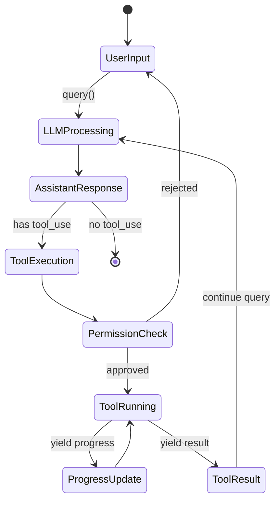
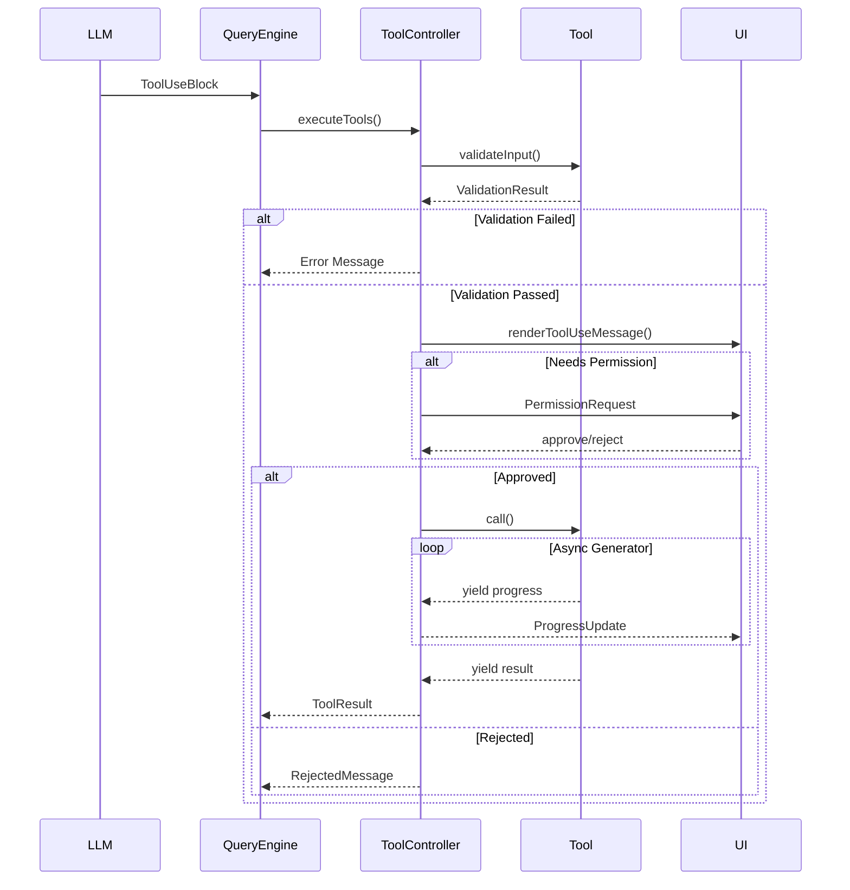

# Kode 核心实现详解

本文档深入分析 Kode 的关键实现细节，包括代码级的设计决策和最佳实践。

---

## 一、消息流转与状态机

### 1.1 消息类型系统

Kode 定义了三种核心消息类型：

```typescript
// src/query.ts

// 用户消息
export type UserMessage = {
  message: MessageParam        // Anthropic API 格式
  type: 'user'
  uuid: UUID                   // 唯一标识符
  toolUseResult?: FullToolUseResult  // 工具执行结果（如果有）
  options?: {
    isKodingRequest?: boolean       // 是否为 # 命令请求
    kodingContext?: string          // Koding 上下文
    isCustomCommand?: boolean       // 是否为自定义命令
    commandName?: string
    commandArgs?: string
  }
}

// 助手消息
export type AssistantMessage = {
  costUSD: number              // API 调用成本
  durationMs: number           // 响应时间
  message: APIAssistantMessage // Anthropic API 格式
  type: 'assistant'
  uuid: UUID
  isApiErrorMessage?: boolean  // 是否为错误消息
  responseId?: string          // GPT-5 Responses API 状态管理
}

// 进度消息（不发送给 LLM）
export type ProgressMessage = {
  content: AssistantMessage
  normalizedMessages: NormalizedMessage[]
  siblingToolUseIDs: Set<string>  // 同批次工具调用 ID
  tools: Tool[]
  toolUseID: string
  type: 'progress'
  uuid: UUID
}
```

### 1.2 消息状态转换



### 1.3 关键代码：Query 循环

```typescript
// src/query.ts

export async function* query(
  messages: Message[],
  systemPrompt: string[],
  context: { [k: string]: string },
  canUseTool: CanUseToolFn,
  toolUseContext: ExtendedToolUseContext,
  getBinaryFeedbackResponse?: (m1, m2) => Promise<BinaryFeedbackResult>
): AsyncGenerator<Message, void> {
  
  // === 阶段 1: 上下文压缩 ===
  markPhase('AUTO_COMPACT_CHECK')
  const { messages: processedMessages, wasCompacted } = 
    await checkAutoCompact(messages, toolUseContext)
  
  if (wasCompacted) {
    messages = processedMessages
    logUserFriendly('Context auto-compacted to fit within limits')
  }
  
  // === 阶段 2: 系统提示构建 ===
  markPhase('SYSTEM_PROMPT_BUILD')
  const { systemPrompt: fullSystemPrompt, reminders } =
    formatSystemPromptWithContext(systemPrompt, context, toolUseContext.agentId)
  
  // 发出会话启动事件
  emitReminderEvent('session:startup', {
    agentId: toolUseContext.agentId,
    messages: messages.length,
    timestamp: Date.now()
  })
  
  // 注入系统提醒到最后的用户消息
  if (reminders && messages.length > 0) {
    for (let i = messages.length - 1; i >= 0; i--) {
      if (messages[i].type === 'user') {
        const userMsg = messages[i] as UserMessage
        userMsg.message.content = [
          ...normalizeContent(userMsg.message.content),
          ...reminders.map(r => ({ type: 'text', text: r }))
        ]
        break
      }
    }
  }
  
  // === 阶段 3: 归一化消息 ===
  markPhase('MESSAGE_NORMALIZATION')
  const normalizedMessages = normalizeMessagesForAPI(messages)
  
  // === 阶段 4: LLM 调用 ===
  markPhase('LLM_CALL')
  const { message: rawAssistantMessage, shouldSkipPermissionCheck } = 
    await queryWithBinaryFeedback(
      toolUseContext,
      () => queryLLM(normalizedMessages, fullSystemPrompt, toolUseContext),
      getBinaryFeedbackResponse
    )
  
  if (!rawAssistantMessage) {
    // 用户取消
    return
  }
  
  // 检查中断
  if (toolUseContext.abortController.signal.aborted) {
    const interruptMessage = createAssistantMessage(INTERRUPT_MESSAGE, 0, 0)
    yield interruptMessage
    return
  }
  
  const assistantMessage = rawAssistantMessage
  yield assistantMessage
  
  // === 阶段 5: 工具执行 ===
  const toolUseBlocks = assistantMessage.message.content.filter(
    (block): block is ToolUseBlock => block.type === 'tool_use'
  )
  
  if (toolUseBlocks.length === 0) {
    // 没有工具调用，结束
    return
  }
  
  markPhase('TOOL_EXECUTION')
  
  // 区分并发安全和非安全工具
  const toolController = createToolExecutionController()
  const toolResults: Message[] = []
  
  for (const toolBlock of toolUseBlocks) {
    const tool = tools.find(t => t.name === toolBlock.name)
    if (!tool) {
      toolResults.push(createToolErrorMessage(toolBlock.id, `Tool ${toolBlock.name} not found`))
      continue
    }
    
    // 权限检查
    if (!shouldSkipPermissionCheck && tool.needsPermissions(toolBlock.input)) {
      const hasPermission = await canUseTool(tool, toolBlock.input)
      if (!hasPermission) {
        toolResults.push(createToolRejectedMessage(toolBlock.id))
        continue
      }
    }
    
    // 执行工具
    try {
      for await (const chunk of tool.call(toolBlock.input, toolUseContext)) {
        if (chunk.type === 'progress') {
          yield createProgressMessage(chunk, toolBlock.id, assistantMessage.uuid)
        } else if (chunk.type === 'result') {
          toolResults.push(createToolResultMessage(toolBlock.id, chunk.data))
        }
      }
    } catch (error) {
      toolResults.push(createToolErrorMessage(toolBlock.id, error.message))
    }
  }
  
  // === 阶段 6: 递归继续对话 ===
  markPhase('RECURSIVE_QUERY')
  yield* query(
    [...messages, assistantMessage, ...toolResults],
    systemPrompt,
    context,
    canUseTool,
    toolUseContext,
    getBinaryFeedbackResponse
  )
}
```

---

## 二、工具执行引擎

### 2.1 工具生命周期



### 2.2 工具并发控制器

```typescript
// src/utils/toolExecutionController.ts

export function createToolExecutionController() {
  const runningTools = new Map<string, AbortController>()
  const MAX_CONCURRENT_SAFE_TOOLS = 10
  
  return {
    async executeToolCalls(
      toolBlocks: ToolUseBlock[],
      tools: Tool[],
      context: ToolUseContext
    ): Promise<ToolResult[]> {
      
      // 分类工具
      const safeCalls = toolBlocks.filter(block => {
        const tool = tools.find(t => t.name === block.name)
        return tool?.isConcurrencySafe() ?? false
      })
      
      const unsafeCalls = toolBlocks.filter(block => {
        const tool = tools.find(t => t.name === block.name)
        return !(tool?.isConcurrencySafe() ?? false)
      })
      
      const results: ToolResult[] = []
      
      // 并发执行安全工具（限制并发数）
      if (safeCalls.length > 0) {
        const batches = chunkArray(safeCalls, MAX_CONCURRENT_SAFE_TOOLS)
        for (const batch of batches) {
          const batchResults = await Promise.all(
            batch.map(block => executeSingleTool(block, tools, context))
          )
          results.push(...batchResults)
        }
      }
      
      // 串行执行非安全工具
      for (const block of unsafeCalls) {
        const result = await executeSingleTool(block, tools, context)
        results.push(result)
      }
      
      return results
    },
    
    async executeSingleTool(
      block: ToolUseBlock,
      tools: Tool[],
      context: ToolUseContext
    ): Promise<ToolResult> {
      const tool = tools.find(t => t.name === block.name)
      if (!tool) {
        return createToolErrorResult(block.id, `Tool not found: ${block.name}`)
      }
      
      // 创建独立的 AbortController
      const abortController = new AbortController()
      runningTools.set(block.id, abortController)
      
      try {
        // 输入验证
        const validation = await tool.validateInput?.(block.input, context)
        if (validation && !validation.result) {
          return createToolErrorResult(block.id, validation.message)
        }
        
        // 执行工具
        const chunks: any[] = []
        for await (const chunk of tool.call(
          block.input,
          { ...context, abortController }
        )) {
          if (chunk.type === 'result') {
            return createToolResult(block.id, chunk.data, chunk.resultForAssistant)
          }
          chunks.push(chunk)
        }
        
        return createToolErrorResult(block.id, 'Tool did not yield a result')
        
      } catch (error) {
        if (error.name === 'AbortError') {
          return createToolErrorResult(block.id, 'Tool execution was aborted')
        }
        throw error
      } finally {
        runningTools.delete(block.id)
      }
    },
    
    abortTool(toolId: string) {
      const controller = runningTools.get(toolId)
      if (controller) {
        controller.abort()
      }
    },
    
    abortAll() {
      for (const controller of runningTools.values()) {
        controller.abort()
      }
      runningTools.clear()
    }
  }
}
```

### 2.3 FileEditTool 深度剖析

FileEditTool 是最复杂的工具之一，展示了 Kode 的精细设计：

```typescript
// src/tools/FileEditTool/FileEditTool.tsx

export const FileEditTool = {
  name: 'Edit',
  
  inputSchema: z.strictObject({
    file_path: z.string().describe('The absolute path to the file to modify'),
    old_string: z.string().describe('The text to replace'),
    new_string: z.string().describe('The text to replace it with'),
  }),
  
  async validateInput(
    { file_path, old_string, new_string },
    { readFileTimestamps }
  ): Promise<ValidationResult> {
    
    // 验证 1: 检查是否有实际变更
    if (old_string === new_string) {
      return {
        result: false,
        message: 'No changes to make: old_string and new_string are exactly the same.',
        meta: { old_string }
      }
    }
    
    const fullFilePath = isAbsolute(file_path)
      ? file_path
      : resolve(getCwd(), file_path)
    
    // 验证 2: 创建新文件的情况
    if (!existsSync(fullFilePath) && old_string === '') {
      // 允许创建新文件
      return { result: true }
    }
    
    // 验证 3: 文件已存在但试图创建
    if (existsSync(fullFilePath) && old_string === '') {
      return {
        result: false,
        message: 'Cannot create new file - file already exists.'
      }
    }
    
    // 验证 4: 文件不存在但 old_string 不为空
    if (!existsSync(fullFilePath) && old_string !== '') {
      // 查找相似文件名
      const similarFile = findSimilarFile(fullFilePath)
      if (similarFile) {
        return {
          result: false,
          message: `File not found. Did you mean: ${similarFile}?`
        }
      }
      return {
        result: false,
        message: `File not found: ${file_path}`
      }
    }
    
    // 验证 5: 检测文件编码
    const encoding = detectFileEncoding(fullFilePath)
    if (encoding === 'binary') {
      return {
        result: false,
        message: 'Cannot edit binary file'
      }
    }
    
    // 验证 6: 读取文件内容
    const content = readFileSync(fullFilePath, encoding)
    
    // 验证 7: 检查 old_string 是否存在
    if (!content.includes(old_string)) {
      // 尝试模糊匹配
      const fuzzyMatch = findFuzzyMatch(content, old_string)
      if (fuzzyMatch) {
        return {
          result: false,
          message: `old_string not found. Did you mean:\n${fuzzyMatch}`,
          meta: { suggestion: fuzzyMatch }
        }
      }
      return {
        result: false,
        message: 'old_string not found in file'
      }
    }
    
    // 验证 8: 检查是否多次匹配
    const occurrences = content.split(old_string).length - 1
    if (occurrences > 1) {
      return {
        result: false,
        message: `old_string appears ${occurrences} times in the file. Make it more specific.`,
        errorCode: 1,  // 特殊错误码，触发系统提醒
        meta: { occurrences }
      }
    }
    
    // 验证 9: 检查文件是否在会话中被修改过
    const lastModified = statSync(fullFilePath).mtimeMs
    const lastRead = readFileTimestamps[fullFilePath]
    
    if (lastRead && lastModified > lastRead) {
      return {
        result: false,
        message: 'File was modified outside of this session. Please re-read the file first.'
      }
    }
    
    return { result: true }
  },
  
  async *call(
    { file_path, old_string, new_string },
    { abortController, readFileTimestamps }
  ) {
    const fullFilePath = isAbsolute(file_path)
      ? file_path
      : resolve(getCwd(), file_path)
    
    // 步骤 1: 检测文件属性
    const encoding = detectFileEncoding(fullFilePath)
    const lineEndings = detectLineEndings(fullFilePath)
    
    // 步骤 2: 读取或创建文件
    let content = ''
    if (existsSync(fullFilePath)) {
      content = readFileSync(fullFilePath, encoding)
    }
    
    // 步骤 3: 执行替换
    const newContent = content.replace(old_string, new_string)
    
    // 步骤 4: 生成 diff
    const { patch, structuredPatch } = applyEdit(
      file_path,
      old_string,
      new_string
    )
    
    // 步骤 5: 创建目录（如果需要）
    const dir = dirname(fullFilePath)
    if (!existsSync(dir)) {
      mkdirSync(dir, { recursive: true })
    }
    
    // 步骤 6: 写入文件
    writeTextContent(fullFilePath, newContent, encoding, lineEndings)
    
    // 步骤 7: 更新时间戳
    readFileTimestamps[fullFilePath] = Date.now()
    
    // 步骤 8: 记录文件编辑（用于文件新鲜度追踪）
    recordFileEdit(fullFilePath)
    
    // 步骤 9: 触发系统提醒事件
    emitReminderEvent('file:edited', {
      filePath: fullFilePath,
      old_string,
      new_string,
      timestamp: Date.now()
    })
    
    // 步骤 10: 返回结果
    yield {
      type: 'result',
      data: {
        filePath: relative(getCwd(), fullFilePath),
        structuredPatch,
        encoding,
        lineEndings
      },
      resultForAssistant: `Successfully edited ${file_path}`
    }
  },
  
  renderResultForAssistant({ filePath, structuredPatch }) {
    // 为 LLM 生成简洁的结果描述
    const changes = structuredPatch.map(hunk => {
      const additions = hunk.lines.filter(l => l.startsWith('+')).length
      const deletions = hunk.lines.filter(l => l.startsWith('-')).length
      return `+${additions} -${deletions}`
    }).join(', ')
    
    return `File edited: ${filePath} (${changes})`
  },
  
  renderToolResultMessage({ filePath, structuredPatch }) {
    // 为终端 UI 渲染富文本结果
    return (
      <FileEditToolUpdatedMessage
        filePath={filePath}
        structuredPatch={structuredPatch}
        verbose={false}
      />
    )
  }
}
```

**关键设计点**:

1. **9 层验证** - 从简单到复杂，逐步验证输入有效性
2. **文件编码检测** - 支持 UTF-8, UTF-16, GBK 等多种编码
3. **行尾符保留** - 维持 Windows/Unix 换行符一致性
4. **时间戳追踪** - 防止并发修改冲突
5. **模糊匹配建议** - 帮助 LLM 纠正错误
6. **结构化 Diff** - 为 UI 和 LLM 提供不同的输出格式

---

## 三、模型适配器实现

### 3.1 适配器基类

```typescript
// src/services/adapters/base.ts

export interface UnifiedRequestParams {
  messages: MessageParam[]
  systemPrompt: string[]
  model: string
  maxTokens?: number
  temperature?: number
  topP?: number
  stream?: boolean
  tools?: any[]
  reasoningEffort?: 'low' | 'medium' | 'high'
}

export interface UnifiedResponse {
  content: ContentBlock[]
  stopReason: 'end_turn' | 'max_tokens' | 'tool_use' | 'stop_sequence'
  usage: {
    inputTokens: number
    outputTokens: number
    thinkingTokens?: number
  }
  responseId?: string  // For GPT-5 Responses API
}

export abstract class ModelAPIAdapter {
  constructor(
    protected capabilities: ModelCapabilities,
    protected profile: ModelProfile
  ) {}
  
  abstract createCompletion(
    params: UnifiedRequestParams
  ): Promise<UnifiedResponse>
  
  abstract createStreamingCompletion(
    params: UnifiedRequestParams
  ): AsyncGenerator<UnifiedResponse, void>
  
  supportsStreaming(): boolean {
    return this.capabilities.features.streaming
  }
  
  supportsTools(): boolean {
    return this.capabilities.features.toolUse
  }
  
  supportsThinking(): boolean {
    return this.capabilities.features.thinking
  }
}
```

### 3.2 ChatCompletions 适配器

```typescript
// src/services/adapters/chatCompletions.ts

export class ChatCompletionsAdapter extends ModelAPIAdapter {
  private client: OpenAI
  
  constructor(capabilities: ModelCapabilities, profile: ModelProfile) {
    super(capabilities, profile)
    this.client = new OpenAI({
      apiKey: profile.apiKey,
      baseURL: profile.baseURL,
      defaultHeaders: {
        'User-Agent': USER_AGENT
      }
    })
  }
  
  async createCompletion(params: UnifiedRequestParams): Promise<UnifiedResponse> {
    const request = this.transformRequest(params)
    
    const response = await this.client.chat.completions.create(request)
    
    return this.transformResponse(response)
  }
  
  async *createStreamingCompletion(
    params: UnifiedRequestParams
  ): AsyncGenerator<UnifiedResponse, void> {
    const request = this.transformRequest(params)
    
    const stream = await this.client.chat.completions.create({
      ...request,
      stream: true
    })
    
    for await (const chunk of stream) {
      yield this.transformStreamChunk(chunk)
    }
  }
  
  private transformRequest(params: UnifiedRequestParams): any {
    const messages = params.messages.map(msg => {
      if (msg.role === 'system') {
        // 某些模型不支持 system role，转换为 user
        if (!this.capabilities.features.systemMessage) {
          return {
            role: 'user',
            content: `[System]: ${msg.content}`
          }
        }
      }
      return msg
    })
    
    // 注入 system prompt
    if (params.systemPrompt.length > 0) {
      if (this.capabilities.features.systemMessage) {
        messages.unshift({
          role: 'system',
          content: params.systemPrompt.join('\n\n')
        })
      } else {
        // 将 system prompt 注入到第一条 user 消息
        const firstUserIndex = messages.findIndex(m => m.role === 'user')
        if (firstUserIndex >= 0) {
          messages[firstUserIndex].content = 
            `${params.systemPrompt.join('\n\n')}\n\n${messages[firstUserIndex].content}`
        }
      }
    }
    
    const request: any = {
      model: params.model,
      messages,
      max_tokens: params.maxTokens,
      temperature: params.temperature,
      top_p: params.topP
    }
    
    // 工具支持
    if (params.tools && this.supportsTools()) {
      request.tools = params.tools.map(tool => ({
        type: 'function',
        function: {
          name: tool.name,
          description: tool.description,
          parameters: tool.input_schema
        }
      }))
    }
    
    return request
  }
  
  private transformResponse(response: any): UnifiedResponse {
    const choice = response.choices[0]
    
    // 转换 content
    const content: ContentBlock[] = []
    
    if (choice.message.content) {
      content.push({
        type: 'text',
        text: choice.message.content
      })
    }
    
    // 转换 tool_calls
    if (choice.message.tool_calls) {
      for (const toolCall of choice.message.tool_calls) {
        content.push({
          type: 'tool_use',
          id: toolCall.id,
          name: toolCall.function.name,
          input: JSON.parse(toolCall.function.arguments)
        })
      }
    }
    
    return {
      content,
      stopReason: this.mapFinishReason(choice.finish_reason),
      usage: {
        inputTokens: response.usage.prompt_tokens,
        outputTokens: response.usage.completion_tokens
      }
    }
  }
  
  private mapFinishReason(reason: string): UnifiedResponse['stopReason'] {
    switch (reason) {
      case 'stop':
        return 'end_turn'
      case 'length':
        return 'max_tokens'
      case 'tool_calls':
        return 'tool_use'
      default:
        return 'end_turn'
    }
  }
}
```

### 3.3 ResponsesAPI 适配器

```typescript
// src/services/adapters/responsesAPI.ts

export class ResponsesAPIAdapter extends ModelAPIAdapter {
  private client: OpenAI
  
  async createCompletion(params: UnifiedRequestParams): Promise<UnifiedResponse> {
    // GPT-5 Responses API 使用特殊的 endpoint
    const response = await this.client.post('/responses', {
      model: params.model,
      conversation_id: responseStateManager.getConversationId(),
      previous_response_id: responseStateManager.getPreviousResponseId(),
      message: {
        role: 'user',
        content: this.buildMessageContent(params)
      },
      reasoning_effort: params.reasoningEffort || 'medium',
      max_output_tokens: params.maxTokens
    })
    
    // 保存状态用于下次请求
    responseStateManager.updateState({
      conversationId: response.conversation_id,
      previousResponseId: response.response_id
    })
    
    return this.transformResponse(response)
  }
  
  private buildMessageContent(params: UnifiedRequestParams): any {
    // Responses API 支持更丰富的消息格式
    const parts: any[] = []
    
    // 注入 system prompt 作为特殊的 context
    if (params.systemPrompt.length > 0) {
      parts.push({
        type: 'context',
        text: params.systemPrompt.join('\n\n')
      })
    }
    
    // 转换历史消息
    for (const msg of params.messages) {
      if (msg.role === 'user') {
        parts.push({
          type: 'text',
          text: msg.content
        })
      } else if (msg.role === 'assistant') {
        // 助手消息作为上下文
        parts.push({
          type: 'assistant_context',
          content: msg.content
        })
      }
    }
    
    return { parts }
  }
  
  private transformResponse(response: any): UnifiedResponse {
    const content: ContentBlock[] = []
    
    // 处理 thinking block
    if (response.thinking) {
      content.push({
        type: 'thinking',
        thinking: response.thinking
      })
    }
    
    // 处理 output
    if (response.output) {
      for (const part of response.output.parts) {
        if (part.type === 'text') {
          content.push({
            type: 'text',
            text: part.text
          })
        } else if (part.type === 'tool_use') {
          content.push({
            type: 'tool_use',
            id: part.tool_use_id,
            name: part.tool_name,
            input: part.parameters
          })
        }
      }
    }
    
    return {
      content,
      stopReason: 'end_turn',
      usage: {
        inputTokens: response.usage.input_tokens,
        outputTokens: response.usage.output_tokens,
        thinkingTokens: response.usage.thinking_tokens
      },
      responseId: response.response_id
    }
  }
}
```

---

## 四、Agent 配置热重载

### 4.1 文件监听实现

```typescript
// src/utils/agentLoader.ts

let watchers: FSWatcher[] = []
let reloadCallback: (() => void) | null = null

export async function startAgentWatcher(onReload: () => void) {
  reloadCallback = onReload
  
  const dirsToWatch = [
    join(homedir(), '.claude', 'agents'),
    join(homedir(), '.kode', 'agents'),
    join(getCwd(), '.claude', 'agents'),
    join(getCwd(), '.kode', 'agents')
  ]
  
  for (const dir of dirsToWatch) {
    if (!existsSync(dir)) {
      // 创建目录
      mkdirSync(dir, { recursive: true })
    }
    
    try {
      const watcher = watch(dir, { recursive: true }, (eventType, filename) => {
        if (!filename || !filename.endsWith('.md')) {
          return
        }
        
        console.log(`Agent config changed: ${filename}`)
        
        // 清除缓存
        clearAgentCache()
        
        // 延迟回调，避免短时间内多次重载
        debouncedReload()
      })
      
      watchers.push(watcher)
    } catch (error) {
      console.warn(`Failed to watch directory: ${dir}`, error)
    }
  }
}

const debouncedReload = debounce(() => {
  if (reloadCallback) {
    reloadCallback()
  }
}, 300)

export function stopAgentWatcher() {
  for (const watcher of watchers) {
    watcher.close()
  }
  watchers = []
  reloadCallback = null
}

export function clearAgentCache() {
  // 清除 memoize 缓存
  getActiveAgents.cache.clear?.()
  getAllAgents.cache.clear?.()
}
```

### 4.2 Agent 配置解析

```typescript
// src/utils/agentLoader.ts

interface RawAgentConfig {
  name: string
  description: string
  tools?: string | string[] | '*'
  model?: string         // 已弃用
  model_name?: string    // 新字段
  color?: string
}

async function parseAgentFile(filePath: string): Promise<AgentConfig | null> {
  try {
    const content = readFileSync(filePath, 'utf-8')
    const { data: frontmatter, content: body } = matter(content)
    
    // 验证必需字段
    if (!frontmatter.name || !frontmatter.description) {
      console.warn(`Skipping ${filePath}: missing required fields`)
      return null
    }
    
    // 向后兼容性处理
    if (frontmatter.model && !frontmatter.model_name) {
      if (process.env.KODE_DEBUG_AGENTS) {
        console.warn(
          `⚠️ Agent ${frontmatter.name}: 'model' field is deprecated. ` +
          `Use 'model_name' instead.`
        )
      }
      // 静默忽略 model 字段，不自动转换
    }
    
    // 解析 tools 字段
    const tools = parseTools(frontmatter.tools)
    
    // 构建 AgentConfig
    const agent: AgentConfig = {
      agentType: frontmatter.name,
      whenToUse: frontmatter.description.replace(/\\n/g, '\n'),
      tools,
      systemPrompt: body.trim(),
      location: determineLocation(filePath),
      ...(frontmatter.color && { color: frontmatter.color }),
      ...(frontmatter.model_name && { model_name: frontmatter.model_name })
    }
    
    return agent
    
  } catch (error) {
    console.error(`Failed to parse agent file: ${filePath}`, error)
    return null
  }
}

function parseTools(tools: any): string[] | '*' {
  if (!tools) return '*'
  if (tools === '*') return '*'
  
  if (Array.isArray(tools)) {
    const validTools = tools.filter(t => typeof t === 'string')
    return validTools.length > 0 ? validTools : '*'
  }
  
  if (typeof tools === 'string') {
    if (tools === '*') return '*'
    // 逗号分隔的字符串
    return tools.split(',').map(t => t.trim()).filter(t => t.length > 0)
  }
  
  return '*'
}
```

---

## 五、MCP 工具包装器

### 5.1 动态工具生成

```typescript
// src/services/mcpClient.ts

export async function getMCPTools(): Promise<Tool[]> {
  const mcpTools: Tool[] = []
  const clients = await getClients()
  
  for (const [serverName, wrappedClient] of clients.entries()) {
    try {
      // 列出服务器提供的工具
      const { tools } = await wrappedClient.client.listTools()
      
      for (const mcpTool of tools) {
        // 为每个 MCP 工具创建 Kode Tool 包装器
        const kodeTool = createMCPToolWrapper(serverName, mcpTool, wrappedClient)
        mcpTools.push(kodeTool)
      }
    } catch (error) {
      logMCPError(serverName, 'Failed to list tools', error)
    }
  }
  
  return mcpTools
}

function createMCPToolWrapper(
  serverName: string,
  mcpTool: MCPToolDefinition,
  client: WrappedClient
): Tool {
  const toolName = `mcp_${serverName}_${mcpTool.name}`
  
  return {
    name: toolName,
    
    async description() {
      return mcpTool.description || `MCP tool from ${serverName}`
    },
    
    async prompt() {
      return `${mcpTool.description}\n\nInput schema:\n${JSON.stringify(mcpTool.inputSchema, null, 2)}`
    },
    
    // 将 JSON Schema 转换为 Zod Schema
    inputSchema: jsonSchemaToZod(mcpTool.inputSchema),
    
    userFacingName() {
      return `${serverName}:${mcpTool.name}`
    },
    
    async isEnabled() {
      return true
    },
    
    isReadOnly() {
      // MCP 工具默认不是只读的
      return false
    },
    
    isConcurrencySafe() {
      // MCP 工具默认不是并发安全的
      return false
    },
    
    needsPermissions() {
      // MCP 工具默认需要权限
      return true
    },
    
    renderToolUseMessage(input) {
      return `${serverName}:${mcpTool.name}(${JSON.stringify(input)})`
    },
    
    renderResultForAssistant(output) {
      if (Array.isArray(output)) {
        return output.map(item => {
          if (item.type === 'text') {
            return item.text
          } else if (item.type === 'image') {
            return '[Image]'
          }
          return JSON.stringify(item)
        }).join('\n')
      }
      return JSON.stringify(output)
    },
    
    async *call(input, context) {
      try {
        // 调用 MCP 服务器
        const result = await client.client.callTool({
          name: mcpTool.name,
          arguments: input
        })
        
        // 解析结果
        const parsedResult = CallToolResultSchema.parse(result)
        
        if (parsedResult.isError) {
          throw new Error(parsedResult.content[0]?.text || 'Unknown error')
        }
        
        yield {
          type: 'result',
          data: parsedResult.content,
          resultForAssistant: this.renderResultForAssistant(parsedResult.content)
        }
        
      } catch (error) {
        logMCPError(serverName, `Tool ${mcpTool.name} failed`, error)
        throw error
      }
    }
  } as Tool
}

// JSON Schema 到 Zod 转换
function jsonSchemaToZod(schema: any): z.ZodObject<any> {
  // 使用 zod-to-json-schema 的逆向转换
  // 简化实现，实际代码更复杂
  const shape: any = {}
  
  if (schema.properties) {
    for (const [key, value] of Object.entries(schema.properties)) {
      shape[key] = inferZodType(value)
    }
  }
  
  return z.object(shape)
}

function inferZodType(schema: any): z.ZodType {
  if (schema.type === 'string') {
    let zodType = z.string()
    if (schema.description) {
      zodType = zodType.describe(schema.description)
    }
    return zodType
  } else if (schema.type === 'number') {
    return z.number()
  } else if (schema.type === 'boolean') {
    return z.boolean()
  } else if (schema.type === 'array') {
    return z.array(inferZodType(schema.items))
  } else if (schema.type === 'object') {
    return jsonSchemaToZod(schema)
  }
  
  return z.any()
}
```

### 5.2 MCP 客户端管理

```typescript
// src/services/mcpClient.ts

interface WrappedClient {
  client: Client
  config: McpServerConfig
  name: string
}

const clientsCache = new Map<string, WrappedClient>()

export async function getClients(): Promise<Map<string, WrappedClient>> {
  if (clientsCache.size > 0) {
    return clientsCache
  }
  
  // 从所有作用域加载配置
  const projectConfig = getCurrentProjectConfig()
  const globalConfig = getGlobalConfig()
  const mcprcConfig = getMcprcConfig()
  
  const allConfigs = {
    ...globalConfig.mcpServers,
    ...projectConfig.mcpServers,
    ...mcprcConfig
  }
  
  // 连接所有 MCP 服务器
  for (const [name, config] of Object.entries(allConfigs)) {
    try {
      const client = await connectMCPServer(name, config)
      clientsCache.set(name, {
        client,
        config,
        name
      })
    } catch (error) {
      logMCPError(name, 'Failed to connect', error)
    }
  }
  
  return clientsCache
}

async function connectMCPServer(
  name: string,
  config: McpServerConfig
): Promise<Client> {
  
  const client = new Client({
    name: `kode-${name}`,
    version: MACRO.VERSION
  }, {
    capabilities: {
      tools: {},
      prompts: {}
    }
  })
  
  // 创建传输层
  let transport: StdioClientTransport | SSEClientTransport
  
  if (config.url) {
    // HTTP 传输
    transport = new SSEClientTransport(new URL(config.url))
  } else {
    // Stdio 传输
    const env = {
      ...process.env,
      ...(config.env || {})
    }
    
    // 替换环境变量引用
    for (const [key, value] of Object.entries(env)) {
      if (typeof value === 'string' && value.includes('${')) {
        env[key] = value.replace(/\$\{(\w+)\}/g, (_, envVar) => {
          return process.env[envVar] || ''
        })
      }
    }
    
    transport = new StdioClientTransport({
      command: config.command,
      args: config.args || [],
      env
    })
  }
  
  // 连接
  await client.connect(transport)
  
  return client
}
```

---

## 六、性能优化技巧

### 6.1 消息缓存

```typescript
// src/utils/messageContextManager.ts

export class MessageContextManager {
  private cache = new LRUCache<string, NormalizedMessage[]>({
    max: 100,
    maxSize: 10 * 1024 * 1024,  // 10MB
    sizeCalculation: (messages) => {
      return JSON.stringify(messages).length
    }
  })
  
  getCachedMessages(key: string): NormalizedMessage[] | undefined {
    return this.cache.get(key)
  }
  
  setCachedMessages(key: string, messages: NormalizedMessage[]) {
    this.cache.set(key, messages)
  }
  
  generateCacheKey(messages: Message[]): string {
    // 生成基于消息内容的哈希
    const content = messages.map(m => {
      if (m.type === 'user') {
        return `u:${m.message.content}`
      } else if (m.type === 'assistant') {
        return `a:${m.message.id}`
      }
      return ''
    }).join('|')
    
    return createHash('sha256').update(content).digest('hex')
  }
}
```

### 6.2 工具并行执行

```typescript
// 自动检测并发安全性
export function analyzeToolDependencies(
  toolCalls: ToolUseBlock[]
): {
  parallel: ToolUseBlock[][],
  sequential: ToolUseBlock[]
} {
  const graph = new Map<string, Set<string>>()
  
  // 构建依赖图
  for (const call of toolCalls) {
    const deps = extractDependencies(call)
    graph.set(call.id, deps)
  }
  
  // 拓扑排序
  const sorted = topologicalSort(graph)
  
  // 分组：同一层可以并行执行
  const levels: ToolUseBlock[][] = []
  for (const level of sorted) {
    levels.push(toolCalls.filter(c => level.has(c.id)))
  }
  
  return {
    parallel: levels,
    sequential: []
  }
}
```

### 6.3 增量文件读取

```typescript
// src/tools/FileReadTool/FileReadTool.tsx

export const FileReadTool = {
  async *call({ file_path, start_line, end_line }) {
    const fullPath = resolve(getCwd(), file_path)
    
    // 使用流式读取大文件
    if (statSync(fullPath).size > 1024 * 1024) {
      // > 1MB，使用流
      yield* readFileInChunks(fullPath, start_line, end_line)
    } else {
      // 小文件，直接读取
      const content = readFileSync(fullPath, 'utf-8')
      const lines = content.split('\n')
      const slice = lines.slice(start_line - 1, end_line)
      
      yield {
        type: 'result',
        data: {
          content: slice.join('\n'),
          totalLines: lines.length
        }
      }
    }
  }
}

async function* readFileInChunks(
  filePath: string,
  startLine: number,
  endLine: number
) {
  const stream = createReadStream(filePath, { encoding: 'utf-8' })
  let lineNumber = 0
  let buffer = ''
  const targetLines: string[] = []
  
  for await (const chunk of stream) {
    buffer += chunk
    const lines = buffer.split('\n')
    buffer = lines.pop() || ''
    
    for (const line of lines) {
      lineNumber++
      if (lineNumber >= startLine && lineNumber <= endLine) {
        targetLines.push(line)
        
        // 每 100 行 yield 一次进度
        if (targetLines.length % 100 === 0) {
          yield {
            type: 'progress',
            content: `Reading line ${lineNumber}...`
          }
        }
      }
      
      if (lineNumber > endLine) {
        break
      }
    }
  }
  
  yield {
    type: 'result',
    data: {
      content: targetLines.join('\n'),
      totalLines: lineNumber
    }
  }
}
```

---

## 七、错误处理与恢复

### 7.1 API 错误处理

```typescript
// src/services/claude.ts

async function queryLLMWithRetry(
  messages: MessageParam[],
  systemPrompt: string[],
  context: ToolUseContext,
  maxRetries: number = 3
): Promise<AssistantMessage> {
  
  for (let attempt = 0; attempt < maxRetries; attempt++) {
    try {
      return await queryLLM(messages, systemPrompt, context)
      
    } catch (error) {
      if (error instanceof APIConnectionError) {
        // 网络错误，重试
        console.warn(`API connection failed (attempt ${attempt + 1}/${maxRetries})`)
        await sleep(1000 * Math.pow(2, attempt))  // 指数退避
        continue
        
      } else if (error instanceof APIError) {
        if (error.status === 429) {
          // 速率限制，等待后重试
          const retryAfter = parseInt(error.headers?.['retry-after'] || '60')
          console.warn(`Rate limited, waiting ${retryAfter}s`)
          await sleep(retryAfter * 1000)
          continue
          
        } else if (error.status === 400) {
          // 请求错误，不重试
          return createAssistantAPIErrorMessage(error)
          
        } else if (error.status >= 500) {
          // 服务器错误，重试
          console.warn(`Server error (attempt ${attempt + 1}/${maxRetries})`)
          await sleep(1000 * Math.pow(2, attempt))
          continue
        }
      }
      
      // 其他错误，不重试
      throw error
    }
  }
  
  throw new Error(`Failed after ${maxRetries} attempts`)
}

function createAssistantAPIErrorMessage(error: APIError): AssistantMessage {
  return createAssistantMessage(
    `❌ API Error: ${error.message}\n\nPlease check your configuration and try again.`,
    0,
    0,
    true  // isApiErrorMessage
  )
}
```

### 7.2 工具执行超时

```typescript
// src/utils/toolExecutionController.ts

async function executeWithTimeout<T>(
  promise: Promise<T>,
  timeoutMs: number,
  abortController: AbortController
): Promise<T> {
  
  return Promise.race([
    promise,
    new Promise<T>((_, reject) => {
      const timer = setTimeout(() => {
        abortController.abort()
        reject(new Error(`Tool execution timed out after ${timeoutMs}ms`))
      }, timeoutMs)
      
      // 如果 promise 完成，清除定时器
      promise.finally(() => clearTimeout(timer))
    })
  ])
}
```

### 7.3 对话恢复

```typescript
// src/utils/conversationRecovery.ts

export async function loadMessagesFromLog(
  messageLogName: string,
  forkNumber: number
): Promise<Message[]> {
  
  const logPath = getMessagesPath(messageLogName, forkNumber)
  
  if (!existsSync(logPath)) {
    return []
  }
  
  try {
    const content = readFileSync(logPath, 'utf-8')
    const messages = JSON.parse(content)
    
    // 验证消息结构
    for (const msg of messages) {
      if (!msg.type || !msg.uuid) {
        throw new Error('Invalid message structure')
      }
    }
    
    return messages
    
  } catch (error) {
    console.error('Failed to load messages from log:', error)
    
    // 尝试从备份恢复
    const backupPath = `${logPath}.bak`
    if (existsSync(backupPath)) {
      try {
        const content = readFileSync(backupPath, 'utf-8')
        return JSON.parse(content)
      } catch {
        // 备份也损坏，返回空
      }
    }
    
    return []
  }
}

export function saveMessagesWithBackup(
  messageLogName: string,
  forkNumber: number,
  messages: Message[]
) {
  const logPath = getMessagesPath(messageLogName, forkNumber)
  const backupPath = `${logPath}.bak`
  
  // 如果已存在日志，先备份
  if (existsSync(logPath)) {
    copyFileSync(logPath, backupPath)
  }
  
  // 写入新日志
  try {
    writeFileSync(logPath, JSON.stringify(messages, null, 2))
  } catch (error) {
    // 写入失败，恢复备份
    if (existsSync(backupPath)) {
      copyFileSync(backupPath, logPath)
    }
    throw error
  }
}
```

---

## 八、测试策略

### 8.1 工具单元测试

```typescript
// src/tools/FileEditTool/FileEditTool.test.ts

describe('FileEditTool', () => {
  let tempDir: string
  
  beforeEach(() => {
    tempDir = mkdtempSync(join(tmpdir(), 'kode-test-'))
  })
  
  afterEach(() => {
    rmSync(tempDir, { recursive: true })
  })
  
  test('should edit existing file', async () => {
    const filePath = join(tempDir, 'test.txt')
    writeFileSync(filePath, 'Hello World')
    
    const result = await executeToolCall(FileEditTool, {
      file_path: filePath,
      old_string: 'World',
      new_string: 'Kode'
    })
    
    expect(result.data.filePath).toBe(filePath)
    expect(readFileSync(filePath, 'utf-8')).toBe('Hello Kode')
  })
  
  test('should reject duplicate old_string', async () => {
    const filePath = join(tempDir, 'test.txt')
    writeFileSync(filePath, 'foo bar foo')
    
    const validation = await FileEditTool.validateInput({
      file_path: filePath,
      old_string: 'foo',
      new_string: 'baz'
    }, { readFileTimestamps: {} })
    
    expect(validation.result).toBe(false)
    expect(validation.message).toContain('appears 2 times')
  })
})
```

### 8.2 集成测试

```typescript
// tests/integration/conversation.test.ts

describe('Conversation Flow', () => {
  test('should handle complete tool use workflow', async () => {
    const messages: Message[] = []
    const tools = await getTools()
    
    // 用户请求
    messages.push(createUserMessage('Create a file hello.txt with content "Hello"'))
    
    // 模拟 LLM 响应
    const mockLLMResponse = createAssistantMessage(
      '',
      0,
      0,
      false,
      [
        {
          type: 'tool_use',
          id: 'tool_1',
          name: 'Edit',
          input: {
            file_path: 'hello.txt',
            old_string: '',
            new_string: 'Hello'
          }
        }
      ]
    )
    
    // 执行工具
    const tool = tools.find(t => t.name === 'Edit')!
    const toolResult = await executeToolCall(tool, mockLLMResponse.content[0].input, {
      abortController: new AbortController(),
      readFileTimestamps: {}
    })
    
    expect(toolResult.type).toBe('result')
    expect(existsSync('hello.txt')).toBe(true)
  })
})
```

---

## 总结

Kode 的核心实现展现了以下软件工程最佳实践：

1. **类型安全** - 全面使用 TypeScript 和 Zod 验证
2. **异步生成器** - 优雅的流式处理
3. **适配器模式** - 统一不同 API 接口
4. **策略模式** - 灵活的权限控制
5. **观察者模式** - 事件驱动的系统提醒
6. **错误恢复** - 完善的重试和备份机制
7. **并发控制** - 智能的工具执行调度
8. **资源管理** - LRU 缓存和流式读取
9. **测试覆盖** - 单元测试和集成测试

这些实现细节可以为其他 Coding Agent 项目提供有价值的参考。
