```mermaid
sequenceDiagram
    participant User
    participant DevInEditorInput
    participant Keyboard
    participant FocusManager

    Note over User,FocusManager: ❌ OLD BEHAVIOR (iOS Issue)
    
    User->>DevInEditorInput: Screen loads
    activate DevInEditorInput
    DevInEditorInput->>FocusManager: LaunchedEffect { requestFocus() }
    FocusManager->>Keyboard: Show keyboard
    Keyboard-->>User: ⚠️ Keyboard appears immediately
    Note right of User: Cannot dismiss!<br/>Keyboard stuck open
    deactivate DevInEditorInput

    Note over User,FocusManager: ✅ NEW BEHAVIOR (Fixed)
    
    User->>DevInEditorInput: Screen loads
    Note right of DevInEditorInput: No auto-focus on mobile
    User->>DevInEditorInput: Taps input field
    activate DevInEditorInput
    DevInEditorInput->>Keyboard: Show keyboard (user initiated)
    Keyboard-->>User: Keyboard appears
    User->>DevInEditorInput: Types message
    User->>Keyboard: Taps Send button (IME Action)
    DevInEditorInput->>FocusManager: clearFocus()
    FocusManager->>Keyboard: Hide keyboard
    Keyboard-->>User: ✅ Keyboard dismisses
    deactivate DevInEditorInput
    Note right of User: User controls<br/>keyboard visibility!
```

## Platform Comparison

```mermaid
graph TB
    subgraph Desktop["🖥️ Desktop (Unchanged)"]
        D1[Component Loads] --> D2[Auto-focus ✅]
        D2 --> D3[Enter = Send]
        D3 --> D4[Shift+Enter = Newline]
        D4 --> D5[Ctrl+P = Enhance]
    end

    subgraph iOS["📱 iOS (Fixed)"]
        I1[Component Loads] --> I2[No Auto-focus ✅]
        I2 --> I3[User Taps Field]
        I3 --> I4[Keyboard Shows]
        I4 --> I5[Tap Send Button]
        I5 --> I6[Keyboard Dismisses ✅]
        I6 --> I7[Focus Cleared]
    end

    subgraph Android["🤖 Android (Fixed)"]
        A1[Component Loads] --> A2[No Auto-focus ✅]
        A2 --> A3[User Taps Field]
        A3 --> A4[Keyboard Shows]
        A4 --> A5[IME Action: Send]
        A5 --> A6[Keyboard Dismisses ✅]
        A6 --> A7[Focus Cleared]
    end

    style D2 fill:#90EE90
    style I2 fill:#90EE90
    style I6 fill:#90EE90
    style A2 fill:#90EE90
    style A6 fill:#90EE90
```

## Height Constraints Comparison

```mermaid
graph LR
    subgraph Old["❌ Old (Inconsistent)"]
        O1[Android: 48dp min]
        O2[iOS: 56dp min]
        O3[Android: 120dp max]
        O4[iOS: 96dp max]
        
        O1 -.->|Too small| O5[Poor touch target]
        O4 -.->|Too short| O6[Limited expansion]
    end

    subgraph New["✅ New (Optimized)"]
        N1[Android: 52dp min]
        N2[iOS: 56dp min]
        N3[Android: 120dp max]
        N4[iOS: 140dp max]
        
        N1 -->|Better touch| N5[Comfortable typing]
        N4 -->|More room| N6[Multi-line support]
    end

    style O5 fill:#FFB6C1
    style O6 fill:#FFB6C1
    style N5 fill:#90EE90
    style N6 fill:#90EE90
```

## IME Handling Flow

## Key Changes Summary

| Aspect | Before ❌ | After ✅ |
|--------|----------|---------|
| **Auto-focus (iOS)** | Always on mount | Only on desktop when requested |
| **Keyboard control** | Forced by component | User-initiated |
| **Enter key (mobile)** | Intercepted | Let IME handle |
| **IME Action** | Not configured | ImeAction.Send |
| **Keyboard dismiss** | Manual only | Auto on send |
| **Min height (Android)** | 48dp | 52dp |
| **Max height (iOS)** | 96dp | 140dp |
| **Focus after completion** | Always | Desktop only |
| **Breaking changes** | - | None |
