# MPP-Core 改进路线图

## 概览

基于对 Codex、Gemini CLI、Kode 三个生产级 Coding Agent 的深度分析，为 mpp-core 制定的完整改进路线图。

---

## 架构演进对比

### 当前架构 (v0.1)

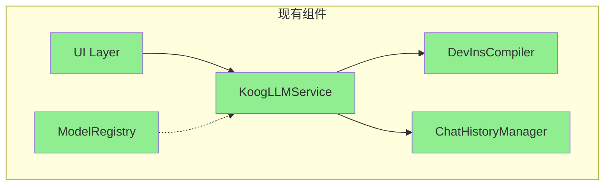

### 目标架构 (v1.0)

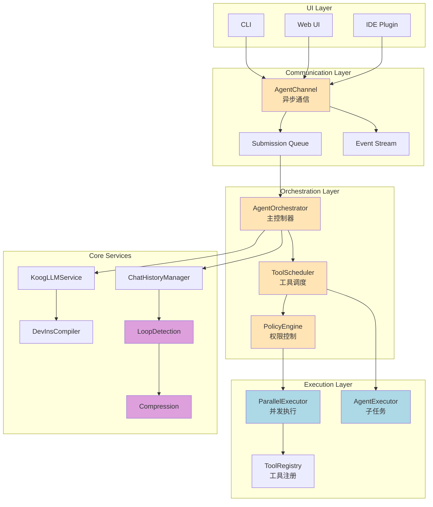

---

## 核心改进点详解

### 1. 异步通信层 (Queue Pair Pattern)

**参考**: Codex Queue Pair + Kotlin Channels

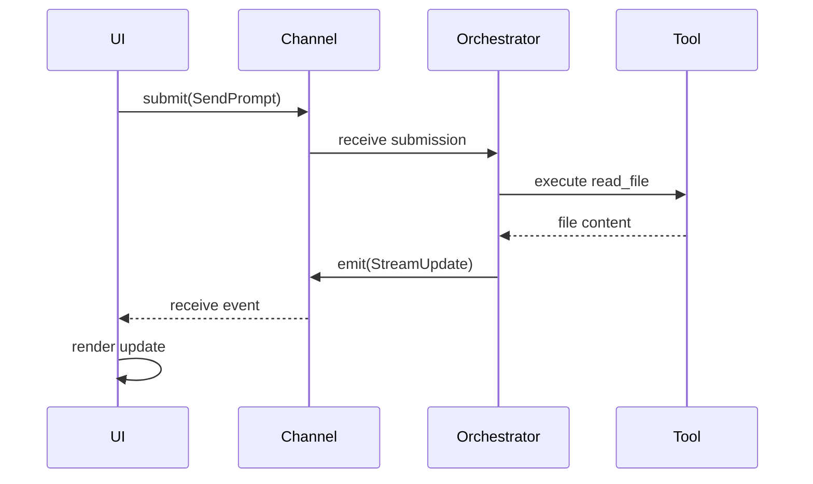

**关键特性**:
- 双向异步通信
- 背压控制
- 可取消任务
- 完全解耦 UI

---

### 2. 工具调度器 (State Machine)

**参考**: Gemini CLI CoreToolScheduler

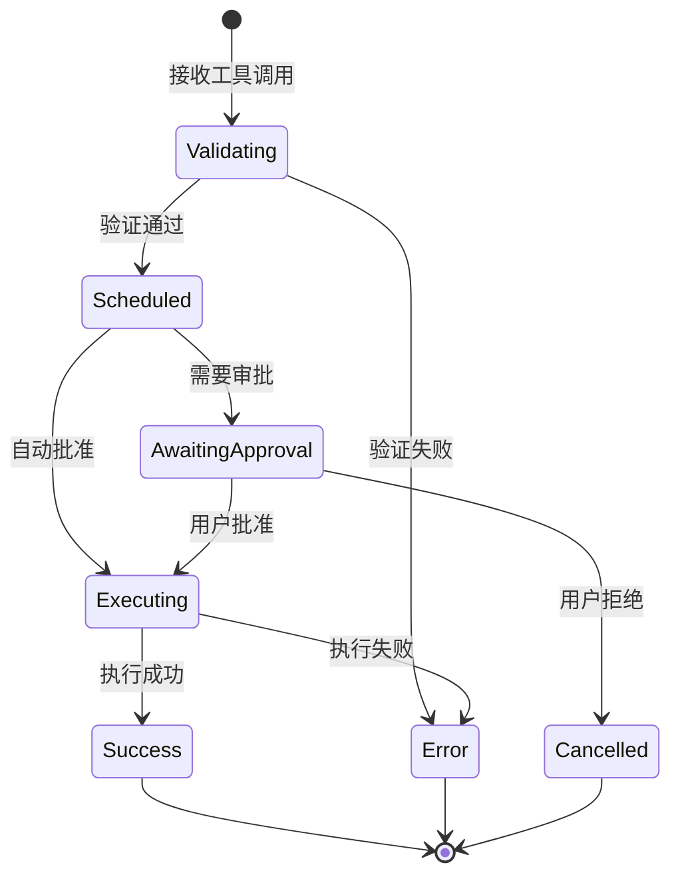

**状态追踪**:
- 每个工具调用都有唯一 ID
- 完整的状态历史
- 可恢复和重试

---

### 3. 并发执行引擎

**参考**: Codex RwLock + Parallel Execution

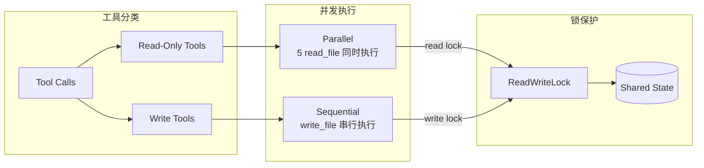

**性能提升**:
- Read 操作: 5-10x 加速
- 无锁冲突
- 资源高效利用

---

### 4. 子任务机制 (Subagent)

**参考**: Gemini CLI AgentExecutor

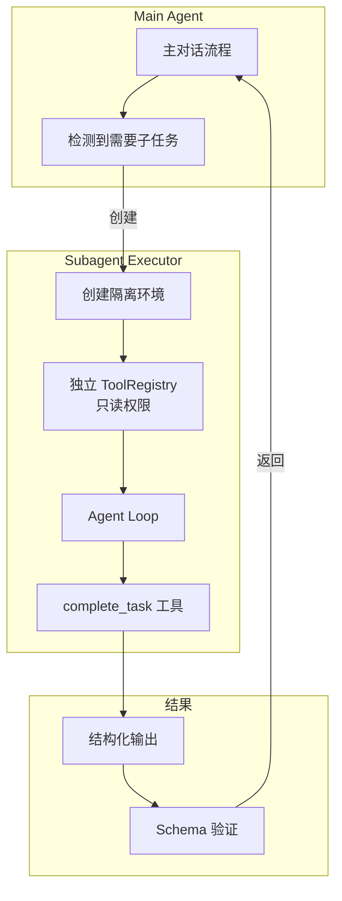

**典型场景**:
```kotlin
// 代码审查子 Agent
val reviewer = AgentDefinition(
    name = "code-reviewer",
    allowedTools = listOf("read_file", "grep"),  // 只读
    outputSchema = CodeReviewResult::class
)

val result = executor.run(reviewer, mapOf("file" to "Auth.kt"))
// 返回: CodeReviewResult(issues=..., score=...)
```

---

### 5. 智能历史管理

**参考**: Gemini CLI Loop Detection + Compression

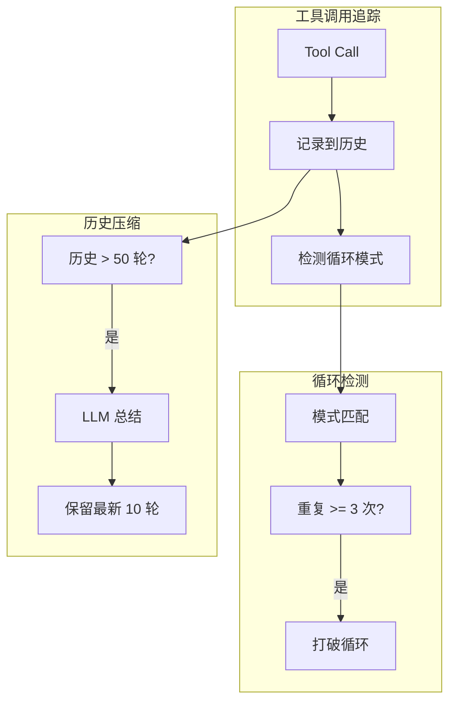

**效果**:
- 避免死循环
- Token 成本降低 60-80%
- 保持对话连贯性

---

## 实施时间线

### Phase 0: 基础设施 (2 周)

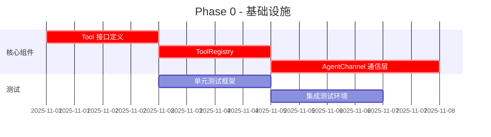

**Deliverables**:
- ✅ `Tool` 接口
- ✅ `ToolRegistry` 注册表
- ✅ `AgentChannel` 通信层
- ✅ 基础测试框架

---

### Phase 1: 工具调度 (2 周)

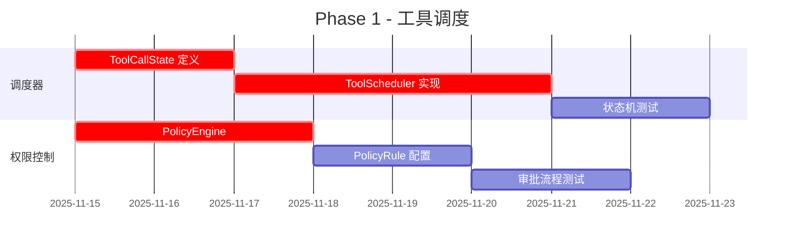

**Deliverables**:
- ✅ `ToolScheduler` 状态机
- ✅ `PolicyEngine` 权限控制
- ✅ 审批缓存机制
- ✅ 完整状态追踪

---

### Phase 2: 性能优化 (2 周)

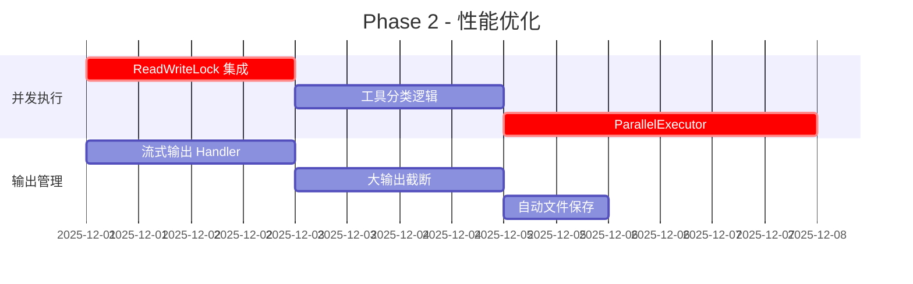

**Deliverables**:
- ⭐ 5-10x 并发读性能
- ⭐ 大输出自动管理
- ⭐ 实时流式更新
- ⭐ 可取消任务

---

### Phase 3: 高级功能 (3 周)

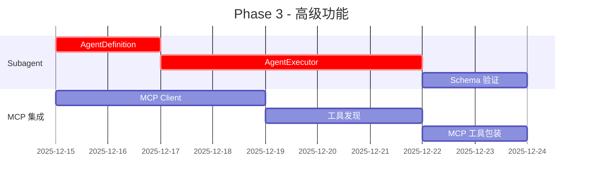

**Deliverables**:
- 🔧 `AgentExecutor` 子任务
- 🔧 工具权限隔离
- 🔧 结构化输出验证
- 🔧 MCP 协议支持

---

### Phase 4: 智能优化 (2 周)

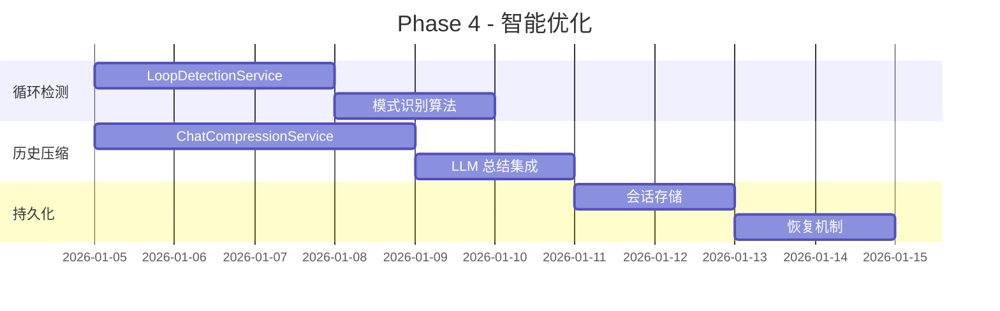

**Deliverables**:
- 💡 循环自动检测
- 💡 历史智能压缩
- 💡 会话持久化
- 💡 IDE 上下文同步

---

## 性能指标对比

### 当前性能 (Baseline)

| 指标 | 当前值 | 来源 |
|------|--------|------|
| Read 工具并发 | 串行 (1x) | 实测 |
| 工具调用延迟 | ~150ms | 估算 |
| 历史 token 控制 | 无限制 | - |
| 循环检测 | 无 | - |
| 权限检查 | 无 | - |

### 目标性能 (v1.0)

| 指标 | 目标值 | 对比基线 | 参考来源 |
|------|--------|----------|----------|
| Read 工具并发 | 并行 (5-10x) | **10x 提升** | Codex |
| 工具调用延迟 | <50ms | **3x 提升** | Gemini CLI |
| 历史 token 控制 | <8k tokens | **控制成本** | Gemini CLI |
| 循环检测 | <5 次重复 | **防死循环** | Gemini CLI |
| 权限检查开销 | <5ms/call | **安全保障** | Gemini CLI |

---

## 兼容性策略

### 保持向后兼容

```kotlin
// 旧 API (v0.1)
class KoogLLMService {
    fun streamPrompt(userPrompt: String): Flow<String>
}

// 新 API (v1.0)
class KoogLLMService {
    @Deprecated("Use submitPrompt instead", ReplaceWith("submitPrompt(userPrompt)"))
    fun streamPrompt(userPrompt: String): Flow<String>
    
    // 新方法
    suspend fun submitPrompt(userPrompt: String): String {
        channel.submit(AgentSubmission.SendPrompt(userPrompt))
        // ...
    }
}
```

### 渐进式迁移

1. **Phase 0-1**: 新旧 API 共存
2. **Phase 2**: 标记旧 API 为 `@Deprecated`
3. **Phase 3**: 文档更新和迁移指南
4. **Phase 4**: 移除旧 API (major version bump)

---

## 风险评估

### 高风险项

| 风险 | 影响 | 概率 | 缓解措施 |
|------|------|------|----------|
| KMP 兼容性问题 | 高 | 中 | 充分测试所有平台 |
| 性能回退 | 中 | 低 | 持续性能基准测试 |
| Breaking changes | 高 | 低 | 保持向后兼容 |

### 中风险项

| 风险 | 影响 | 概率 | 缓解措施 |
|------|------|------|----------|
| 并发 Bug | 中 | 中 | 充分的并发测试 |
| 状态机复杂度 | 中 | 中 | 清晰的文档和图示 |
| 测试覆盖不足 | 中 | 中 | 80%+ 代码覆盖率 |

---

## 成功标准

### 功能完整性

- [x] 异步通信层实现
- [ ] 工具调度器状态机
- [ ] 权限控制系统
- [ ] 并发执行引擎
- [ ] 子任务机制
- [ ] 循环检测
- [ ] 历史压缩

### 性能达标

- [ ] Read 工具 5x+ 并发提升
- [ ] 工具调用延迟 <50ms
- [ ] 历史 token <8k
- [ ] 循环检测准确率 >95%

### 质量保障

- [ ] 单元测试覆盖率 >80%
- [ ] 集成测试通过率 100%
- [ ] 所有平台 (JVM/JS/Wasm) 通过
- [ ] 性能基准测试通过

---

## 参考资源

### 核心文档

1. [Codex 架构分析](./codex-architecture-analysis.md) - Queue Pair + 并发执行
2. [Gemini CLI 架构分析](./gemini-cli-architecture.md) - 状态机 + Subagent
3. [Kode 架构分析](./kode-architecture-analysis.md) - 多模型协作
4. [架构对比分析](./coding-agents-architecture.md) - 综合对比

### 技术栈

- **Kotlin Multiplatform**: https://kotlinlang.org/docs/multiplatform.html
- **Kotlin Coroutines**: https://kotlinlang.org/docs/coroutines-overview.html
- **Kotlin Flow**: https://kotlinlang.org/docs/flow.html
- **MCP Protocol**: https://modelcontextprotocol.io/

---

**文档版本**: v1.0  
**创建日期**: 2025-10-31  
**作者**: AutoDev Team
