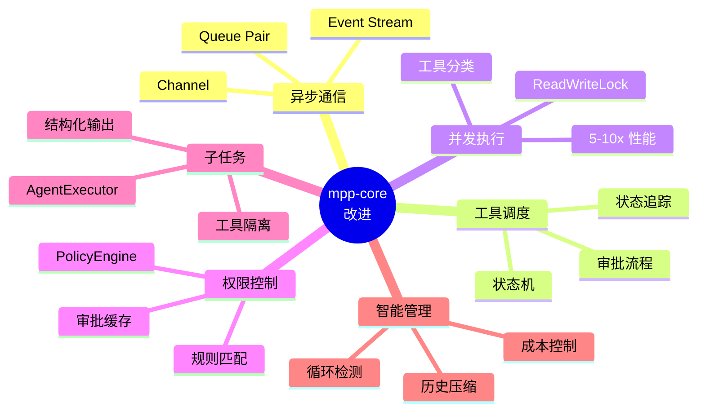

# MPP-Core 改进建议 - 快速总览

> 基于 Codex、Gemini CLI、Kode 三个生产级 Coding Agent 的架构分析

---

## 🎯 核心问题

### 当前 mpp-core 缺失的关键组件



---

## 📊 三大 Agent 对比

| 维度 | Codex (Rust) | Gemini CLI (TS) | mpp-core 方案 |
|------|-------------|----------------|--------------|
| **通信** | ⭐⭐⭐⭐⭐ Queue Pair | ⭐⭐⭐⭐ Event Bus | Kotlin Channel |
| **调度** | ⭐⭐⭐⭐ Orchestrator | ⭐⭐⭐⭐⭐ 状态机 | 状态机 |
| **并发** | ⭐⭐⭐⭐⭐ RwLock 并行 | ⭐⭐ 串行 | ReadWriteLock |
| **Subagent** | ⭐ 无原生支持 | ⭐⭐⭐⭐⭐ AgentExecutor | AgentExecutor |
| **权限** | ⭐⭐⭐ 基础审批 | ⭐⭐⭐⭐⭐ PolicyEngine | PolicyEngine |
| **循环检测** | ⭐ 无 | ⭐⭐⭐⭐⭐ 自动检测 | 自动检测 |

**结论**: 融合 Codex 的并发执行 + Gemini CLI 的工具编排

---

## 🚀 实施路线图 (11 周)

### Phase 0: 基础架构 (2 周)
```
Tool 接口 → ToolRegistry → AgentChannel → 测试框架
```
- ✅ 统一工具抽象
- ✅ 异步通信层
- ✅ 单元测试框架

### Phase 1: 工具调度 (2 周)
```
ToolCallState → ToolScheduler → PolicyEngine → 审批流程
```
- ✅ 状态机编排
- ✅ 权限控制
- ✅ 审批缓存

### Phase 2: 性能优化 (2 周)
```
ReadWriteLock → 工具分类 → ParallelExecutor → 输出管理
```
- ⭐ 5-10x 并发提升
- ⭐ 大输出截断
- ⭐ 流式更新

### Phase 3: 高级功能 (3 周)
```
AgentDefinition → AgentExecutor → MCP Client → 工具发现
```
- 🔧 子任务隔离
- 🔧 MCP 集成
- 🔧 结构化输出

### Phase 4: 智能优化 (2 周)
```
LoopDetection → ChatCompression → 会话持久化
```
- 💡 防死循环
- 💡 成本控制
- 💡 会话恢复

---

## 💡 关键设计决策

### 1. 异步通信: Kotlin Channel (from Codex)

```kotlin
class AgentChannel {
    val submissions = MutableSharedFlow<AgentSubmission>()
    val events = MutableSharedFlow<AgentEvent>()
}
```

**优势**:
- 完全解耦 UI 和业务
- 天然背压控制
- 支持多端 (Compose/Web/CLI)

---

### 2. 工具调度: 状态机 (from Gemini CLI)

```kotlin
sealed class ToolCallState {
    Validating → Scheduled → AwaitingApproval → Executing → Success/Error
}
```

**优势**:
- 清晰的状态转换
- 统一的错误处理
- 完整的状态追踪

---

### 3. 并发执行: ReadWriteLock (from Codex)

```kotlin
// 分类工具
val (readTools, writeTools) = tools.partition { it.isReadOnly }

// 并行执行只读工具 → 5-10x 性能提升
readTools.map { async { execute(it) } }.awaitAll()
```

**优势**:
- Read 操作 5-10x 加速
- 并发安全保障
- 资源高效利用

---

### 4. 子任务: AgentExecutor (from Gemini CLI)

```kotlin
val reviewer = AgentDefinition(
    allowedTools = listOf("read_file", "grep"),  // 只读权限
    outputSchema = CodeReviewResult::class        // 强制类型
)

val result = executor.run(reviewer, inputs)
```

**优势**:
- 工具权限隔离
- 结构化输出验证
- 可组合任务编排

---

## 📈 性能目标

| 指标 | 当前 | 目标 | 提升 |
|------|------|------|------|
| **Read 并发** | 串行 (1x) | 并行 (5-10x) | **10x** ⚡ |
| **调用延迟** | ~150ms | <50ms | **3x** ⚡ |
| **Token 控制** | 无限制 | <8k tokens | **60-80% 成本降低** 💰 |
| **循环检测** | 无 | <5 次重复 | **防死循环** 🛡️ |
| **权限检查** | 无 | <5ms/call | **安全保障** 🔐 |

---

## 🔧 立即可行的改进 (本周)

### 1. 添加 Tool 接口
```kotlin
interface Tool {
    val name: String
    val isReadOnly: Boolean
    suspend fun execute(params: Map<String, Any>): ToolResult
}
```

### 2. 创建 ToolRegistry
```kotlin
class ToolRegistry {
    private val tools = mutableMapOf<String, Tool>()
    fun register(tool: Tool)
    fun getTool(name: String): Tool?
}
```

### 3. 引入 AgentChannel
```kotlin
class AgentChannel {
    val submissions = MutableSharedFlow<AgentSubmission>()
    val events = MutableSharedFlow<AgentEvent>()
}
```

---

## 📚 参考文档

### 核心分析文档
1. **[docs/README.md](./README.md)** - 详细改进建议 (6000+ 字) ⭐⭐⭐⭐⭐
2. **[docs/mpp-core-improvement-roadmap.md](./mpp-core-improvement-roadmap.md)** - 可视化路线图 ⭐⭐⭐⭐
3. **[docs/codex-architecture-analysis.md](./codex-architecture-analysis.md)** - Codex 深度解析
4. **[docs/gemini-cli-architecture.md](./gemini-cli-architecture.md)** - Gemini CLI 深度解析
5. **[docs/coding-agents-architecture.md](./coding-agents-architecture.md)** - 三者对比分析

### 技术栈
- Kotlin Multiplatform: https://kotlinlang.org/docs/multiplatform.html
- Kotlin Coroutines: https://kotlinlang.org/docs/coroutines-overview.html
- Kotlin Flow: https://kotlinlang.org/docs/flow.html

---

## ✅ 成功标准

### 功能完整性
- [ ] 异步通信层
- [ ] 工具调度器
- [ ] 权限控制
- [ ] 并发执行
- [ ] 子任务机制
- [ ] 循环检测
- [ ] 历史压缩

### 性能达标
- [ ] Read 工具 5x+ 提升
- [ ] 工具调用 <50ms
- [ ] 历史 <8k tokens
- [ ] 循环检测 >95% 准确率

### 质量保障
- [ ] 单元测试 >80% 覆盖
- [ ] 集成测试 100% 通过
- [ ] 所有平台 (JVM/JS/Wasm) 通过

---

**文档版本**: v1.0  
**创建日期**: 2025-10-31  
**作者**: AutoDev Team

**下一步**: 开始 Phase 0 - 基础架构实施
